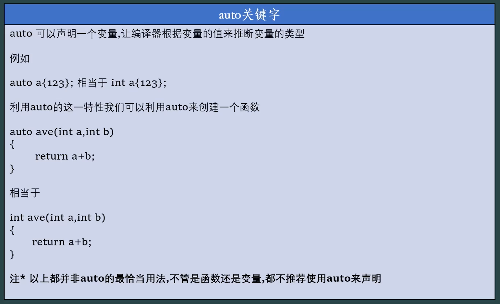
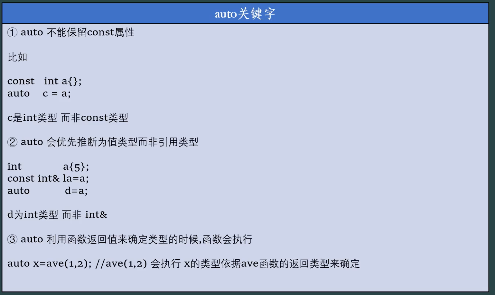
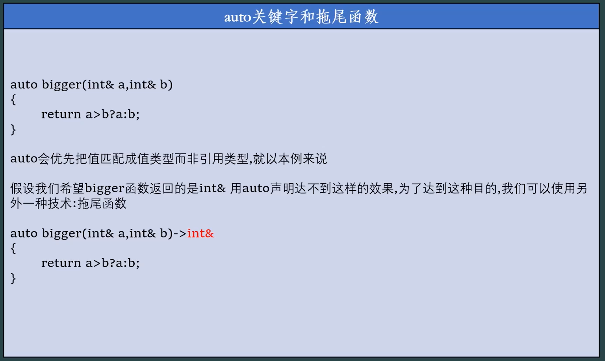
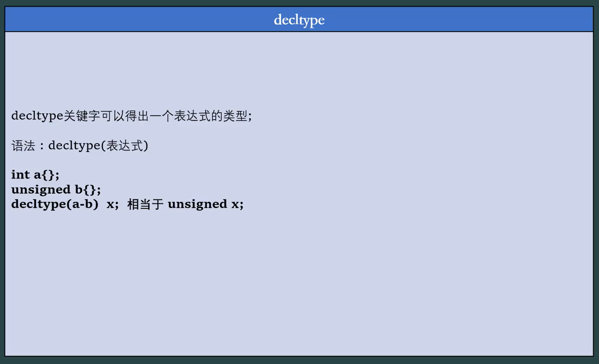
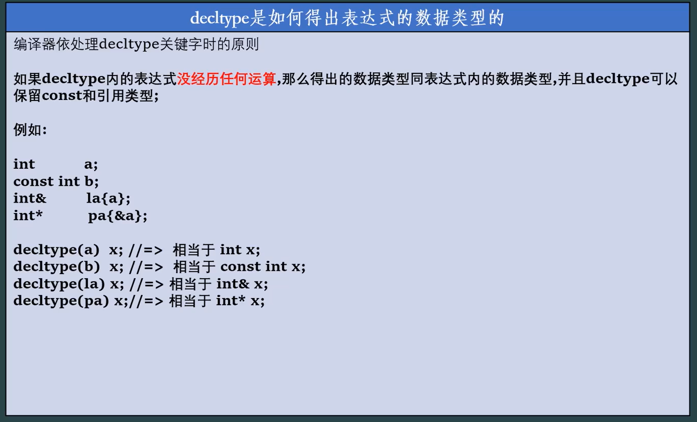
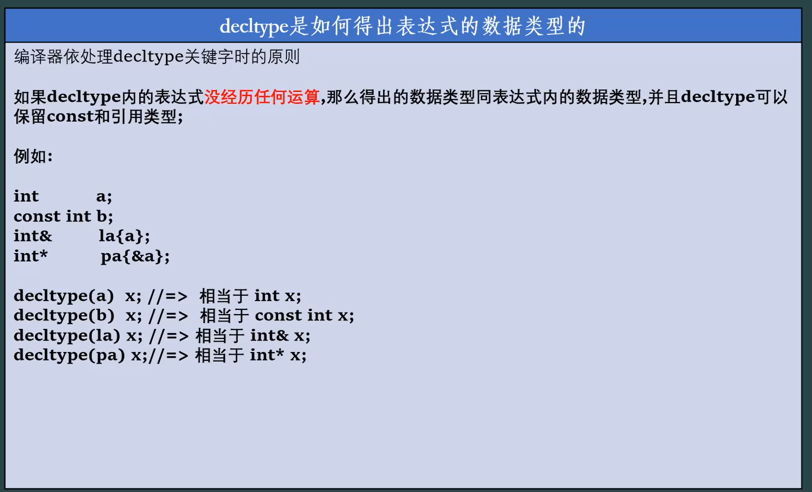
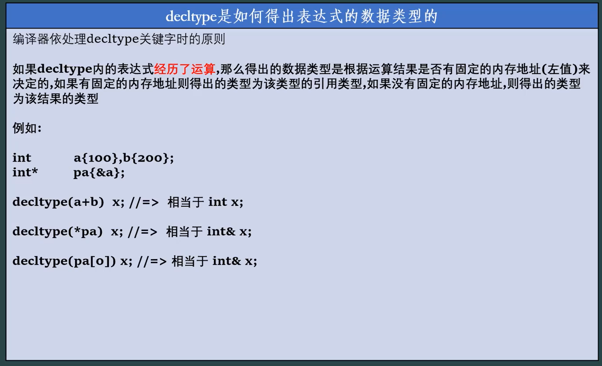
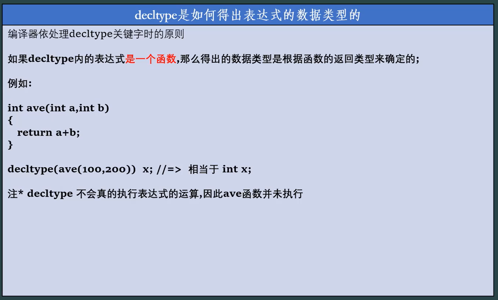
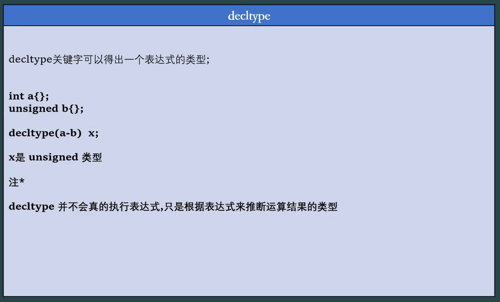
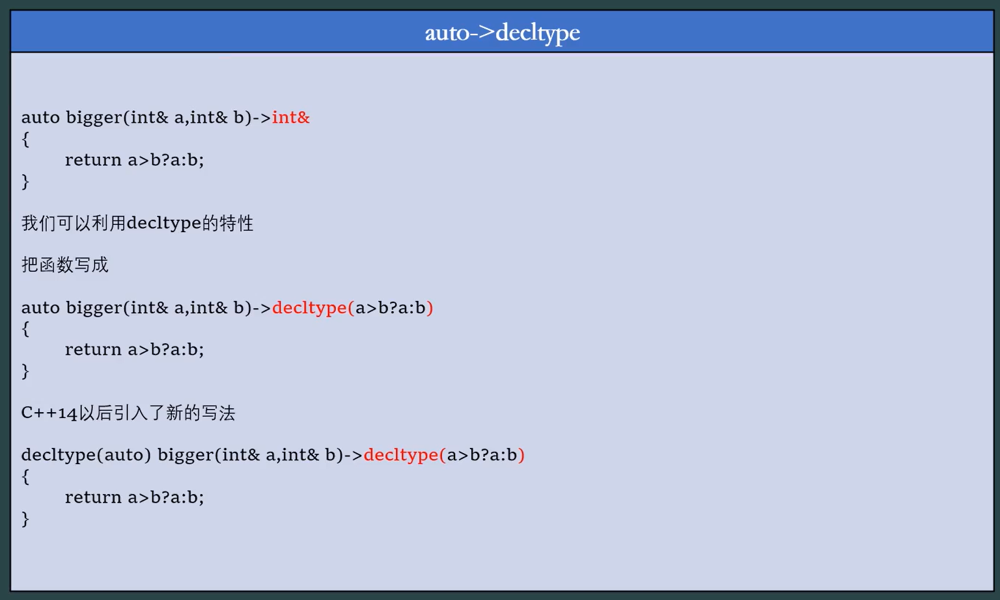

```c++
int a{100};
decltype(a++) x; //=> int x;
decltype(++a) y; //=> int& y;

```

- a++
  - 先创建一个**临时变量**，存储 `a` 递增前的值；
  - 对变量 `a` 执行递增操作（`a = a + 1`）；
  - 返回**临时变量的值**（而非 `a` 本身）。
- ++a
  - 先对变量 `a` 执行递增操作（`a = a + 1`）；
  - 返回**递增后的变量 `a` 本身**（即变量的引用）。

