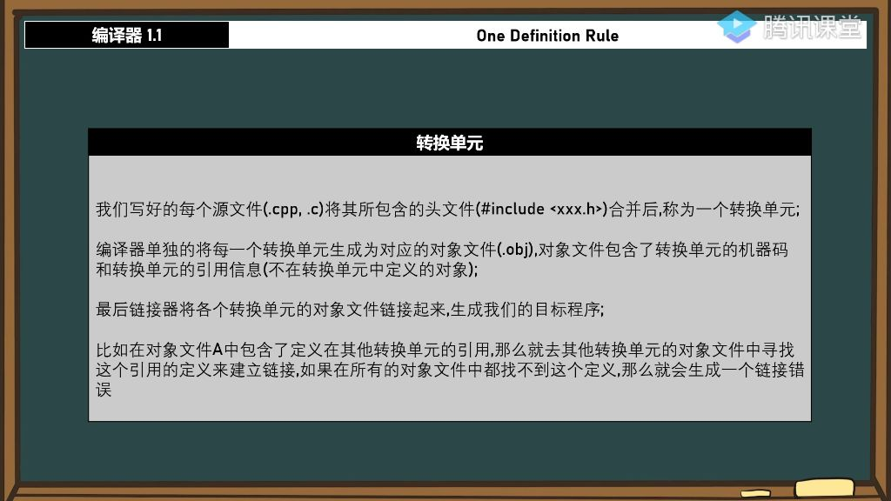
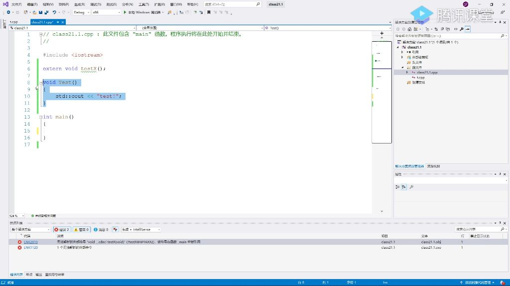
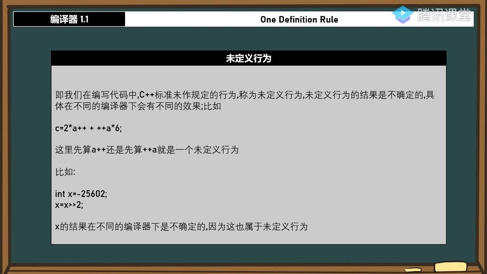
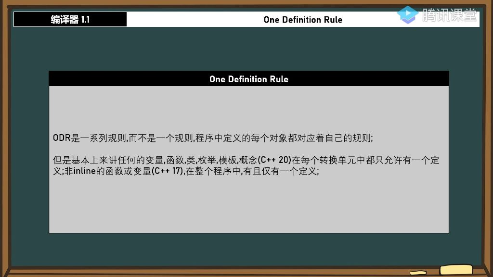
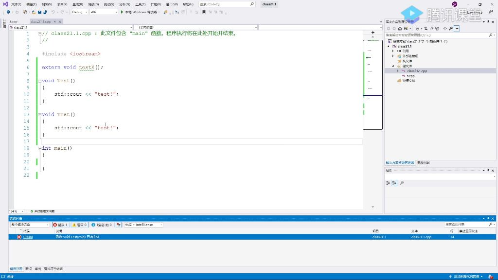
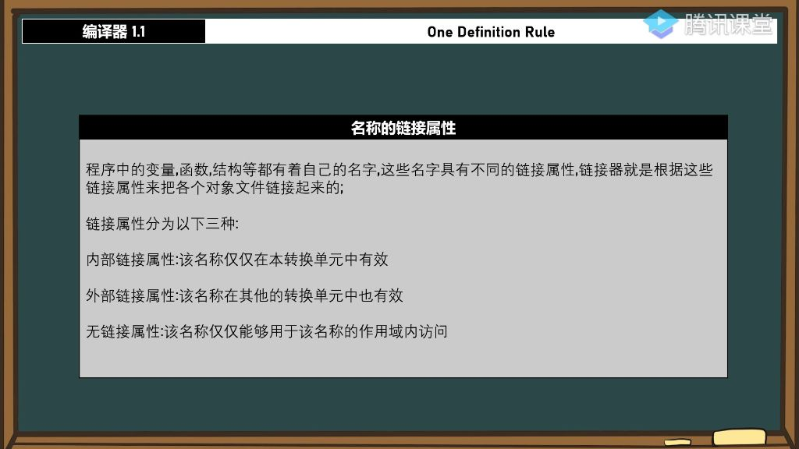

##### 1. 转换单元

基本概念：源文件(.cpp/.c)与其包含的头文件合并后形成的整体称为转换单元（也称翻译单元或编译单元）

编译过程

- 编译器将每个转换单元单独编译生成对应的对象文件(.obj)
- 对象文件包含：机器码 + 外部引用信息（本转换单元未定义的对象）

链接过程

- 链接器将所有对象文件链接生成最终目标程序
- 若对象文件A中引用了其他转换单元定义的对象，链接器会在其他对象文件中查找该定义
- 若所有对象文件中都找不到定义，则产生链接错误(LNK2019)

###### 1）例题:转换单元错误处理 

- 
- 题目解析
  - 错误类型识别
    - LNK2019：链接阶段错误（对象文件间引用未解决）
    - C2084：编译阶段错误（转换单元内部语法错误）
  - 错误原因
    - 声明了extern void testX()但未在任何转换单元中实现
    - 链接器在所有对象文件中都找不到testX函数的定义
  - 解决方案
    - 在某个.cpp文件中实现testX函数
    - 或移除对该函数的调用
  - 易错点
    - 容易混淆编译错误和链接错误的发生阶段
- 实际案例
  - class21.1.cpp调用testX()函数
  - t.cpp中实现testX()函数
  - 编译生成class21.1.obj和t.obj
  - 链接器将两个obj文件中的testX引用与定义匹配
- 关键区别
  - 编译器处理单个转换单元
  - 链接器处理多个对象文件间的关系
- 典型错误
  - 函数声明与定义不匹配
  - 未将包含实现的源文件加入项目
  - 拼写错误导致名称不一致

##### 2. 未定义行为

###### 1）未定义行为的定义与特点

- 
- 标准未规定: C++标准未作明确规定的行为，不同编译器可能有不同实现方式
- 结果不确定性: 具体表现取决于编译器实现，可能产生意外结果
- 典型场景: 复合表达式运算顺序、有符号数位运算等

###### 2）未定义行为的实例：复合表达式 

- 问题本质: 运算顺序未定义，先算a++还是++a会导致不同结果

- 编程建议: 避免在复杂表达式中混合使用自增运算符

###### 3）未定义行为的实例：位运算 

- 底层原因: 有符号数右移时补0/1行为未标准化
- 编程建议: 位运算应使用无符号数(unsigned)进行操作

###### 4）如何避免未定义行为

- 基本原则: 遵循标准明确规定的语法形式
- 具体方法
  - 拆分复杂表达式为多个简单语句
  - 位运算统一使用无符号类型
  - 避免依赖编译器特定实现

##### 3. 单一性规则(ODR)

###### 1）ODR基本概念

- 
- 规则本质: 一系列规则，而非单一规则
- 适用范围: 变量、函数、类、枚举、模板、概念(C++20)
- 核心要求
  - 每个转换单元中只允许一个定义
  - 非inline函数/变量(C++17)在整个程序中仅一个定义

###### 2）ODR违规示例

- 
- 函数重复定义: 同一转换单元中多次定义Test()函数
- 变量重复定义: 全局变量int a在不同文件中重复定义
- 错误类型: 链接错误LNK2005（符号重定义）

###### 3）ODR例外情况

- static变量: 具有内部链接性，各转换单元独立
- const变量: 默认具有内部链接性(C++中)
- inline特性
  - C++17引入inline变量
  - 需要启用C++17标准(/std:c++17)
  - 允许在多个转换单元中重复定义(第一个使用到的生效，其它的没有作用)。
  - 语法形式: inline int a = 350;
  - **实现原理: 编译器保证所有定义指向同一实体。**

##### 4. 名称的链接属性

- 
- 基本概念：程序中的变量、函数、结构等名称具有不同的链接属性，链接器根据这些属性将对象文件链接起来
- 分类：分为内部链接属性、外部链接属性和无链接属性三种

###### 1）内部链接属性

- 定义：该名称仅在本转换单元中有效

- 示例

  - static int x = 352; 定义的变量
- const int pt = 999; 定义的常量
  
- 特点

  - 使用static关键字声明的函数或变量具有内部链接属性
- 在C++17后，推荐使用未命名的命名空间替代static关键字
  - 编译器不会将内部链接属性的名称纳入全局搜索范围

###### 2）外部链接属性

- 定义：该名称在其他转换单元中也有效

- 示例

  - 全局变量int x = 350;
- 使用extern关键字声明的变量或函数
  
- 特点

  - 默认情况下，全局变量和函数具有外部链接属性
- 使用extern关键字可以显式声明外部链接属性
  - 在整个程序中，非inline的函数或变量有且仅有一个定义(ODR规则)
  - 违反ODR规则可能导致未定义行为

###### 3）inline与static的问题

- inline特性

  - 具有外部链接属性
  - C++17开始支持inline变量
    - 多个转换单元中可以包含相同的inline定义
    - 实际使用的是头文件中的定义
  
- static特性

  - 具有内部链接属性
  - 每个转换单元有自己的static变量副本
  - 函数内的static变量仅在该函数作用域内有效
  
- 关键区别

  - inline变量/函数在程序中只有一个实体
  - static变量/函数在每个转换单元中有独立实体
  - inline定义应放在头文件中以确保统一性
  - static定义可以放在实现文件中实现隔离。
  
