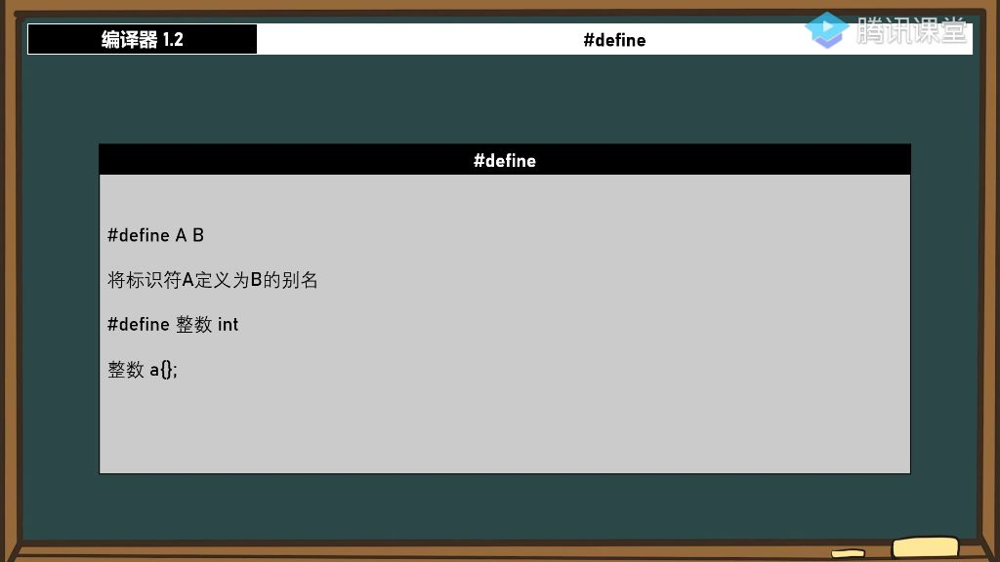
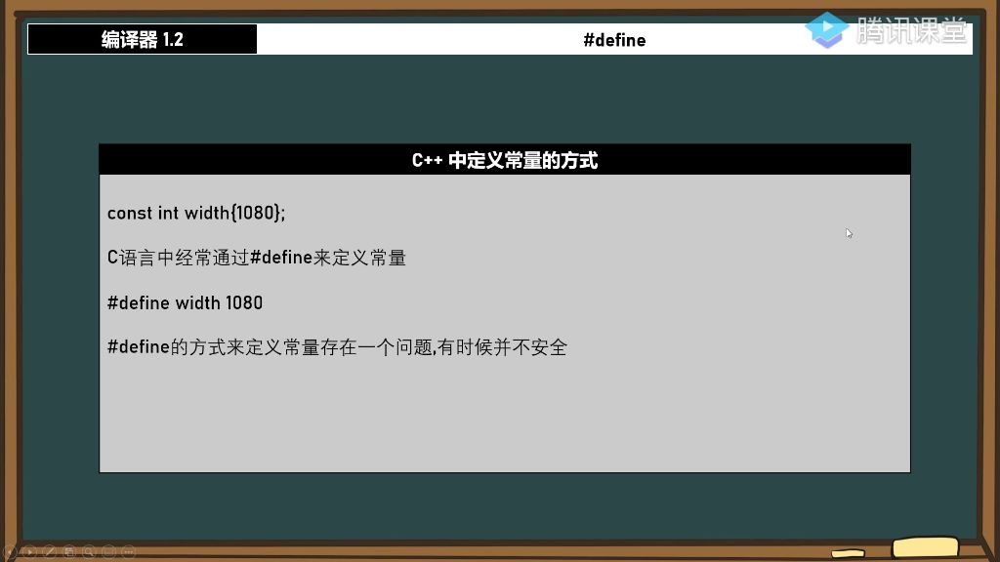
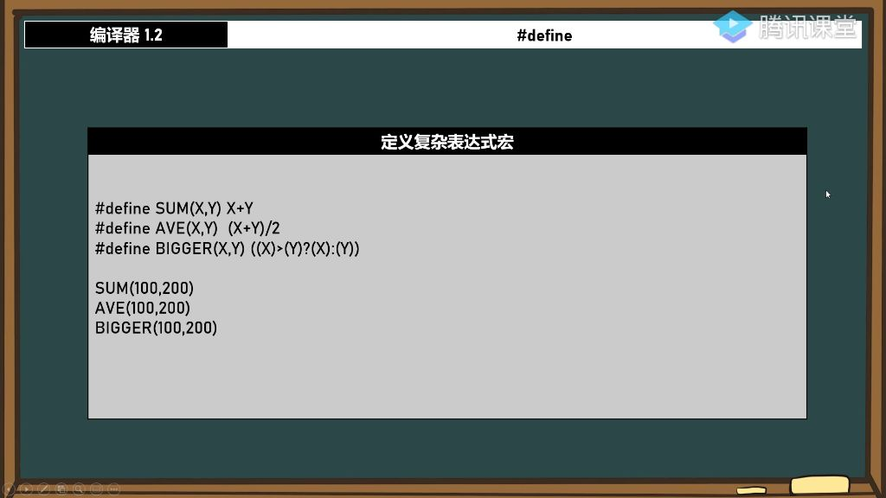
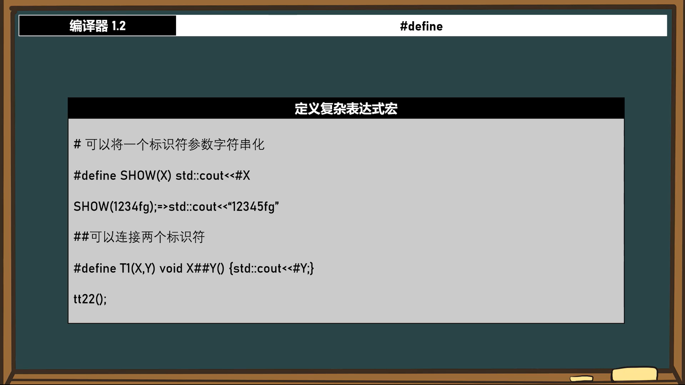
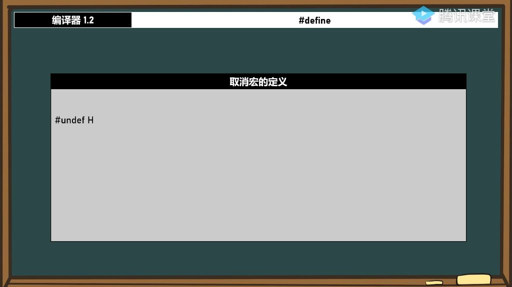
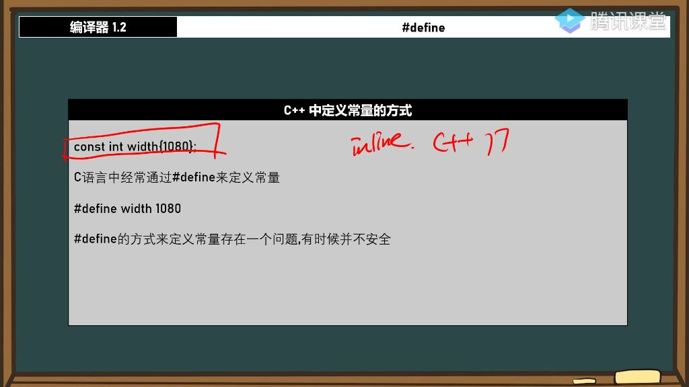

##### 1. 定义别名

###### 1）#define的基本用法：定义常量 

- 

- 语法格式：#define A B 表示将标识符A定义为B的别名，如#define 整数 int，后续代码中所有"整数"都会被替换为"int"

- 替换机制：预处理器会进行无脑文本替换;

  -  例如

    ```c++
    整数 a = 250;
    会被替换为:
    int a = 250;
    ```

###### 2）命名规则与注意事项 

- 命名规范
  - 类似变量命名规则，不能以数字开头
  - 可以是字母数字组合或中文（如#define HHHH int）
  - 不能包含特殊符号（如#define a%d int会报错）
- 替换特性
  - 会替换所有匹配文本，包括不完整的标识符
  - 示例：#define HHHH int a 会将 HHHH 替换为 int a，可能导致未声明变量的问题
- 实际应用
  - Windows API中大量使用#define定义常量.
  - 常用于版本控制，如#define VERSION "2.0.1"，修改时只需改一处
  - 提高代码可读性，如#define SCREEN_WIDTH 1980比直接使用1980更易理解

##### 2. 定义常量

###### 1）C++中定义常量的方式

- 

- const方式:

  const int width(1080);

  是<font color='green'>C++</font>推荐的方式

  - 优点：具有类型检测，安全性高，可读性强
  - 适用场景：C++17后建议在头文件中使用inline const修饰

- \#define方式:

  \#define width 1080

   是<font color='green'>C语言</font>常用方式

  - 缺点：只是无脑替换，没有类型检查，容易出错
  - 不安全示例：可以#define int float或#define true false导致逻辑混乱

###### 2）定义复杂表达式宏

- 基本表达式宏

  - 
  - 语法格式：#define 宏名(参数) 表达式
  - 典型应用
    - \#define SUM(X,Y) X+Y 实现简单加法
    - \#define RELEASE(x) delete[] x;x=nullptr 安全释放内存
  - 注意事项
    - 定义要加括号：#define BIGGER(X,Y) <font color='red'>**(**</font>(X)>(Y)?(X):(Y)<font color='red'>**)**</font>
    
    - 避免运算符优先级问题，如
    
      ```c++
      #define SUM(X,Y) X + Y *3
      
      SUM(100,200);	//实际是100+200*3;
      
      ```

- 标识符字符串化

  

  - 单#号用法:

    \#define SHOW(X) std::cout<<#X

    - 将标识符转为字符串，如SHOW(123)输出"123"
    - 自动添加引号，无需手动转义

  - 双井号用法：

    \#define CONCAT(X,Y) X##Y

    - 连接两个标识符，如CONCAT(test,22)生成test22
    - 典型应用：动态生成函数名void X##Y(){}

- 宏定义管理

  - 

  - 取消定义:

    \#undef 宏名

    - 作用：在指定位置后使宏定义失效(编译期生效)
    - 示例：#undef TEST后不能再使用TEST宏

  - 作用范围：

    - 按代码顺序生效，与函数调用无关
    - 取消后再次使用会导致编译错误

- 特殊用法示例

  - 
  - 参数标记
    - \#define `_in_`和#define `_out_`提高代码可读性
    - Windows API中常见`_in_`表示输入参数，`_out_`表示输出参数
  - 条件编译:
    - \#define TEST可用于标记测试代码
    - 配合#ifdef TEST实现测试代码的开关控制