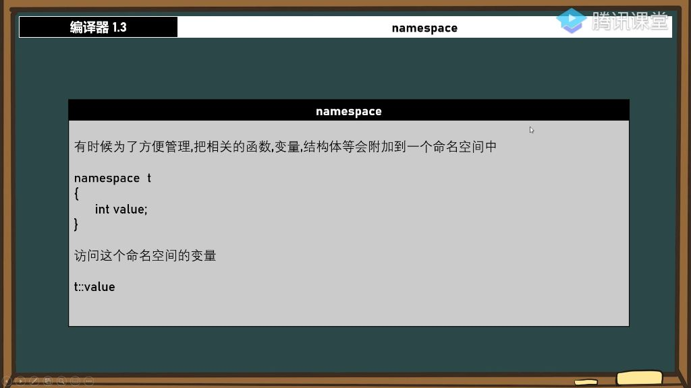
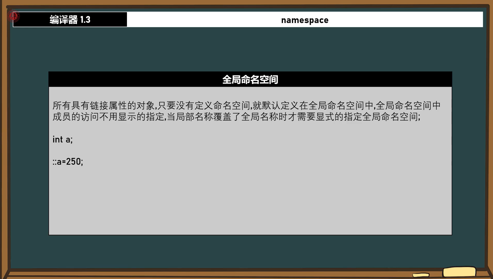
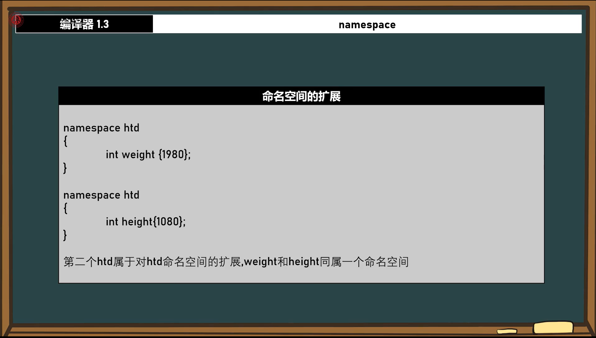
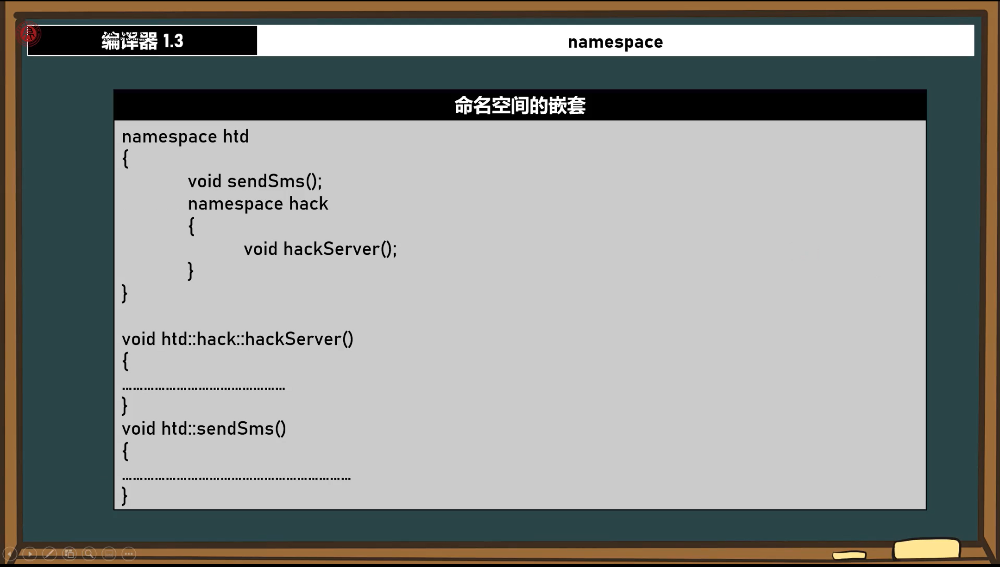
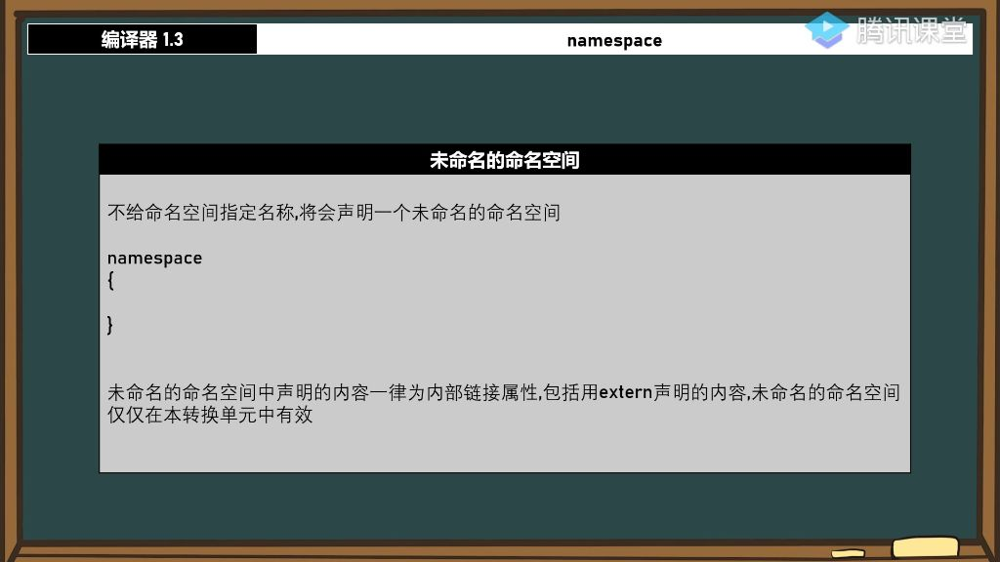
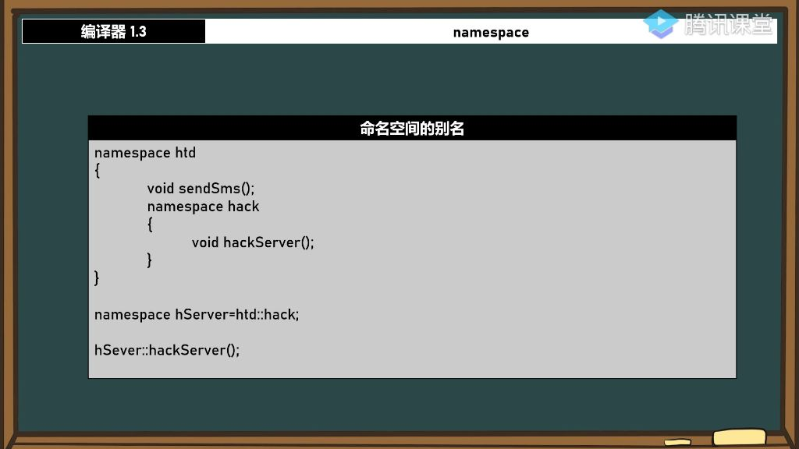

##### 1. 全局命名空间 

###### 1）全局命名空间的定义

- 

- **默认容器**：所有具有连接属性的对象（函数、变量、结构体等），若未显式放入特定命名空间，则自动归入全局命名空间

  

- **示例对比**:
  - 变量 `t::value` 在命名空间t中
  - 变量 `p` 未定义命名空间，则默认在全局命名空间

###### 2）全局命名空间与连接属性

- **必要条件**: 只有具备连接属性的对象才会进入全局命名空间
  - **外部连接**：如全局变量 `int x=250` 
  - **内部连接**: `如const int p{}`
  - **无连接**：如函数局部变量不会进入全局命名空间

###### 3）全局命名空间的访问

- **默认访问**：全局命名空间成员可直接访问，无需前缀
- **显式访问**：当局部名称覆盖全局名称时，使用`::`操作符
  - 示例：局部 `int p=250` 覆盖全局 `p` 时，通过 `::p` 访问全局变量
- **典型场景**：解决命名冲突时特别有用

###### 4）全局命名空间的作用范围

- **跨文件特性**：全局命名空间不受单个源文件限制
  - 需通过外部连接属性实现跨文件访问
  - 需要正确导入声明（如`extern`）
- **验证方法**： 在不同文件中定义 `int x=250`，可通过 `::x`跨文件访问。

##### 2. 命名空间的扩展

- **扩展机制**：同一命名空间可分散在不同文件中定义
  - **标准库示例**：STD命名空间通过不同头文件（如<iostream>、<bitset>）扩展
  - **自定义扩展**：多次定义`namespace t`会合并内容
- **实际应用**：
  - 允许模块化开发时分散功能到不同文件
  - 用户可选择性加载所需功能模块
- **访问方式**：扩展后仍通过统一命名空间名访问（如`t::member`）

##### 3. 命名空间的声明

###### 1）命名空间的声明语法

- **声明与定义区别**:
  - 声明：仅包含变量或函数原型，如`extern int value`;
  - 定义：包含具体实现或初始化值，如`int height{1280}`;
- **头文件规范**:
  - 头文件中应使用声明而非定义
  - 若必须定义，需使用`inline`关键字（C++17语法）
  - 示例：`inline int x = 250;`为合法定义方式
- 版本兼容性:
  - `inline`定义需要C++17标准支持
  - visual studio项目配置需设置：工具→选项→C++→语言标准→ISO C++17

###### 2）命名空间实践

- **分离实现方法**:
  - 声明放在头文件（如htd.h）：
  - 定义放在源文件：
- **ODR原则**:
  - 同一实体的定义只能出现一次
  - 违反会导致"LNK2007无法解析的外部符号"错误
- **定义形式选择**:
  - 传统方式：
  - 分离定义方式：
  - 后者优势：避免重复书写命名空间，减少代码冗余

###### 3）函数定义规范

- **函数定义要点**:
  - 必须完整限定命名空间：`void htd::test() {...}`
  - 错误示例：单独写`test()`会导致未定义错误
- **验证方法**:
  - 删除定义后编译会报错"LNK1120: 1个无法解析的外部命令"
  - 完整实现后输出应为250

##### 4. 命名空间的嵌套

- 
- **多层嵌套实现**：命名空间内可以继续嵌套其他命名空间，形成层级结构。例如在`htd`命名空间中嵌套`hack`命名空间，只需在内部直接声明即可。
- **定义位置灵活性**：嵌套的命名空间成员可以定义在命名空间内部，也可以在其他位置定义。如示例中的`hack()`函数既可以在嵌套命名空间内定义，也可以单独定义。
- **无限嵌套特性**：支持一层层向下无限嵌套，每层命名空间都是独立的容器，不会互相干扰。

##### 5. 未命名的命名空间

- 
- **声明方式**：使用不带名称的namespace关键字声明，格式为：namespace { /内容/ }
- **链接属性**：
  - **强制内部链接**：其中声明的所有内容（包括extern声明）都具有内部链接属性
  - **作用域限制**：仅在当前转换单元（源文件）内有效
- **替代static的优势**：
  - 解决多个转换单元中同名符号冲突问题
  - 比static声明更符合现代C++标准规范
- **独立作用域**：不同转换单元中的未命名空间互不干扰，各自维护独立的作用域

##### 6. 命名空间的别名

- 
- **声明语法**：通过namespace 别名=原命名空间 的方式创建，如`namespace a=htd::hack`
- **使用场景**：
  - 简化深层嵌套命名空间的访问（如五层以上嵌套）
  - 替代#define的命名空间重定义方案
- **调用方式**：通过别名直接访问成员，如`a::hack()`等价于`htd::hack::hack()`
- **作用域特性**：别名仅在当前作用域有效，不影响其他代码区域的命名空间访问方式

