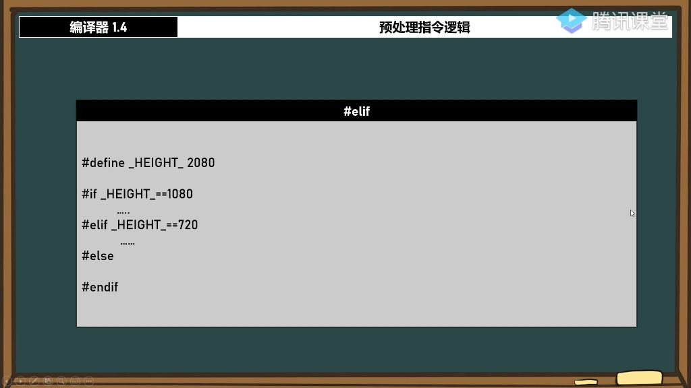

#### 一、 预处理指令

##### 1. 预处理指令的作用 

###### 1）例题:头文件预处理指令

- 
- **基本语法**：包含`#ifdef`、`#define`、`#else`、`#endif`等指令，用于条件编译
- **头文件保护**：通过`#ifdef`和`#ifndef`防止头文件重复包含
  - 示例：`#ifndef HC`_和`#define HC_`配合使用
  - 原理：第一次包含时定义宏，后续包含时跳过内容
- **嵌套规则**：预处理指令支持多层嵌套，但必须成对出现
  - 示例：`#ifdef`必须对应`#endif`，`#if`可嵌套在`#ifdef`内部

###### 2）预先定义的宏

- 例题:检测编译器宏 
  - **系统宏检测**：编译器预定义宏如UNICODE可检测字符集类型
    - 使用方式：`#ifdef UNICODE`判断是否使用Unicode字符集
    - 应用场景：根据字符集选择`wchar_t`或`char`类型变量
  - **配置关联**：在项目属性→配置属性→常规→字符集中修改设置
    - 多字节字符集：不定义UNICODE宏
    - Unicode字符集：自动定义UNICODE宏

###### 3）版本控制

- 
- **版本分支**：通过\#define VERSION 101定义版本号
  - 比较方式：`#if VERSION == 100`精确匹配版本
  - 运算符支持：支持==, >, <, +, -, *, /等运算
- **功能开关**：结合功能宏实现条件编译
  - 示例：#if VERSION == 103 && SEND_SMS == 1
  - 逻辑运算：支持与(&&)、或(||)、异或等逻辑运算

###### 4）额外用法

- 例题:版本控制函数定义 
  - **多版本函数**：不同版本编译不同函数实现
    - 方法：使用`#if`/`#elif`/`#else`定义各版本专属函数
    - 优势：保持代码统一仓库，编译时自动选择正确实现
  - **elif用法**：扩展条件判断分支
    - 语法：`#elif` 条件替代多层嵌套的`#else`/`#if`
    - 要求：必须与`#if`/`#ifdef`配套使用，结束于`#endif`

#### 二、预处理指令逻辑总结

- **核心要点**：
  - 所有带#的指令都是编译时处理，不会生成实际代码
  - 条件编译指令必须严格配对出现
  - 支持数值比较和逻辑运算
- **典型应用**：
  - 头文件保护（防止重复包含）
  - 跨平台代码适配
  - 功能开关控制
  - 多版本代码维护
- **注意事项**：
  - 避免过度复杂的预处理逻辑
  - 嵌套层次不宜过深
  - 宏定义和条件判断需要清晰注释