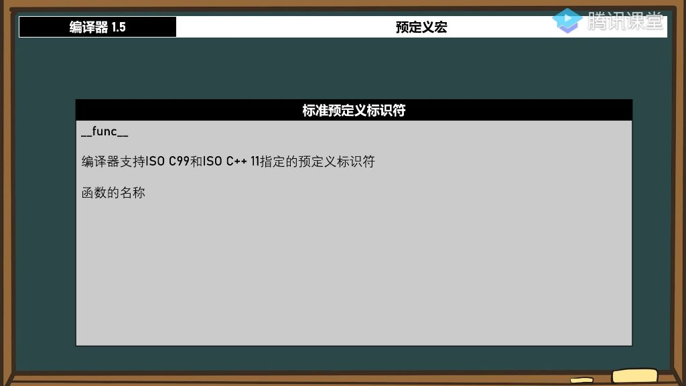
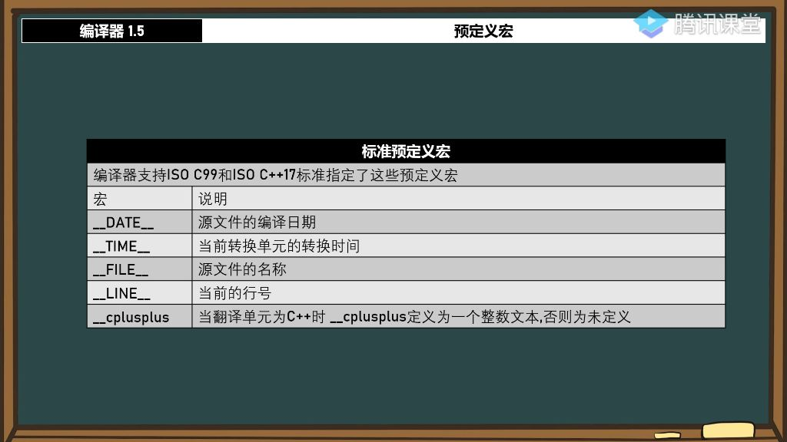
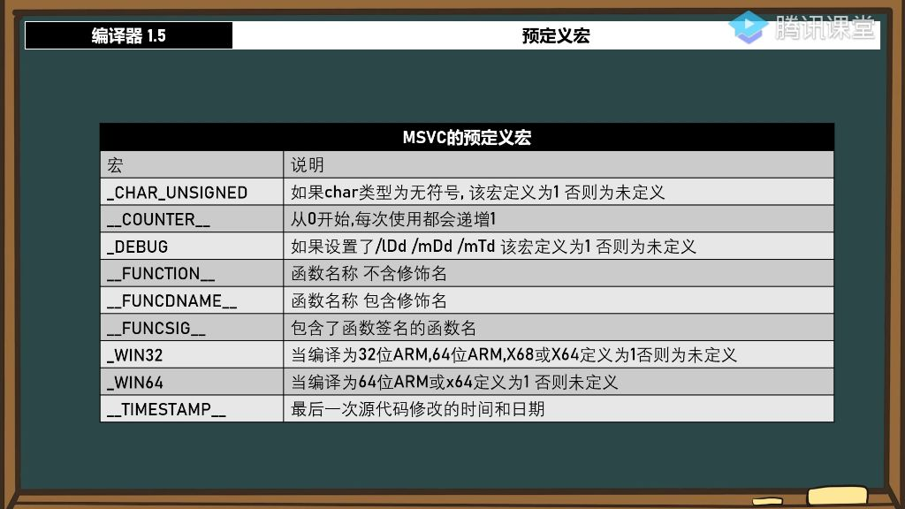

#### 一、预定义宏

##### 1. 标准预定义标识符

###### 1）func_ 

- 
- **支持标准**: 编译器需支持ISO C99或ISO C++11标准，主流编译器通常都支持该标识符
- **功能作用**: 返回当前所在函数的名称字符串，可用于调试和日志记录
- **使用方法**: 直接通过`std::cout << __func__`输出当前函数名
- **应用场景**:
  - 记录程序异常时自动获取发生异常的函数名
  - 替代手动设置函数名字符串常量
  - 调试时快速定位当前执行函数
- **动态特性**: 在不同函数中使用时自动返回对应函数名
- **示例说明**:
  - 在`main()`函数中输出显示为"main"
  - 在`ave()`函数中输出显示为"ave"
  - 无需手动修改，自动适应不同函数环境

###### 2）标准预定义宏 

- 
- **支持标准**: 需编译器支持ISO C99或ISO C++17标准
- **__DATE__宏**:
  - 返回源文件编译日期，格式为"month day year"
  - 示例输出："Dec 29 2019"
  - 用于版本控制和编译时间记录
- **__TIME__宏**:
  - 返回当前转换单元的转换时间(不是运行的时间)
  - 格式为"hour : minute : second"
  - 示例输出："13:30:47"
  - 仅在代码修改重新编译时更新
- **__FILE__宏**:
  - 返回当前源文件的完整路径和文件名
  - 示例输出："D:...\class21.5.cpp"
  - 用于定位文件和调试信息输出
- **__LINE__宏**:
  - 返回当前代码行号
  - 可用于调试定位具体代码行
- **__cplusplus__宏**:
  - 仅当翻译单元为C++时定义
  - 返回整数文本表示C++标准版本
  - 示例值：199711（表示C++98标准）
  - 用于区分C和C++代码环境
- **版本检测**:
  - 理论上应显示具体标准年份（如201703表示C++17）
  - 实际实现可能统一显示为199711
  - 仍可用于基本C/C++环境区分

##### 2. MSVC的预定义宏

###### 1）MSVC预定义宏概述

- **标准预定义宏**：由C++标准委员会要求定义的宏，如`__cplusplus__`、`__LINE__`等
- **编译器扩展宏**：MSVC编译器自行定义的宏，如_DEBUG、_WIN32等
- **功能区别**：
  - **标准宏**：用于标识C++版本（如`__cplusplus__`值为199711表示C++98）
  - **扩展宏**：提供编译器特定功能检测（如_CHAR_UNSIGNED检测char类型符号性）
  - 
- **常用标准宏**：
  - `__DATE__`：源文件编译日期（格式MMM DD YYYY）
  - `__TIME__`：编译时间（格式HH:MM:SS）
  - `__FILE__`：当前源文件名
  - `__LINE__`：当前行号

###### 2）_DEBUG宏

- **触发条件**：当设置/lDd、/mDd或/mTd编译选项时定义为1

- **典型应用**：

  - 区分Debug/Release模式代码路径
  - 调试时输出中间变量值，发布时自动移除

- 配置位置

  ：项目属性→C/C++→代码生成→运行库

  - 调试模式：选择带"Debug"的运行时库（如/MDd）
  - 发布模式：选择不带"Debug"的运行时库（如/MD）

###### 3）_WIN32与_WIN64宏

- 定义规则：
  - **_WIN32**：**32位ARM**/**64位ARM x86/x64**平台均定义为1
  - **_WIN64**：仅64位平台（**ARM64/x64**）定义为1
- **注意事项**：
  - x64编译时_WIN32仍然为1（保持向后兼容）
  - ARM架构同样适用这些宏定义
  - 实际工程中常用于指针大小相关的条件编译

###### 4）其他实用预定义宏

- 函数相关宏：
  - `__FUNCTION__`：不包含修饰名的函数名（如ave）
  - `__FUNCDNAME__`：包含修饰名的函数名（如?ave@@YAHHH@Z）
  - `__FUNCSIG__`：完整函数签名（含调用约定和参数类型）
- `_CHAR_UNSIGNED`：
  - 当char类型为无符号时定义为1
- `__COUNTER__`：
  - 每次使用自动递增的计数器
  - 典型应用：生成唯一标识符或调试时标记执行顺序

