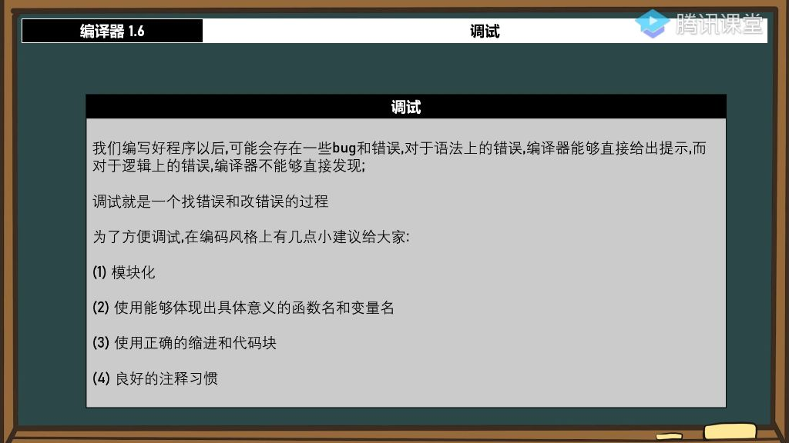
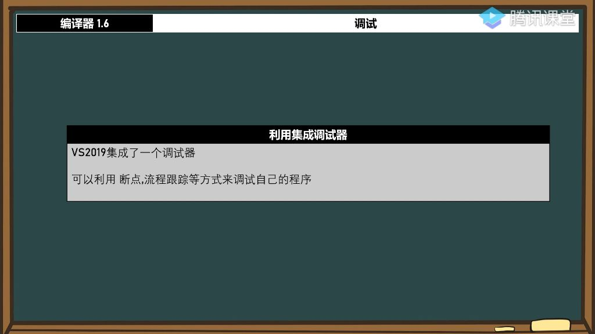
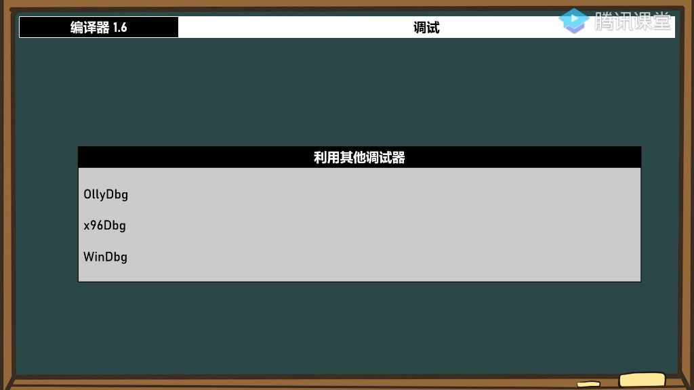
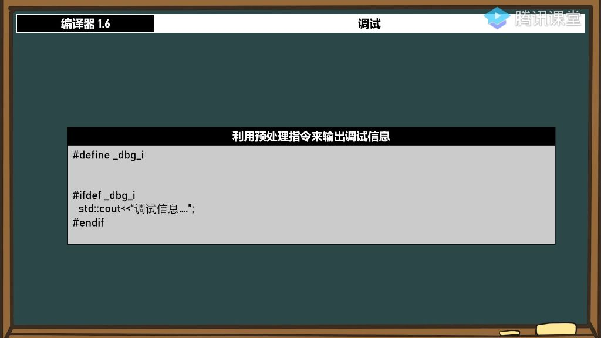

#### 一、编译器调试

##### 1. 调试

###### 1）编码风格建议 

- 

- **错误类型区分**：程序错误分为语法错误和逻辑错误。编译器能直接发现语法错误并给出提示，但对逻辑错误无法直接识别。
- **模块化** 
  - **实现方式**：将功能封装成独立函数，避免将所有代码集中编写。例如显示功能可封装为`show()`函数。
  - **优势**：
    - 提高代码可读性，阅读者能快速理解功能模块
    - 便于调试和维护，比数千行集中编写的代码更易管理
    - 功能边界清晰，每个模块职责明确

- **使用具体意义的函数名和变量名** 
  - **命名原则**：
    - 函数名、变量名、类名、结构体名应直观表达用途
    - 理想情况下无需注释就能通过名称理解功能
    - 避免使用无意义缩写如"d sy"等晦涩命名
  - **效果**：良好的命名习惯能显著提升代码可维护性，降低团队协作成本

- **使用正确的缩进和代码块** 
  - **实践要点**：
    - 使用标准缩进（通常4个空格）区分代码层级
    - 保持代码块结构清晰，支持IDE的折叠功能
    - 避免所有代码左对齐，建立视觉层次关系
  - **重要性**：
    - 正确缩进能明确显示控制结构的嵌套关系
    - 防止if-else等语句的匹配错误
    - 示例显示缩进后的代码调试效率显著提高

- **良好的注释习惯** 
  - **注释必要性**：
    - 即使命名规范，关键逻辑仍需注释说明
    - 方便他人阅读和维护代码
    - 避免时间久远后作者自己也难以理解
  - **注意事项**：
    - 反对"不写注释"的不良示范
    - 重要算法、业务逻辑必须添加注释
    - 注释应简明扼要，避免过度注释

###### 2）调试技术

- 
- **调试工具**：VS2019集成调试器支持断点调试和流程跟踪
- **调试方法**：
  - 通过跟踪变量值变化定位逻辑错误
  - 逐步执行观察程序实际运行路径

###### 3）利用集成调试器

- **VS2019集成调试器**
  - **集成特性**: VS2019自带集成调试器，大多数现代编译器都会集成调试工具
  - **调试入口**: 通过"调试"菜单或快捷键启动调试会话
  - **界面组成**: 包含解决方案资源管理器、局部变量窗口、输出窗口等核心组件
- **断点的作用** 
  - **定义**: 程序执行到断点时会暂停运行，便于检查程序状态
  - **设置方法**: 在代码行左侧点击设置红色断点标记，可设置多个断点
  - **核心功能**:
    - **继续执行**: 恢复程序运行直到下一个断点
    - **单步跟踪**: 逐行执行代码观察变量变化
  - **动态管理**: 调试过程中可随时添加/删除断点
- **逐语句与逐过程** 
  - **逐语句(Step Into)**:
    - 逐行执行代码，会进入函数内部
    - 对应快捷键F11
    - 适用于需要深入分析函数内部逻辑的情况
  - **逐过程(Step Over)**:
    - 执行当前行但不进入函数
    - 对应快捷键F10
    - 适用于确认无问题的函数调用
  - **跳出(Step Out)**:
    - 从当前函数跳出到调用处
    - 对应快捷键Shift+F11
    - 适用于快速退出复杂函数
- **调试 --> 窗口** 
  - **局部变量**:
    - 显示当前作用域内所有变量值
    - 可实时观察变量变化情况
  - **寄存器**:
    - 显示CPU寄存器当前状态
    - 包含EAX、EBX、ECX等主要寄存器
    - 用于底层调试和反汇编分析
  - **自动窗口**:
    - 自动显示相关变量
    - 根据执行位置动态变化
- **反汇编调试** 
  - **进入方式**: 通过调试窗口切换至反汇编视图
  - **功能特点**:
    - 显示代码对应的汇编指令
    - 每条指令对应一个机器操作
    - 可观察寄存器值的变化过程
  - **使用场景**:
    - 分析底层执行逻辑
    - 排查编译器优化问题
    - 研究程序性能瓶颈
  - **调试技巧**:
    - 结合源代码和汇编视图
    - 关注关键跳转指令
    - 监视重要寄存器变化

###### 4）利用其他调试器

- 

- **OllyDbg调试器** 
  - **主要用途**: 逆向工程工具，但本质是功能强大的调试器
  - **适用场景**:
    - 正常代码调试时使用效果较好
    - 查看反汇编代码时特别有用
  - **注意事项**: 常被用于逆向分析等特殊用途，后续课程会专门讲解
- **x96Dbg调试器** 
  - **特点**: 新推出的调试工具
  - **学习建议**: 可自行下载了解，课程后续会详细讲解
- **WinDbg调试器与双机调试** 
  - **主要用途**:
    - 主要用于驱动层调试
    - 支持双机调试模式
  - **双机调试原理**: 使用电脑A调试电脑B的程序
  - **适用场景**: 本机调试困难时使用，如驱动开发调试
- **通过打印地址进行调试** 
  - **方法原理**: 直接打印变量地址和值进行调试分析
  - **优势**:
    - 避免打断程序执行流程
    - 适合复杂调试场景
  - **使用技巧**: 通过观察输出值的变化分析程序行为
- **利用预处理指令输出调试信息**
  - 
  - **实现方法**:
    - 使用`#define`定义调试宏
    - 通过`#ifdef`控制调试信息输出
  - **优势**
    - 发布时只需移除宏定义即可关闭调试输出
    - 调试开关灵活控制
  - **实用技巧**:
    - 为不同调试模块定义不同宏
    - 可分级控制调试信息详细程度
  - **注意事项**:
    - 宏命名应具有明确含义
    - 避免在正式版本中保留调试宏