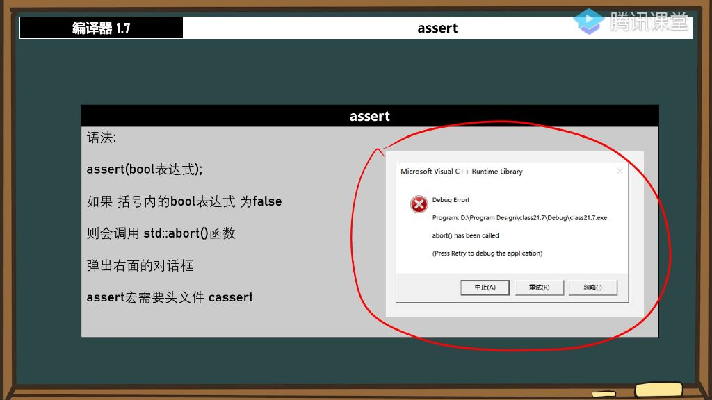
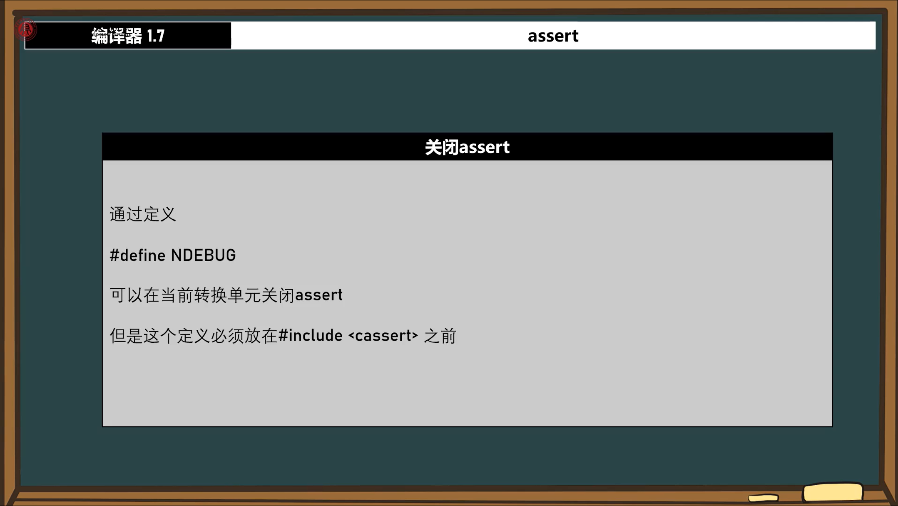
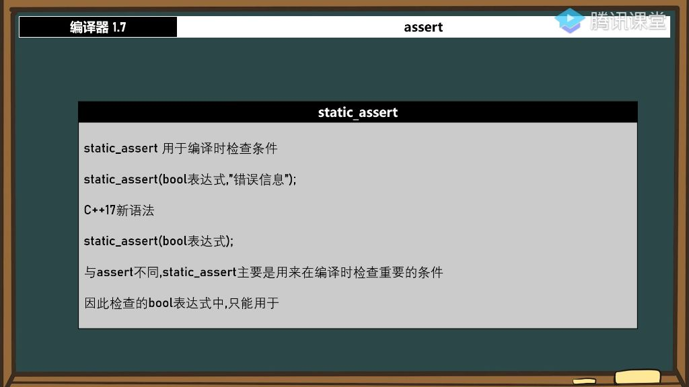

#### 一、编译器

##### 1. 断言

- 
- **定义**：断言(assert)是一个调试用的宏，用于在程序运行时检测条件是否满足
- **头文件**：需要包含<cassert>头文件
- **语法**：`assert(布尔表达式)`，表达式为false时会触发错误
- **错误显示**：会弹出包含"中止/重试/忽略"选项的对话框，显示错误文件和行号

###### 1）断言的实现机理 

- **底层实现**：通过调用`abort()`函数实现错误提示
- **表达式转换**：任何表达式都会被转换为布尔值，如0→false，非0→true
- **调试模式**：默认只在Debug模式下有效，Release模式下自动失效

###### 2）应用案例

- 例题:用户输入整数计算
  - **问题场景**：计算1000除以用户输入的整数，需要防止除数为0
  - **解决方案**：使用assert()检测输入值
  - **错误处理**：
    - 中止：直接结束程序
    - 重试：进入调试模式
    - 忽略：继续执行(可能导致程序崩溃)

###### 3）关闭断言 

- **关闭方法**：在包含<cassert>前定义#define NDEBUG
- **原理**：预处理阶段会替换assert为`(void)0`空操作
- **注意事项**：必须放在头文件包含之前才有效

###### 4）静态断言

- 
- **特点**：在编译时检查条件，只能用于常量表达式
- **语法**：
  - **C++11**：static_assert(布尔表达式, "错误信息")
  - **C++17**：static_assert(布尔表达式)
- **应用场景**：
  - 检查编译环境：static_assert(sizeof(int)==4)  ==> 限制只能在32位平台编译
- **优势**：比动态断言更常用，能提前发现编译期错误