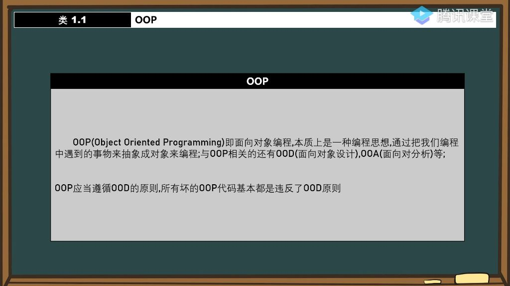
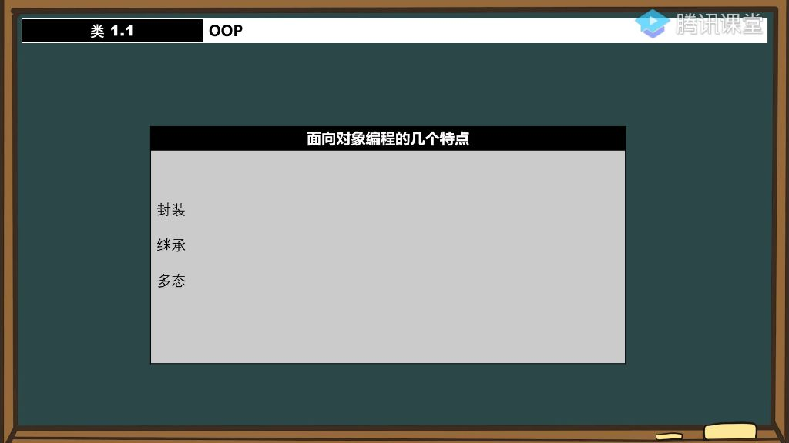
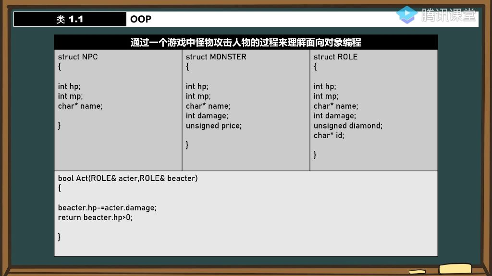
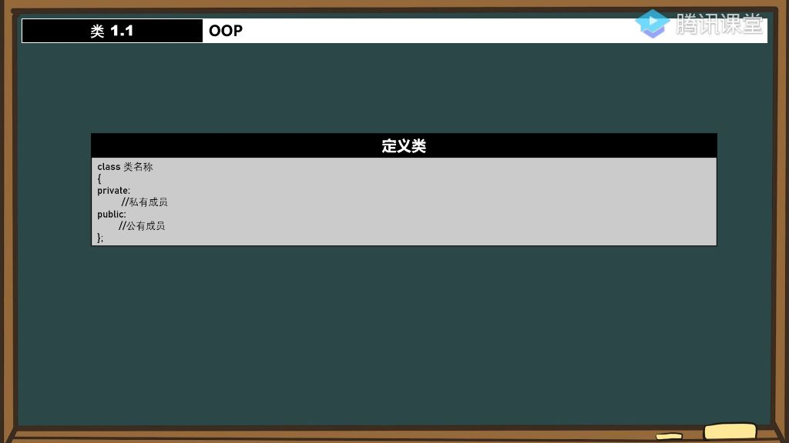
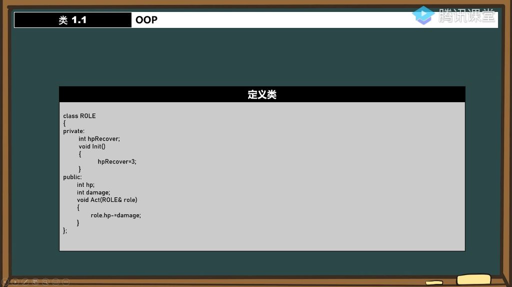

#### 一、类 

##### 1. 面向对象编程

###### 1）面向对象编程的含义

- OOP的概念与误区 
  - 
  - **本质特征**: 面向对象编程(OOP)是一种编程思想，核心是将编程中遇到的事物抽象成对象进行处理
  - **常见误区**:
    - 认为OOP是语言特性（如C++/Java支持OOP）
    - 过度强调语言对OOP的支持程度（如"Java是完全面向对象"的说法）
  - **正确理解**: OOP应视为思想而非工具，其关键在于用对象视角建模现实问题
  - **典型示例**: 游戏角色攻击行为应建模为"对象A.攻击(对象B)"而非"攻击函数(A,B)"
- OOP与语言的关系 
  - **语言支持度**:
    - **C++**：支持OOP但保留过程式特性
    - **Java**：强制OOP范式（万物皆对象）
    - **C语言**：可通过设计模拟OOP（但实现复杂）
  - **设计原则**:
    - 避免"为OOP而OOP"的过度设计
    - 合理使用命名空间等非OOP机制
  - **历史演变**:
    - 50年代概念萌芽 → 90年代成为主流
    - 推动因素：硬件发展、软件复杂度提升
- OOP的历史背景 
  - **发展脉络**:
    - 1950s：概念提出（非主流）
    - 1990s：成为编程范式主流
    - 2000s：理性反思阶段（提出SOLID原则）
  - **相关概念**:
    - OOA（面向对象分析）
    - OOD（面向对象设计）→ OOP应遵循其原则
  - 行业现象:
    - 90年代盲目追捧导致劣质OOP代码
    - 坏代码主因：违反OOD原则而非OOP本身

###### 2）OOP核心特性

- 
- **基本特性**:
  - 封装（信息隐藏）
  - 继承（代码复用）
  - 多态（接口统一）

###### 3）实战案例解析

- 过程式与面向对象对比
  - 
  - **过程式实现**:
    - **缺陷**：行为与对象分离，不符合现实逻辑
  - **面向对象实现**:
    - **优势**：行为归属对象，更符合直觉
  - **设计启示**:
    - 现代大型项目必须采用OOP
    - 但需避免教条主义（如全部强制OOP）

###### 4）面向对象编程的几个特点

- 封装
  - **核心概念**：将数据和操作数据的方法捆绑在一起，并控制对内部数据的访问权限
  - **访问控制**：只暴露必要的数据成员和方法，隐藏内部实现细节。例如NPC结构体中的hp、mp等成员可能需要被隐藏
  - **方法封装**：在结构体/类中定义成员函数（如"打"函数），将相关操作与数据绑定
  - **实际意义**：结构体内部可能需要使用某些数据进行计算，但这些数据不需要对外公开
- 继承 
  - **基本概念**：允许新类（派生类）基于现有类（基类）创建，自动获得基类特性
  - **游戏实例**：
    - NPC（基类）：包含hp、mp、name等基础属性
    - MONSTER（派生类）：继承NPC属性，新增damage、price属性
    - ROLE（派生类）：继承NPC属性，新增damage、diamond、id属性
  - **优势**：避免重复定义共性属性，只需专注差异部分的设计
  - **现实类比**：如同生物分类体系，下级分类继承上级分类的特征，例如狗是动物。
- 多态
  - **概念特点**：同一操作作用于不同对象可以产生不同行为
  - **实现基础**：建立在继承关系之上，通过虚函数等机制实现
  - **实际应用**：例如不同怪物类型对"攻击"行为的差异化实现
  - **记忆要点**：常被幽默地称为"变态"，强调其灵活多变的特性
- 多态 
  - 多态与变态的类比 
    - 生物变态实例：毛毛虫通过变态过程转变为不同形态的昆虫，展示生物体在不同生命阶段的形态变化。
    - 编程类比：面向对象编程中，对象也可以表现为不同形态，如同人类可被分类为生物→动物→哺乳动物→灵长类→人，每个分类层级都正确但视角不同。
  - 面向对象编程中的多态 
    - 多态实现原理
      - 基础结构体：
        - struct NPC：包含基础属性`hp`,`mp`,`name`
        - struct MONSTER：继承NPC并扩展`damage`，`price`属性
        - struct ROLE：继承NPC并扩展damage，diamond，id属性
      - 行为函数：bool Act(ROLE& acter, ROLE& beacter)实现攻击逻辑：beacter.hp -= acter.damage
    - 类型转换实践
      - 强制类型转换：通过(NPC*)指针转换，使不同角色类型能共用同一个Act()函数
      - 实例验证：
        - 角色张三（伤害50）攻击李四：1000HP - 50 = 950HP
        - 怪物奥特曼（伤害100）攻击李四：1000HP - 100 = 900HP
      - 设计优势：避免为每种角色组合单独编写攻击函数，减少代码冗余
    - 多态本质理解
      - 核心思想：同一操作作用于不同对象产生不同行为，如同生物分类中的"人"在不同语境下的正确表述

- C语言多态：

  - 实现方式：
    - 通过结构体首属性对齐实现伪继承
    - 利用指针强制转换实现伪多态

  - 关键区别：与真正的面向对象语言相比，C语言需要手动处理类型转换和内存布局

    

- 类的定义与成员访问权限 
  - 
  - **基本语法**：使用class关键字定义类，格式为class 类名称{private: //私有成员 public: //公有成员};
  - **成员分类**：
    - **私有成员**：在private后声明，只能被类内部的成员函数访问
    - **公有成员**：在public后声明，可以被类外部的代码访问
  - **历史背景**：C++为了兼容C语言保留了struct，但struct最初不支持成员函数，后来逐步与class功能趋同
  - **设计建议**：
    - 纯数据结构时推荐使用struct
    - 需要封装数据和功能时使用class
    - struct默认成员是public的，class默认是private的
- struct与class的区别 
  - 
  - **默认访问权限**：
    - **struct**：成员默认是public的
    - **class**：成员默认是private的
  - **访问控制**：
    - **public**：后面声明的成员可以被外部访问
    - **private**：后面声明的成员只能被类内部访问,保护数据安全，防止外部直接修改关键数据.
  - **混合声明**：可以在类中多次使用public和private关键字，灵活控制各部分访问权限
  - **初始化问题**：直接初始化类对象会报错"初始设定的项目太多"，需要通过构造函数解决（下节课内容）
  - **底层原理**：C++的类机制底层实现与面向过程编程类似，只是语法层面的封装

