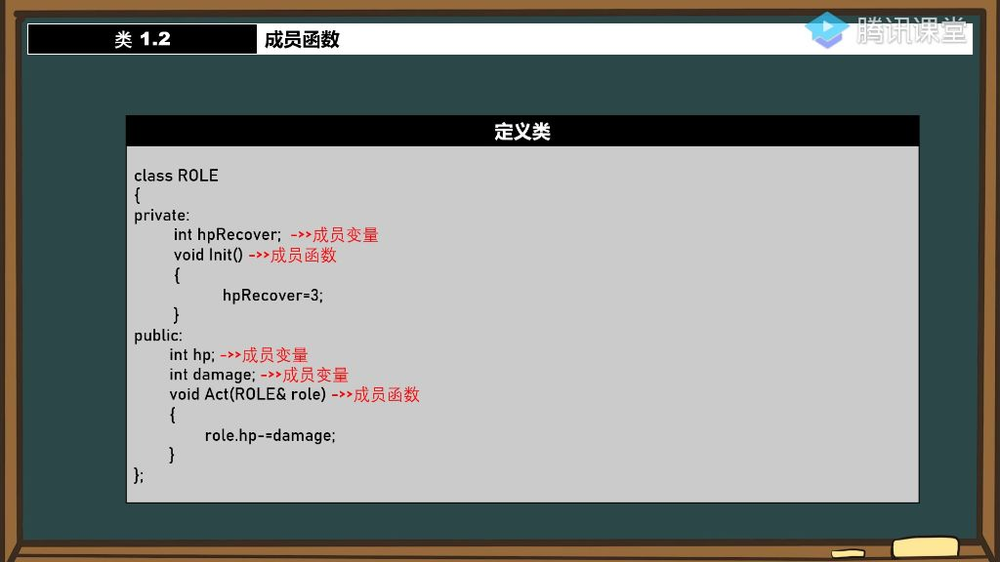
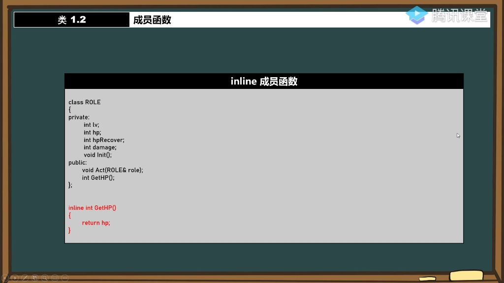
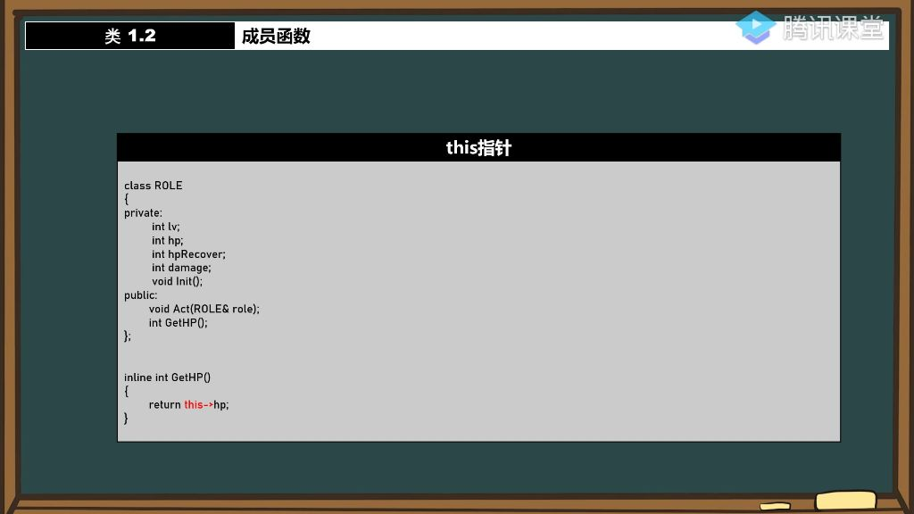

#### 一、成员函数

##### 1. 类成员函数与成员变量

- **基本概念**：类由成员变量和成员函数构成，成员变量表示对象的属性，成员函数表示对象的行为方法。
- **类比说明**：以人为例，单双眼皮是成员变量（属性），谈恋爱、上课等行为是成员函数（方法）。
- **代码示例**：在class ROLE中，hp、damage是成员变量，Init()、Act()是成员函数。

##### 2. 访问权限与封装

- 
- **private与public区别**：
  - **private**：如同人体内脏，不对外公开（如hpRecover）
  - **public**：如同外貌特征，可公开访问（如hp、damage）
- **本质**：访问权限不影响成员归属，private和public的变量/函数都属于类的成员。

##### 3. 作用域与类定义

- **作用域规则**：
  - 成员变量/函数的作用域限定在类内部
  - 外部访问需通过实例化对象
- **类外定义成员函数**：
  - 需使用作用域限定符`::`（如ROLE::Init()）
  - 类内仍需保留函数声明
- **底层原理**：与命名空间作用域机制类似，编译器通过限定符识别成员归属

##### 4. 类的大小计算

- **内存分配原则**：
  - 仅成员变量占用实例内存空间（如3个int变量占12字节）
  - 成员函数不占用实例内存，所有实例共享同一函数代码段
- **空类特性**：
  - 空类默认占1字节，用于区分不同实例的内存地址
  - 编译器自动分配最小内存保证实例可寻址
- **验证方法**：可通过sizeof()运算符查看类/对象实际大小

##### 5. 类与结构体的关系

- **本质相同**：都是自定义类型的"蓝图"，通过实例化创建具体对象
- **内存计算**：类的大小计算规则与结构体完全一致（虚函数除外）
- **设计思想**：类作为面向对象的核心，既包含数据也包含操作数据的方法

##### 6. 类的实际应用

###### 1）类的定义与使用

- **声明与定义分离**：类定义通常采用头文件声明、源文件实现的方式，头文件包含类声明（可被多次包含），源文件包含具体实现（只能定义一次）。
- **创建类文件**：在IDE中添加类时会生成头文件(.h)和源文件(.cpp)，文件名通常与类名相同，但可自定义。
- **使用方式**：使用时只需包含头文件，源文件需在工程中或通过库文件链接。

###### 2）inline成员函数

​	

- **定义位置**：推荐将inline成员函数定义(实现)在头文件中，避免编译时到处查找实现。
- **重写原则**：当声明和定义中同时指定inline时，以定义处的inline声明为准，类似函数默认参数的规则。
- **适用场景**：简单函数如getter/setter适合定义为inline，例如获取HP值的函数：inline int GetHP() { return hp; }
- **封装优势**：通过private隐藏数据成员，提供public的inline接口函数，既保证封装性又不损失性能。

###### 3）this指针

- **本质**：
  - 指向当前对象实例的指针，用于区分成员变量与局部变量。
  - this指针是类的非静态成员函数的隐含参数，在成员函数内部通过this->成员或(*this).成员访问成员。
- **应用**：
  - 比较函数：实现对象比较时，通过this指针获取调用者信息。
  - 链式调用：通过返回*this引用实现方法链式调用。
    - **实现原理**：返回当前对象的引用，避免值返回导致的拷贝开销。
    - **内存效率**：相比值返回，引用返回不产生临时对象，效率更高。
    - **设计优势**：通过this指针和引用返回实现的链式调用，代码更简洁流畅，是面向对象编程的常见模式。