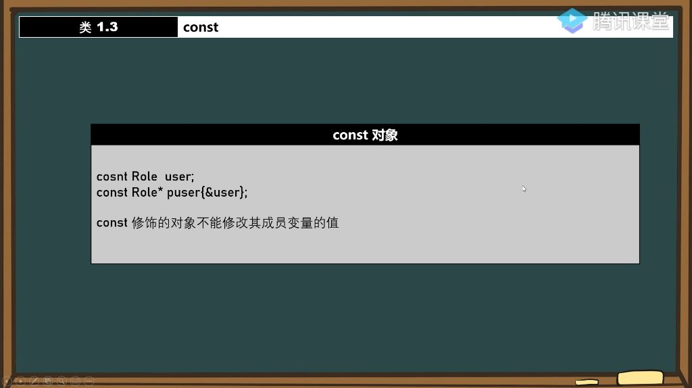
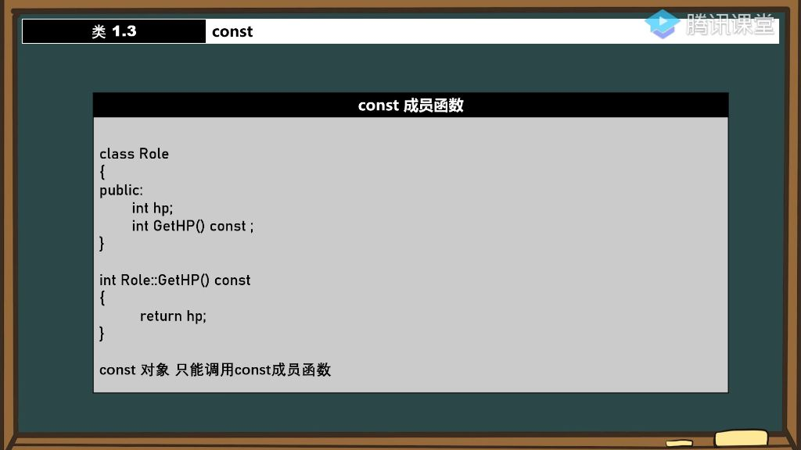
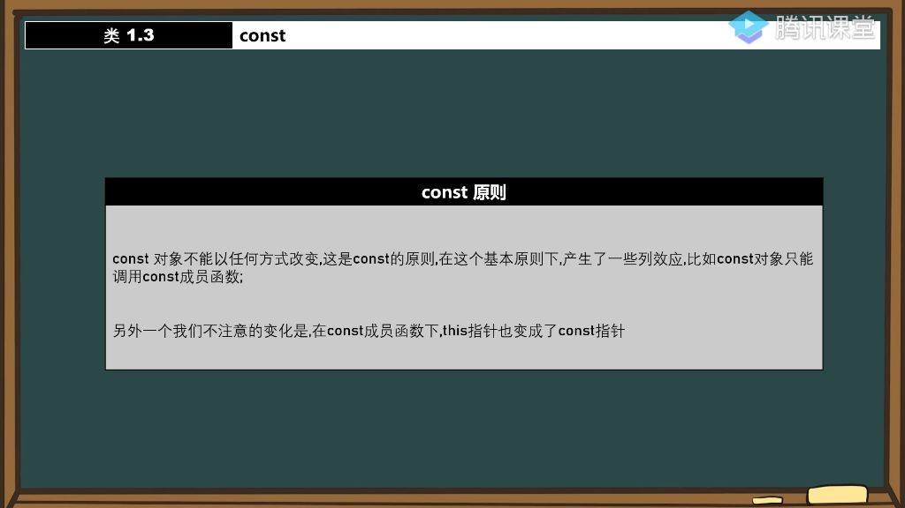
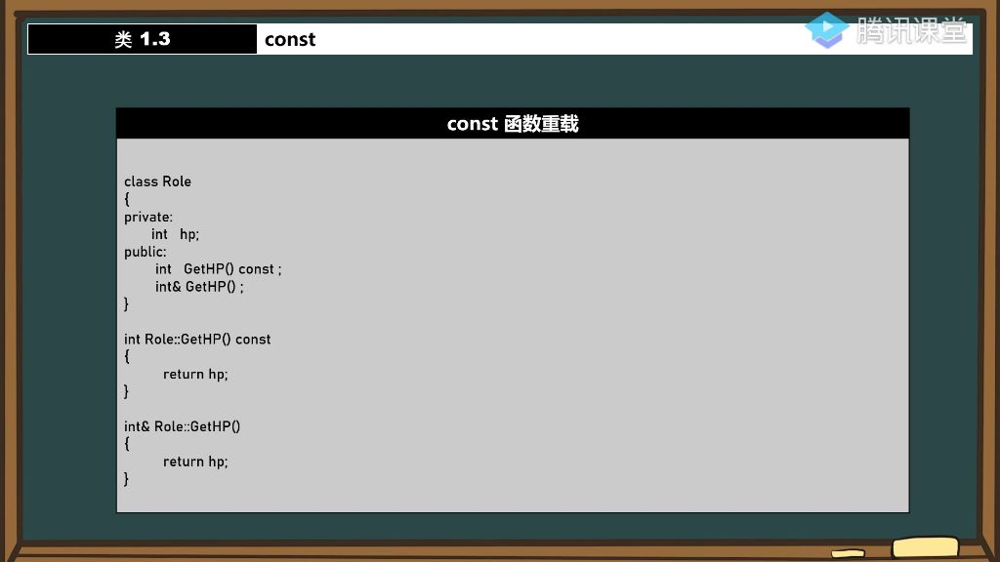
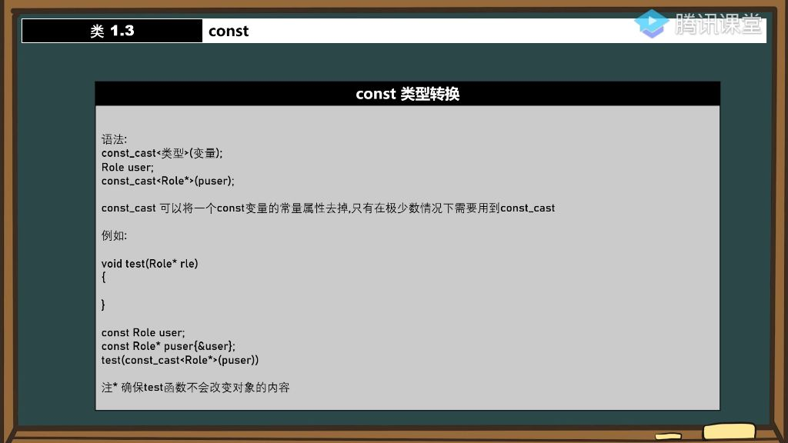
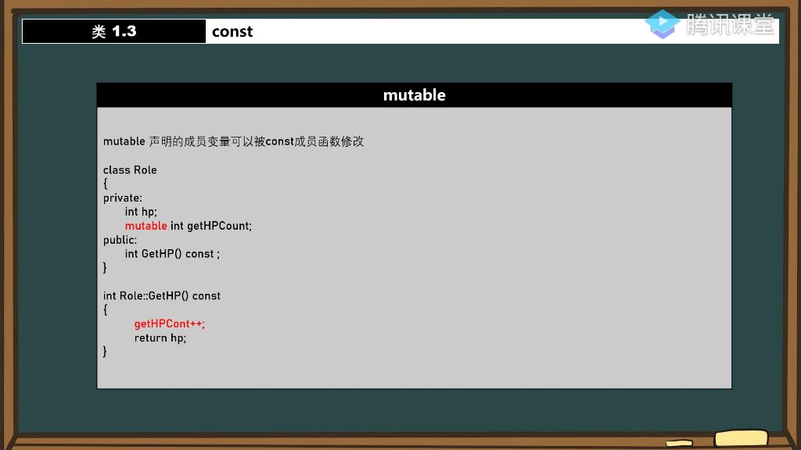

#### 一、类

##### 1. const对象

###### 1）const对象定义

- **基本特性**：const修饰的对象不能修改其成员变量的值，如const Role user中的user对象。
- **内存保护机制**：const对象的内存空间及其成员变量（如user.lv、user.damage）均不可修改。
- **指针关联性**：
  - 使用const Role* puser指针时，不能通过指针修改对象成员。
  - 这与指针本身的const性质有关，而非指向的对象是否为const; 即, const指针即使指向非const对象（如monster）也无法修改成员
- 
- **指针二要素**：指针行为由其**类型**和指向**地址**共同决定。

###### 2）const对象无法调用成员函数问题 

- **调用限制**：const对象只能调用被const修饰的成员函数，普通成员函数会被编译器隐藏。
- **const成员函数声明**：在函数声明后加const，表示该函数不会修改成员变量。
- **函数修饰位置**：const关键字必须放在函数参数列表后，放在前面会变成修饰返回值类型。
- **双向兼容性**：const成员函数既可以被const对象调用，也可以被普通对象调用。
- **设计原理**：编译器通过限制const对象的函数调用权限，确保成员变量的不可修改性。

##### 2. const成员函数

###### 1）const成员函数定义 

- 
- **语法形式**：在成员函数声明和定义后添加const关键字;
- **调用限制**：const对象只能调用const成员函数;
- **内部限制**：const成员函数内部不能修改任何成员变量，如尝试修改hp会导致编译错误;
- **函数调用限制**：const成员函数内部不能调用非const成员函数，防止间接修改成员变量.
- **返回值限制**：const成员函数不能返回非const引用，如int& GetLv() const会导致编译错误
- **安全返回**：可以返回const引用或值类型，如const int& GetLv() const或int GetLv() const
- **推荐做法**: 对于不修改成员变量的函数，建议一律加上const修饰符，这样const对象也能调用这些函数。

###### 2）const对象原则

- 
- **核心原则**：const对象不能以任何方式被修改，这是所有const规则的基础
- **衍生效应**：
  - const对象只能调用const成员函数
  - const成员函数内的this指针变为const指针，例如：const Role*
  - 通过this指针修改成员变量会被禁止，如this->damage = 2会导致编译错误
- **指针类型变化**：在const成员函数内，this指针从`Role*`变为`const Role*`
- **修改限制**：尝试通过this指针修改成员变量会提示"表达式必须是可修改的左值"错误
- **设计思想**：所有限制都服务于const的核心原则，防止对象状态被意外修改
- **引用返回**：const成员函数可以返回const引用，如const int& GetLv() const
- **值返回**：更安全的做法是直接返回值类型，如int GetLv() const
- **编码规范**：避免通过函数返回值直接修改对象状态，应使用专门的setter函数

##### 3. const函数重载

###### 1）引入const函数重载的问题

- 
- **问题背景**: 当const对象调用成员函数时，编译器会阻止调用可能修改成员变量的函数，即使该函数实际上并未修改任何成员变量。
- **编译器行为**: 编译器采取保守策略，只要函数未被const修饰，const对象就不能调用，不管函数内部是否真的修改了成员变量。

###### 2）利用函数重载解决const对象调用成员函数的问题

- **解决方案**: 通过函数重载提供const和非const两个版本的成员函数。
- **调用规则:**
  - const对象自动调用const版本
  - 非const对象自动调用非const版本

##### 4. const类型转换 

###### 1）const类型转换的应用场景 

- **典型场景**：当函数参数设计时忘记加const限定，但需要传递const对象时使用。例如库函数设计者忘记加const限定，使用者无法修改源码的情况。
- **必要性**：强制类型转换可以解决参数类型不匹配的问题，如void test(Role* rle)需要接收const Role*参数时。

###### 2）强制类型转换（C语言方式）

- **语法形式**：(目标类型)变量，如(Role*)puser
- **效果**：直接去除const属性，允许通过指针修改原const对象内容
- **注意事项**：这种转换方式简单暴力，但可能破坏const语义的安全性

###### 3）const_cast类型转换

- 
- **标准语法**：const_cast<目标类型>(变量)，如const_cast<Role*>(puser)
- **作用机制**：专门用于去除const属性，比C风格转换更明确表达意图
- **典型用法**：将const指针转换为非const指针传递给函数参数，如test(const_cast<Role*>(puser))

###### 4）类型转换的安全性问题

- **核心原则**：转换前必须确认被调函数不会修改对象内容
- **风险提示**：与普通常量不同，const对象通过转换后可能被真实修改
- **使用建议**：非必要不使用，使用时必须确保函数行为的安全性

##### 5. mutable

###### 1）mutable关键字的作用 

- **突破限制**：使被修饰变量不受const成员函数的修改限制
- **语法特征**：声明在成员变量前;
- **本质区别**：不同于const_cast，它是在类设计阶段就规划好的可变状态

###### 2）mutable关键字的应用场景 

- **调试统计**：记录成员函数调用次数，如mutable int getDamageCount
- **性能监控**：跟踪对象方法执行频率
- **状态标记**：在const方法中更新不影响对象逻辑状态的辅助标记

###### 3）典型案例：调试时记录函数调用次数

- **实现方式**：在const成员函数中递增mutable计数器
- **设计意义**：既保持方法const语义，又能实现调用统计功能

###### 4）mutable关键字的使用总结

- **使用原则**：仅用于确实需要修改的辅助性成员变量
- **注意事项**：不能滥用，否则会破坏const成员函数的设计初衷

#### 二、类与对象初始化问题

##### 1. const对象初始化问题

- **const对象特性**: 必须通过构造函数进行初始化，编译器生成的默认构造函数无法可靠初始化const成员。

##### 2. 指针与对象操作

- **const指针操作**: 使用const Role* puser指针时，只能调用const成员函数。
- **普通对象操作**: 非const对象可以调用所有公有成员函数，包括const成员函数。
- **类型转换技巧**: 使用const_cast可以临时去除const属性。

