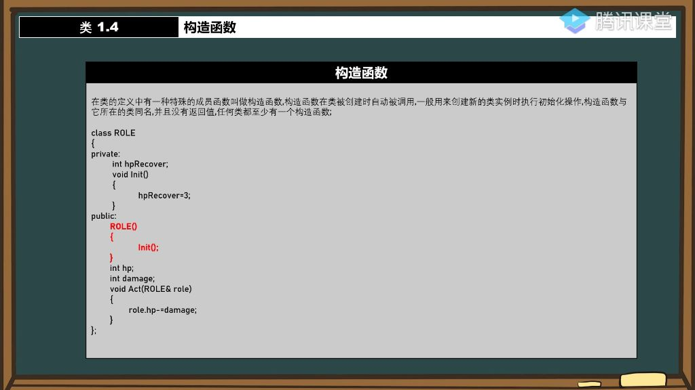
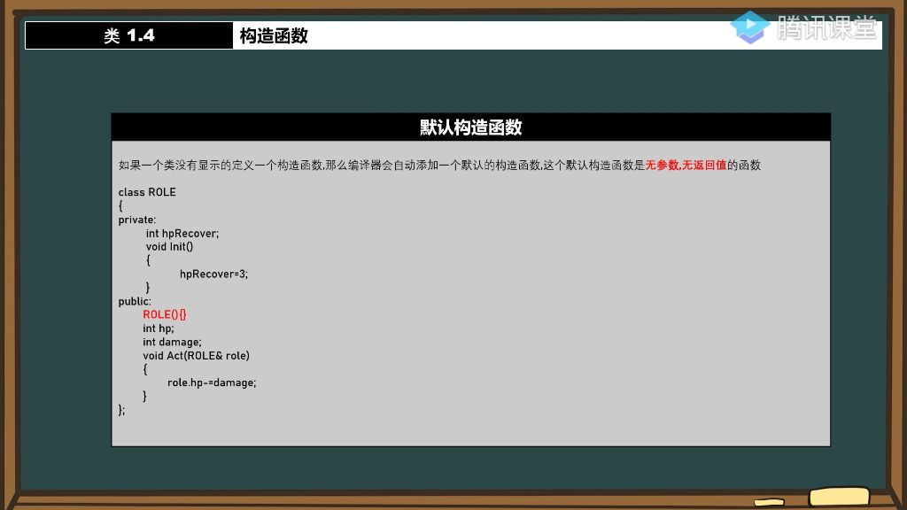
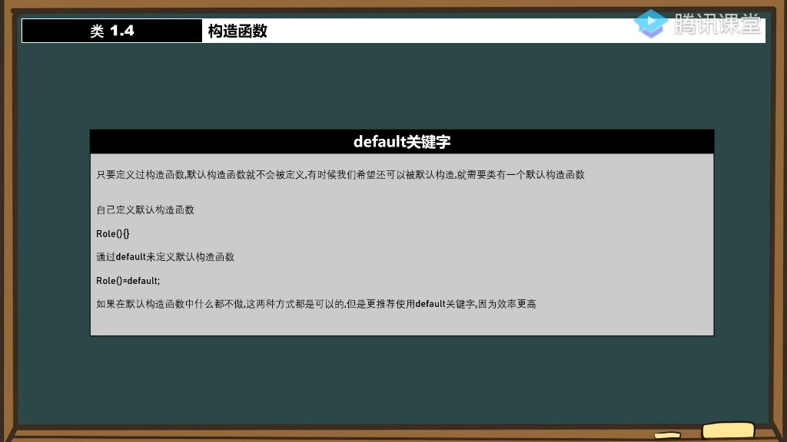
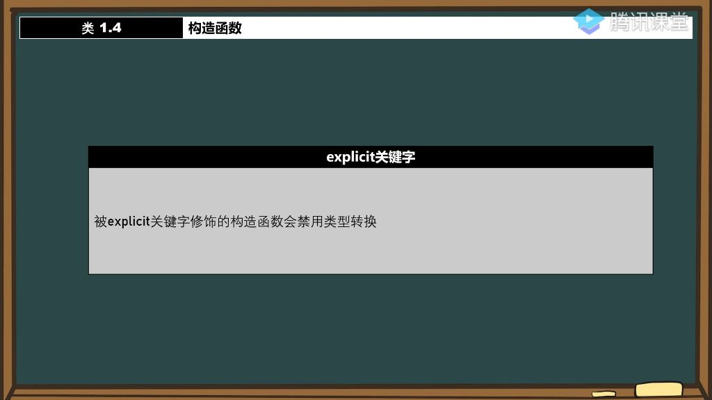

#### 一、构造函数

##### 1. 构造函数的概念

- 

###### 1)构造函数的写法

- **命名规则**: 必须与类名完全相同
- **返回值**: 不能有任何返回值声明
- **默认构造函数**: 当类中没有显式定义构造函数时，编译器会自动生成一个默认构造函数

###### 2)构造函数的作用

- **自动调用**: 构造函数在对象创建时自动执行，无需手动调用。

- **初始化必要性**:  避免成员变量出现不确定值（未初始化的变量）。
- **重载特性**: 可以定义多个构造函数，通过参数不同实现重载
  - **无参构造函数**
  - **有参构造函数**
  - **拷贝构造**:通过另一个同类对象初始化新对象
- **参数传递方式**: 推荐使用小括号初始化，不推荐大括号，例如：T t1(100,200),而不是T t1{100,200};
- **调用顺序验证**: 可以通过输出语句验证具体调用了哪个构造函数

###### 3）构造函数的注意事项

- **拷贝构造限制**: 不能直接使用`T(Tt)`形式，会导致无限递归
  - 原因：参数T本身需要构造，形成循环依赖
- **正确写法**: 应使用引用形式`T(constT&t)`
- **初始化方式**:
  - **直接赋值**：`hp=t.hp;`
  - **通过getter方法**：`mp=t.GetMP();`

##### 2. 默认构造函数

- **编译器行为**：
  - **自动添加**：当类未定义任何构造函数时，编译器会自动添加默认构造函数
  - **默认特性**：自动添加的默认构造函数无参数、无返回值且函数体为空
  - **示例说明**：如ROLE类未定义构造函数，但实际存在编译器生成的默认构造函数
  - 
- **特殊情况**：
  - **多构造函数**：一个类可以存在多个构造函数（重载）
  - **编译器差异**：不同编译器对默认构造函数的处理可能略有不同
  - **初始化问题**：默认构造函数不会自动初始化成员变量，可能导致未定义行为

##### 3. default关键字

- 
- **核心机制**：
  - **构造函数定义影响**：只要定义了任意构造函数，编译器就不再自动生成默认构造函数
  - **显式需求**：当需要保留默认构造能力时，必须显式声明
- **使用方式**：
  - **语法格式**：类名() = default;
  - **效率优势**：比手动定义空构造函数效率更高
  - **应用场景**：适用于不需要特殊初始化逻辑的情况
- **注意事项**：
  - **重定义问题**：不能与默认参数的构造函数同时存在，会导致调用歧义
  - **代码冲突**：当成员变量有默认值时，需注意与默认构造函数的兼容性
  - **最佳实践**：优先使用default而非手动定义空构造函数

##### 4. 自己定义默认构造函数

- **实现方式**：
  - **显式定义**：手动编写无参构造函数 `类名(){}`
  - **初始化代码**：可在构造函数体内添加初始化逻辑
  - **多构造函数共存**：可与带参构造函数同时存在
- **与default对比**：
  - **功能差异**：手动定义可包含初始化代码，default只能生成空实现
  - **选择标准**：无初始化代码时优先用default，有初始化需求时用手动定义
- **常见问题**：
  - **构造失败**：定义了带参构造函数后，尝试默认构造会编译失败
  - **解决方案**：通过default或手动定义恢复默认构造能力
  - **错误示例**：同时存在默认构造函数和带默认参数的构造函数会导致重定义错误

##### 5. explicit关键字

- 
- **核心功能**：被explicit修饰的构造函数会禁用隐式类型转换
- **禁用机制**：防止编译器自动调用构造函数进行不期望的类型转换

###### 1）隐式转换示例 

- **问题场景**：定义比较函数IsBig(Role rl)时，传入整数值520仍能编译通过
- **转换过程**：
  - 步骤1：编译器发现需要Role类型参数
  - 步骤2：自动调用Role(int)构造函数创建临时对象
  - 步骤3：用临时对象执行比较操作
- **验证方法**：在构造函数中添加输出语句std::cout << lv << "Role(int)\n"可观察到转换过程

###### 2）explicit解决方案

- **使用方法**：在构造函数声明前添加explicit关键字
- **效果验证**：
  - 直接传入整数值520会导致编译错误
  - 错误信息显示"不存在从int到Role的适当构造函数"
- **设计意义**：
  - **安全控制**：避免意外的类型转换导致逻辑错误
  - **代码明确**：强制要求显式构造对象，提高代码可读性
- **使用建议**：
  - 默认给单参数构造函数添加explicit
  - 仅在确实需要隐式转换的场景才省略explicit

