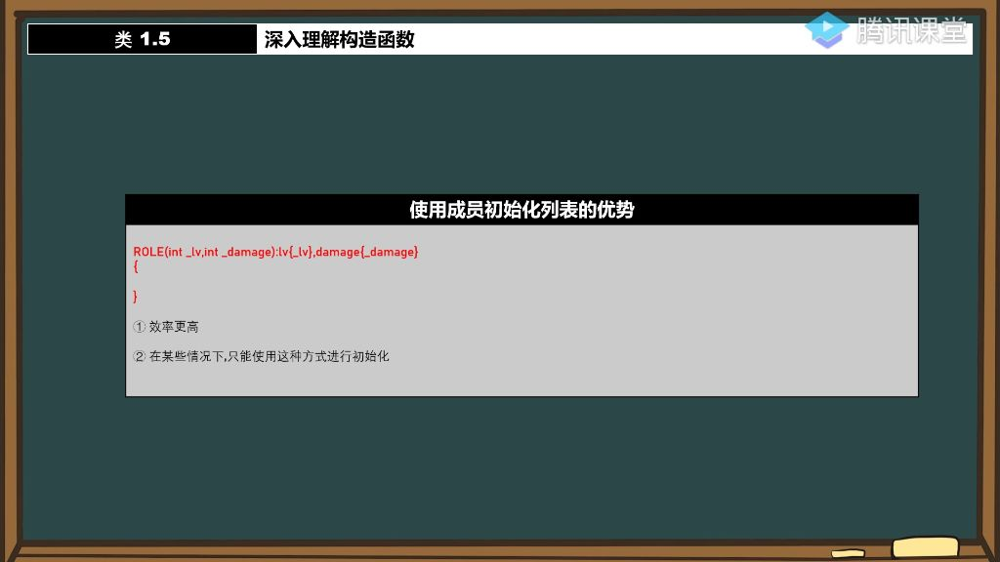
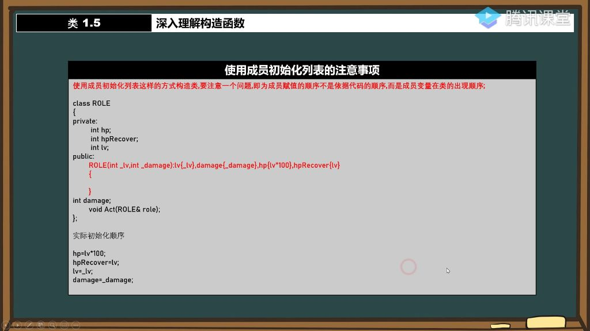
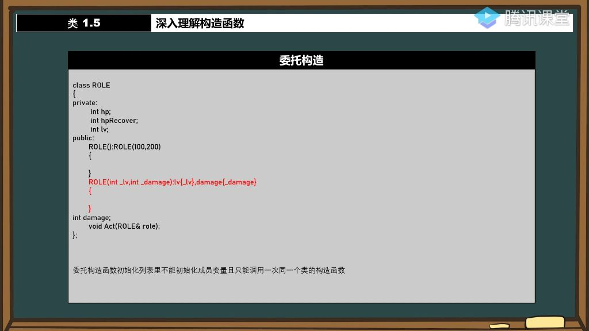
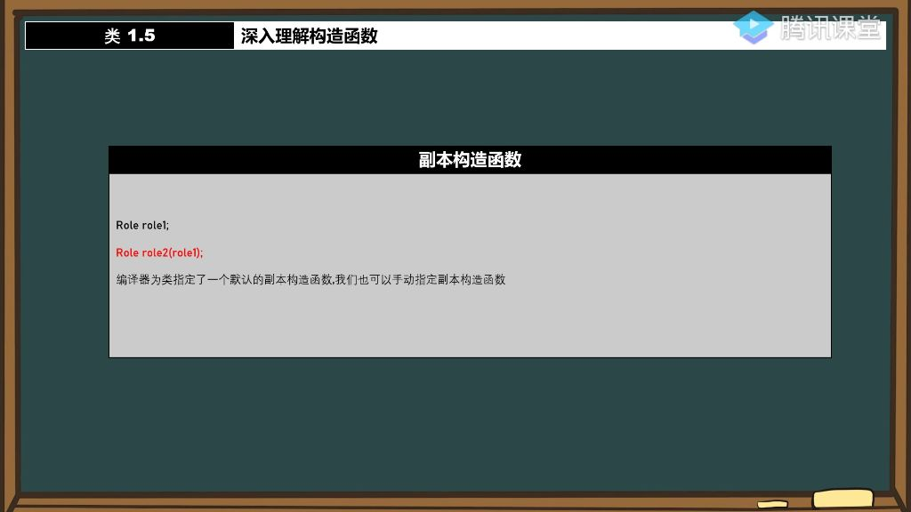

#### 一、使用成员初始化列表

##### 1. 使用成员初始化列表的优势

- 

###### 1）效率更高

- **执行时机差异**：
  - **传统方式**：先分配内存空间 → 设置默认值（如lv=100,damage=200）→ 在构造函数体内重新赋值（如lv=300,damage=500）
  - **成员初始化列表**：直接在内存分配阶段完成初始化（直接设为300和500），跳过了默认值设置和二次赋值的步骤
- **性能对比**：
  - 传统方式需要执行两次赋值操作（默认值+构造函数赋值）
  - 成员初始化列表仅需一次初始化操作
- **底层原理**：
  - **类实例化过程**：内存分配 → 成员初始化 → 构造函数执行
  - **成员初始化列表**在"成员初始化"阶段完成工作，而传统方式将初始化工作推迟到"构造函数执行"阶段

###### 2）必须使用的情况

- **强制使用场景**：
  - 当类包含const成员变量时
  - 当类包含引用类型成员时
  - 当类成员是自定义类类型且该类没有默认构造函数时
  - 在继承关系中初始化基类成员时
- **特殊类型处理**：
  - 对于结构体或类类型的成员变量，往往必须使用初始化列表
  - 基本数据类型（如int）两种方式均可，但推荐使用初始化列表
  - 
- **初始化顺序规则**：
  - 初始化顺序与初始化列表中的书写顺序无关
  - 实际初始化顺序严格按照成员变量在类定义中的声明顺序
- **工程实践建议**：
  - 始终保持初始化列表顺序与成员声明顺序一致
  - 对于有依赖关系的成员变量，要确保被依赖的变量先声明
  - 在团队协作中应明确约定成员变量的声明顺序规范

##### 2. 使用成员初始化列表的缺点

- **核心缺点**：初始化顺序与成员变量声明顺序强相关，可能导致依赖关系错乱

###### 1）成员初始化顺序问题 

- 顺序规则：初始化顺序严格遵循类定义中成员变量的声明顺序（从上往下）

###### 2）成员变量依赖问题

- 
- **执行流程**：
  - 分配内存空间
  - 立即执行hp=lv*100（此时lv未初始化）
  - 执行hpRecover=lv（仍为随机值）
  - 最后初始化lv=_lv和damage=_damage
- **设计建议**：
  - 避免在初始化列表中使用未初始化的成员变量进行计算
  - 相互依赖的成员变量应调整声明顺序或改用构造函数内赋值
- **本质矛盾**：
  - 在内存分配后立即执行初始化，未初始化的依赖变量会导致计算异常
  - 效率优势（直接内存写入）与顺序强约束形成天然矛盾

##### 3. 委托构造

###### 1）委托构造的定义与理解

- 
- **基本概念**：委托构造是指一个构造函数通过调用同一个类的其他构造函数来完成部分或全部初始化工作。
- **核心思想**：通过代码复用减少重复初始化逻辑，提高代码可维护性。

###### 2）委托构造的执行顺序

- **执行流程**：
  - 先执行被委托的构造函数
  - 再执行委托构造函数的主体部分

###### 3）委托构造的注意事项

- **关键限制**：
  - 单一委托原则：一个构造函数只能委托一个其他构造函数，不能链式委托多个。
  - 初始化列表限制：在委托构造函数的初始化列表中，除了被委托的构造函数外，不能初始化其他成员变量。

##### 4. 副本构造函数

- 

###### 1）副本构造函数的定义

- **基本概念**：副本构造函数是一种特殊的构造函数，用于通过已有对象初始化新对象，如Role role1; Role role2(role1);。
- **调用时机**：当用一个已存在的对象初始化新对象时自动调用。
- **语法特点**：参数必须是同类型对象的引用，通常为const引用以防止修改原对象。

###### 2）编译器默认副本构造函数

- **默认行为**：编译器会自动为类生成默认副本构造函数，即使未手动定义。
- **功能说明**：默认副本构造函数会逐个复制原对象的所有成员变量到新对象。
- **验证方法**：通过调试查看构造函数调用情况，可观察到编译器隐式添加的副本构造函数。

###### 3）手动指定副本构造函数

- **自定义需求**：当需要控制复制过程（如只复制部分成员）时，需手动定义副本构造函数。
- **注意事项**：
  - 必须使用引用参数，否则会导致无限递归调用（如Role(Role role)会不断调用副本构造函数）。
  - 类内部可以访问同类对象的私有成员，例如 ，副本构造函数。
- **副本构造函数的特殊权限**
  - **私有成员访问**：在副本构造函数中可以访问同类对象的私有成员（如role.hp），这是类内部的特权。
  - **对比说明**：普通函数无法访问其他对象的私有成员，但副本构造函数作为成员函数可以。
- **初始化与赋值的区别**
  - **初始化调用**：Role userA = user;和Role userA(user);都会调用副本构造函数。
  - **赋值操作**：已构造对象使用=时（如userA = user;）调用的是赋值运算符而非副本构造函数。
  - **本质区别**：初始化发生在对象创建时，赋值发生在对象已存在时。

###### 4）关键注意事项

- **成员初始化列表**：副本构造函数的成员初始化在构造函数体执行前完成。
- **默认行为覆盖**：手动定义副本构造函数后，编译器不再提供默认实现。
- **深拷贝问题**：默认副本构造函数进行浅拷贝，若类包含指针成员需手动实现深拷贝。