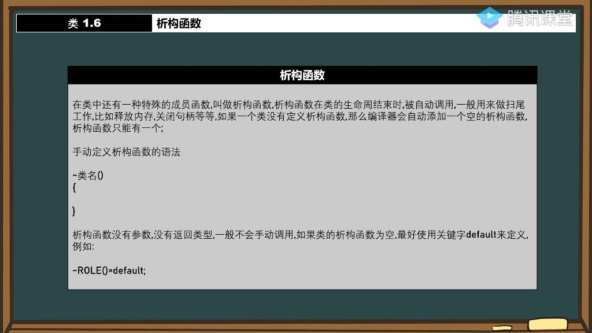

#### 一、析构函数

##### 1. 析构函数的概念

###### 1）析构函数定义

- 
- **特殊成员函数**: 析构函数是类中与构造函数对应的特殊成员函数，英文名为"destructor"，直译为"破坏者"，负责在对象生命周期结束时执行清理工作。
- **命名规则**: 使用波浪线加类名定义，如 `∼Role()`，表示与构造函数相反的操作。
- **自动调用机制**: 当对象离开作用域或被显式删除时自动调用，无需手动触发。

###### 2）析构函数的作用

- **资源释放**: 主要用于释放动态分配的内存（如new创建的数组）、关闭文件句柄、断开网络连接等"扫尾工作"。
- **内存泄漏防范**: 若不定义析构函数释放动态内存，仅会回收指针本身占用的4字节，导致实际分配的内存泄漏。
- **系统资源管理**: 可处理Windows API中的句柄关闭、socket连接终止等系统级资源回收。

###### 3）析构函数被自动调用的时间

- **生命周期终点**: 当对象所在代码块执行完毕（如函数结束、循环退出）时自动调用。
- **销毁顺序:** 在局部作用域中创建的对象遵循"后进先出"的销毁顺序。

###### 4）动态分配内存

- **典型应用场景**: 类中包含指针成员时（如int* array），应在构造函数中用new分配内存（如array = new int[100]），在析构函数中用delete[]释放。
- **必要性**: 若未定义析构函数释放内存，仅会回收指针变量本身（4字节），而不会释放指针指向的100×4字节内存空间(内存泄漏)。

###### 5）编译器自动添加空的析构函数

- **默认行为**: 当类未显式定义析构函数时，编译器会自动生成一个空实现的析构函数。
- **优化建议**: 对于空析构函数，推荐使用 `∼Role()=default`语法明确声明，比完全省略定义或写空函数体更规范。

###### 6）手动定义析构函数的语法

- **语法特征**： 无返回值类型、无参数列表，如`∼Role(){}`。
- **唯一性限制**: 由于没有参数重载的可能，每个类只能有一个析构函数。

###### 7）应用案例

- **std::string原理**: 标准库字符串类内部使用析构函数管理动态分配的字符数组内存。
- 实践建议: 可模仿实现简易字符串类，在析构函数中释放字符数组内存。

##### 2. 编译器自动定义的内容

- **三默认函数**:
  - 默认构造函数（无参构造）
  - 默认拷贝构造函数
  - 默认析构函数
- **隐式行为**: 即使类定义看似简单（如仅包含int成员），编译器也会在背后自动生成这些基础函数。