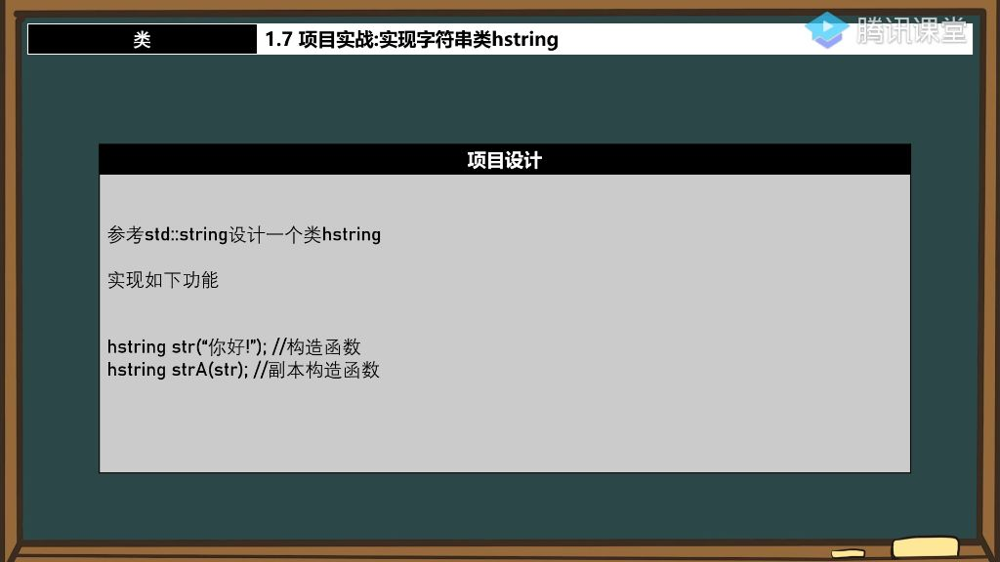

#### 一、类

##### 1. 项目实战

###### 1）项目设计

- 
- **项目目标**：参考std::string设计自定义字符串类hstring
- **核心功能**：
  - 构造函数：hstring str("你好！");
  - 副本构造函数：hstring strA(str);
- **设计意义**：在特殊项目（如安全敏感项目）中避免使用标准库，实现轻量级自定义字符串类。

###### 2）构造函数和显示功能实现

- **成员变量**：使用char* c_str作为字符串存储指针
- **显示方法**：通过Show()方法返回字符指针
- **内存管理**：构造函数分配内存后必须实现析构函数释放内存。
- **使用内存拷贝实现字符串复制** 
  - 实现步骤：
    - 计算源字符串长度len
    - 为目标字符串分配len+1字节内存
    - 使用memcpy复制字符串内容

###### 3）副本构造函数实现

- 实现用hstring对象初始化新对象的功能
  - 实现方式：通过构造函数完成对象间的数据复制
- **默认副本构造函数问题探讨** 
  - 问题本质：默认副本构造函数执行浅拷贝
  - 具体表现：
    - 内存共享：两个对象的 `c_str`指向同一内存区域
    - 重复释放：析构时对同一内存进行多次释放导致错误
  - 错误原因：
    - 第一次释放后内存已归还系统
    - 第二次释放时访问非法内存地址
  - 解决方案：自定义构造函数 
    - 实现方法：
      - 为每个对象分配独立内存空间
      - 通过`memcpy`进行数据复制
    - 优势：
      - 避免内存共享问题
      - 确保每个对象拥有独立资源
      - 符合RAII原则

###### 4）修改功能实现

- SetStr函数实现

  - **功能作用**：用于修改已初始化的字符串内容，突破初始化后不可更改的限制。
  - **实现原理**：
    - **内存释放**：首先删除原内存空间，因为新字符串长度不确定，简单粗暴的方法是先释放
    - **重新分配**：根据新字符串长度重新分配内存空间
    - **数据拷贝**：使用memcpy将新字符串内容拷贝到新分配的内存中

  - **内存管理**：
    - 先执行delete[] c_str释放原有内存
    - 通过len = length(str)计算新字符串长度
    - 使用new char[len]重新分配内存空间

- 优化建议

  - **内存优化**：
    - 可先比较新旧字符串长度，避免不必要的重新分配
    - 应维护两个长度值：字符长度和实际分配的内存长度

#### 二、知识小结

- 安全性：深拷贝 vs 默认浅拷贝
- 性能：动态内存预分配优化 vs 每次重新分配
- 功能完整性：基础构造/析构 vs 完整运算符重载