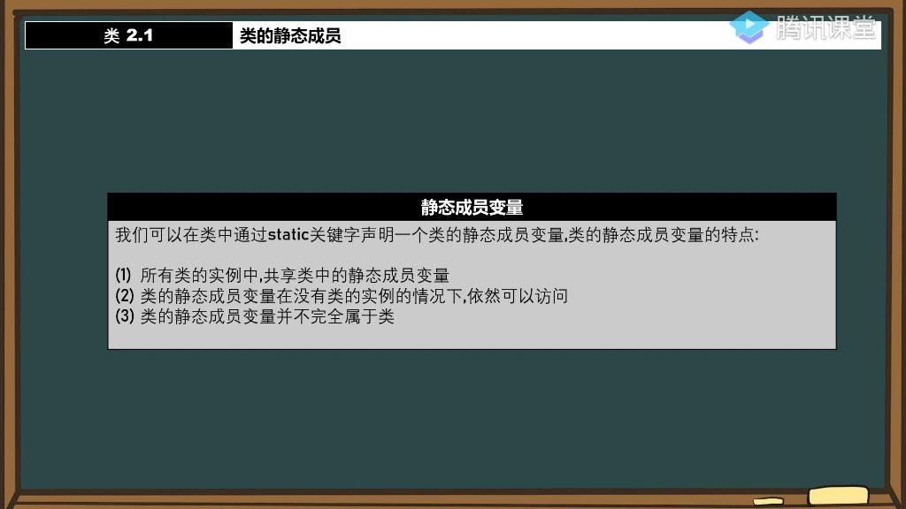
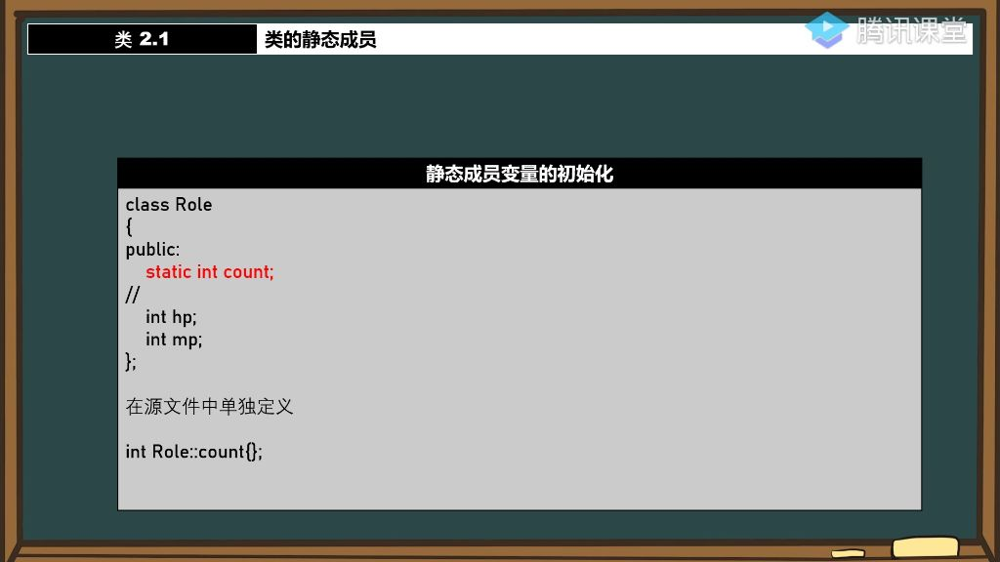
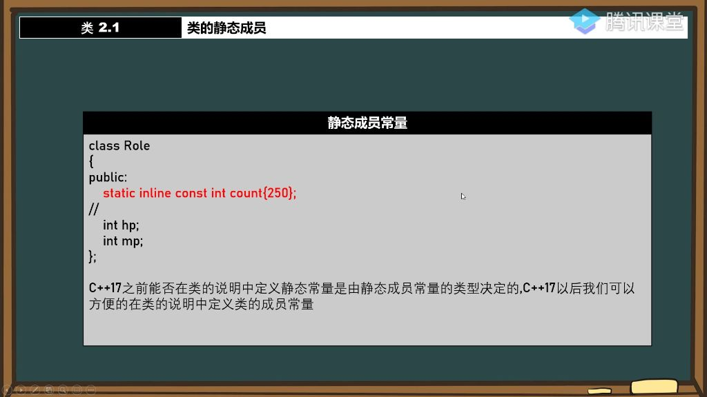

#### 一、静态成员变量

##### 1. 类的静态成员

- **基本语法**：在类中使用static关键字声明静态成员变量，如static int count;
- **初始化限制**：
  - 不能在类内直接初始化静态成员变量
  - 必须在类外单独定义并初始化，格式为 变量类型 类名::变量名 = 初始值;

###### 1）类的静态成员变量的特点

- 
- **共享变量** 
  - **内存共享**：
    - 所有类实例共享同一个静态成员变量
    - 通过指针验证：不同实例访问静态成员变量的内存地址相同
  - **内存分配**：
    - 静态成员变量**不占用**类实例的内存空间
    - sizeof(类)不包含静态成员变量的大小
- **静态访问** 
  - **无实例访问**：
    - 可通过**类名::静态成员**直接访问，无需创建实例
  - **对比普通成员**：
    - 普通成员必须通过实例访问
    - 尝试直接访问普通成员会导致编译错误
- **类的静态成员变量并不完全属于类** 
  - **归属特性**：
    - 作用域属于类，需通过类名::或实例访问
    - 但内存分配独立于类实例，类似全局变量
  - **访问控制**：
    - 可定义在私有区，但会影响外部访问性
    - 定义位置不影响初始化，但影响访问权限

###### 2）静态成员变量的初始化

- 
- **传统方法**：
  - 必须在类外单独定义并初始化
  - 语法：类型 类名::变量名 = 值;
  - 示例：int Role::count = 100;
- **访问控制**：
  - 初始化不受访问修饰符限制, 可定义在私有区但仍能完成初始化

###### 3）C++17静态成员变量的初始化

- **新特性**：
  - 使用**inline static**可在类内直接初始化
  - 需要编译器支持C++17标准
  - 示例：inline static int count{};
- **优势**：
  - 简化代码结构
  - 避免类外定义的繁琐

###### 4）静态成员常量

- 
- **特性**：
  - 使用static const声明
  - 值不可修改，编译期确定
  - 示例：static  const int count = 250;
- **初始化**：
  - C++17前：类型决定能否在类内初始化
  - C++17后：可用inline统一在类内初始化
- **应用场景**：
  - 类级别的常量配置
  - 替代宏定义的常量