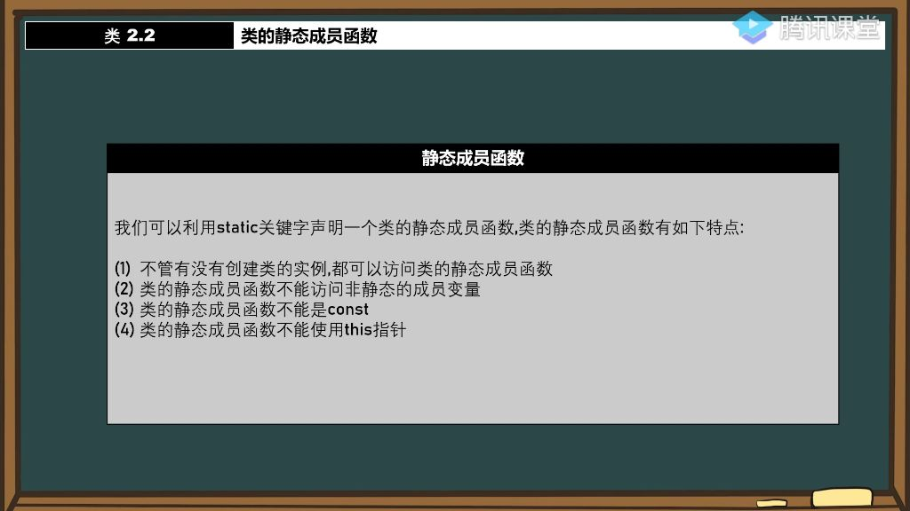

#### 一、类的静态成员函数

- 
- **定义方式**：使用static关键字声明类的静态成员函数，如static void Test()
- **与静态变量的关系**：静态成员函数是静态成员变量的配套概念，两者都使用static关键字修饰

- **调用方式**：既可以通过类名直接调用T::Test()，也可以通过对象调用t1.Test()

##### 1. 静态成员函数与普通成员函数的区别

###### 1）访问静态成员函数时不需要类的实例

- **独立访问性**：即使没有创建类的实例，也可以直接访问静态成员函数
- **示例说明**：如T::Test()调用时，不需要任何T类的实例存在
- **相似性**：这个特性与静态成员变量的访问方式非常相似

###### 2）不能访问非静态成员变量

- **限制原因**：静态成员函数在没有类实例的情况下也能调用，而非静态成员变量需要类实例才能分配内存
- **具体表现**：静态函数中尝试访问普通成员变量会导致编译错误

###### 3）不能是const

- **语法限制**：静态成员函数不能被声明为const，如static void Test() const是非法的。
- **原因分析**：
  - const用于限制函数修改对象状态，但静态函数本身就不属于任何对象
  - 静态函数在任何情况下都可访问，不需要const限定
- **设计合理性**：编译器禁止这种写法是因为它既**无必要**也**无意义**

###### 4）不能使用this指针

- **根本原因**：this指针指向当前对象实例，而静态函数可以在没有实例的情况下调用
- **具体表现**：静态函数中尝试使用this->会导致编译错误
- **逻辑关系**：这个限制与不能访问非静态成员的限制是一脉相承的

