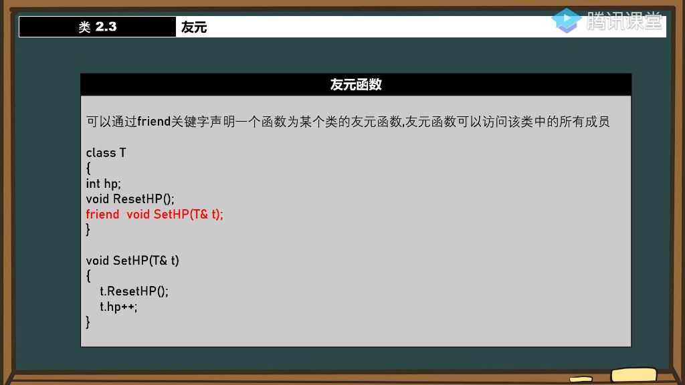
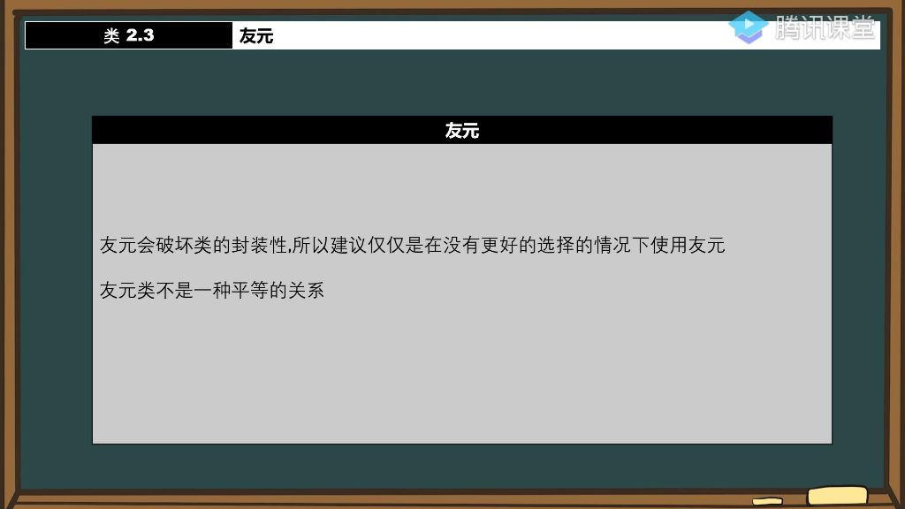

#### 一、友元

##### 1. 友元函数

- 
- **核心概念**：通过friend关键字声明友元函数，该函数可以访问类的所有成员（包括私有成员）
- **实现方式**：
  - 在类内部声明;
  - 函数定义在类外部。
- **类比解释**：
  - 如同现实中的朋友关系，类允许特定外部函数访问其私有成员；
  - 朋友可以进入你家（访问私有成员），陌生人则不能。
- **特性说明**：
  - 一个类可以有多个友元函数
  - 友元函数不是类的成员函数，只是被授权访问
  - 友元声明与位置无关（可放在public/private区域）
  - 需要前置声明：当涉及交叉友元时需注意类定义顺序
- **典型场景**：
  - 当外部函数需要频繁访问类私有成员时
- **注意事项**：
  - 友元关系是单向的（A是B的朋友≠B是A的朋友）
  - 友元函数可以访问多个类的私有成员（需各自声明）

##### 2. 友元类

- **声明方式**：friend class T1;
- **访问权限**：
  - 友元类所有成员函数都可访问声明类的私有成员
  - 示例：T声明T1为友元后，T1可访问T的hp/mp等私有成员
- **关系特性**：
  - **非对称性**：A是B的友元类≠B是A的友元类
  - **非传递性**：A是B的友元，B是C的友元≠A是C的友元
- **实际应用**：
  - 常用于紧密协作的类之间

##### 3. 友元的封装性

- 
- **设计原则**：
  - **慎用原则**：仅在必要时使用，避免破坏封装性
  - **最小化原则**：只授予必要的访问权限
- **潜在问题**：
  - 过度使用会导致类失去封装保护
  - 增加代码耦合度，降低可维护性
- **使用建议**：
  - 优先考虑通过公有接口访问
  - 当性能要求极高或接口设计不合理时再考虑友元
  - 良好的文档说明友元关系的必要性
- **关键区别**：
  - 友元函数 vs 成员函数：前者是外部函数，后者是类组成部分
  - 友元类 vs 继承：前者是平等协作关系，后者是父子关系
- **设计哲学**：
  - 反映现实世界中的信任关系
  - 强调"谨慎交友"的编程理念
  - 体现C++灵活性与约束性的平衡

