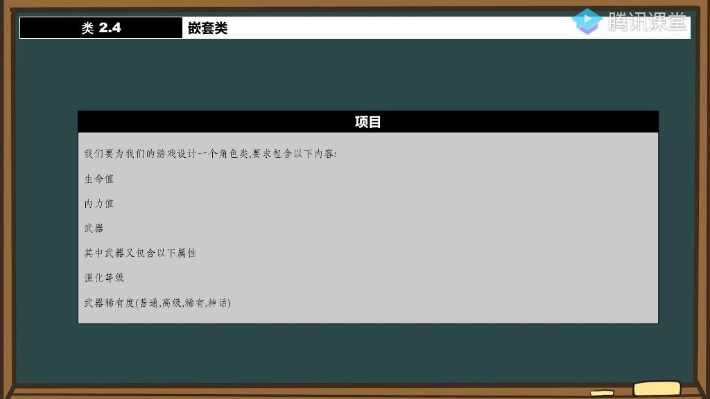
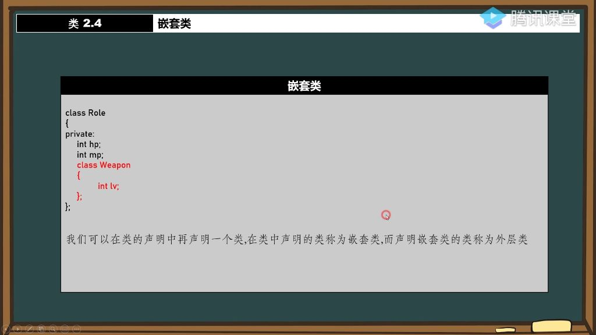
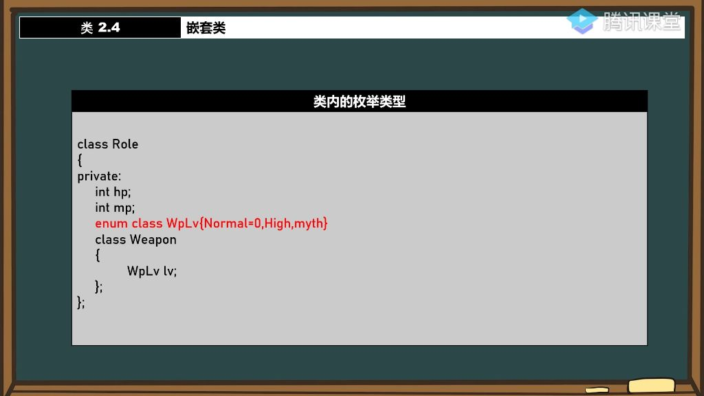
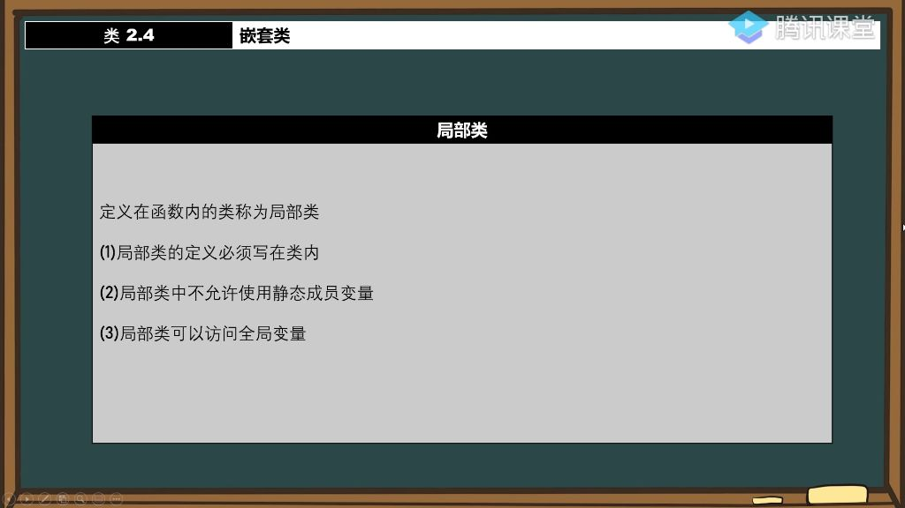

#### 一、嵌套类

##### 1. 例题:游戏角色类设计

- 
- **基本属性**:
  - **生命值(HP)**：使用整型变量int存储
  - **内力值(MP)**：可以用int，float或short类型存储
- **武器子系统**:
  - **强化等级**：使用short类型存储，变量名为lv
  - **武器稀有度**：采用枚举类型enum class定义，包含四个等级：
    - normal=0（普通）
    - high（高级）
    - rare（稀有）
    - myth（神话）

##### 2. 嵌套类的概念

- **定义方式**:
  - **语法特征**：将一个类的声明写在另一个类的内部
  - **外层类**：包含嵌套类的类（如示例中的Role类）
  - **嵌套类**：被包含的类（如示例中的Weapon类）
- **作用域特性**:
  - 嵌套类仅在其外层类的作用域内可见
  - 外部代码无法直接访问嵌套类
- **工程优势**:
  - 增强代码的层次感和结构清晰度
  - 适用于仅在特定类内部使用的组件
  - 符合大型工程项目的模块化设计原则

##### 3. 类的作用域

- **作用域归属**: 在类中声明的嵌套类，其作用域属于外层类。例如Weapon类声明在Role类中，则Weapon的作用域仅限于Role类内部。
- **访问限制**: 嵌套类受外层类封装属性(public/private)管辖。若声明为private，外部无法直接访问该嵌套类。
- **访问方式**: 可通过外层类作用域解析符访问，如Role::Weapon wpl; 但前提是该嵌套类声明在public区域。

###### 1）在类外定义嵌套类 

- 
- **注意事项**:
  - 类定义不能重复，需避免class重定义错误(C2011)
  - 析构函数等成员函数也可在类外定义
- **典型错误**:
  - 忘记写作用域解析导致新类定义(C2011)
  - 尝试访问private嵌套类(C2248)
  - 使用不完整类型(C2079)

###### 2）在类外定义嵌套类的成员函数

- **定义格式**: 
  - 返回值类型 Outer::Inner::functionName(){...}，需完整指明每一层作用域。
  - 返回嵌套类指针时，返回值类型也要写全作用域, 如: Role::Weapon* Role::Weapon::ReturnW()
  - 构造函数/析构函数同样适用此规则

##### 4. 嵌套类的访问权限

| 访问成员方式   | 不依赖对象直接访问 | 类名作用域访问   | 通过对象直接访问                                             |
| -------------- | ------------------ | ---------------- | ------------------------------------------------------------ |
| 外部类对内部类 | 无                 | 内部类的静态成员 | 在外部类中的内部类对象只能访问公有成员 |
| 内部类对外部类 | 外部类的静态成员   | 外部类的静态成员 | 在内部类中的外部类对象即使是私有成员也可以访问 |

- 内部类相当于是定义在外部类中的外部类的友元类。

##### 5. 类内枚举类型与嵌套类的关系

- 
- **作用域继承**: 外层类定义的枚举类型（如WpLv）可被嵌套类直接使用
- **访问控制**: 枚举类型的可见性受外层类访问修饰符约束，需声明为public才能在外部通过Role::WpLv访问
- **典型应用**: Weapon类可以直接使用Role类中定义的WpLv枚举，无需额外声明

##### 6. 类内的枚举类型

- **封装优势**: 将枚举类型定义在类内部（如WeaponLv）可以更好地组织相关代码
- **访问规则**:
  - 嵌套类可直接使用外层类的枚举类型
  - 外部代码需要通过Role::WeaponLv访问，且枚举类型必须声明为public
- **类型安全**: 使用enum class可以避免枚举值冲突，如Normal=0, High, myth等值的作用域受类限制

##### 7. 局部类

- 
- 定义位置：定义在函数内部的类称为局部类，与嵌套类（定义在类内部的类）形成对比
- 使用建议：虽然不常用，但需要了解其特性以避免使用时出现困惑

###### 1）局部类的定义必须写在类内

- **语法限制**：局部类的成员函数定义必须完全写在类内部，不能像普通类那样可以在外部定义
- **原因分析**：
  - 函数内部不能再嵌套定义函数（不存在"嵌套函数"的概念）
  - 局部类的作用域仅限于所在函数，无法通过类名作用域解析符(::)在外部访问

###### 2）局部类中不允许使用静态成员变量

- **语法限制**：局部类中不能声明静态成员变量
- **历史原因**：
  - 传统上静态成员需要在类外定义，但局部类无法提供合适的定义位置
  - 即使C++11引入inline关键字允许在类内定义，语法仍未完全支持
- **特殊情况**：
  - 静态成员函数在VS编译器中可以正常使用
  - 不同编译器实现可能存在差异（需在Linux等其他平台验证）

###### 3）局部类可以访问全局变量

- **访问权限**：
  - 可以访问全局变量
  - 在VS编译器中，不能访问其所在函数的局部变量
- **注意事项**：
  - 不同资料对局部变量访问规则描述不一致
  - 实际测试结果可能因编译器而异，需要具体验证
- **使用建议**：
  - 由于语法限制和兼容性问题，应尽量避免使用局部类

