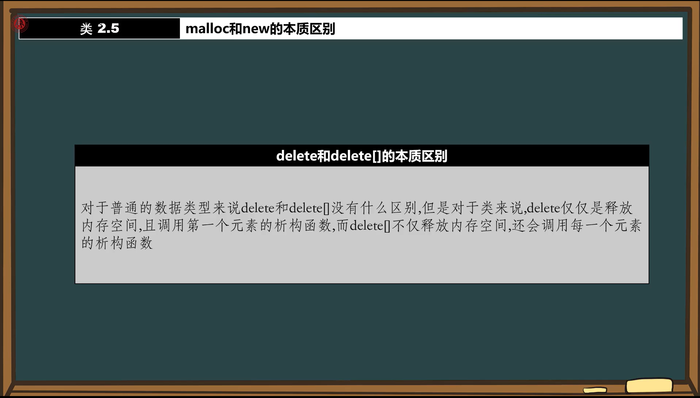

#### 一、类

##### 1. malloc和new的本质区别

- 
- **基本区别**:
  - 对于普通数据类型(int/float等)，malloc和new功能相同
  - 对于类对象，malloc仅分配内存，new还会调用构造函数
- **内存分配机制**:
  - malloc是C语言函数，只负责内存空间的分配
  - new是C++运算符，完成内存分配后会自动调用构造函数初始化对象

##### 2. free和delete的本质区别

- 
- **基本区别**:
  - free仅释放内存空间
  - delete会先调用析构函数再释放内存

- **正确用法**:
  - malloc/free配对使用
  - new/delete配对使用

##### 3. delete和delete[]的本质区别

- 基本区别:
  - delete仅调用第一个元素的析构函数
  - delete[]会为每个元素调用析构函数
- 使用原则:
  - new创建单个对象用delete
  - new[]创建数组用delete[]
- 销毁顺序:
  - 数组对象按创建顺序的逆序销毁(后进先出)

##### **4.总结**:

- malloc/free是C语言的内存管理
- new/delete是C++的对象生命周期管理
- 数组操作要使用对应的[]形式
- 基本类型较宽松，类类型必须严格配对

