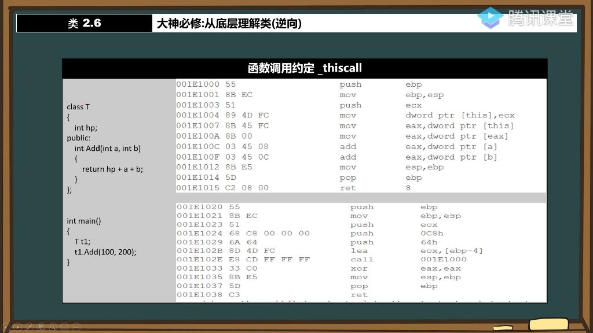
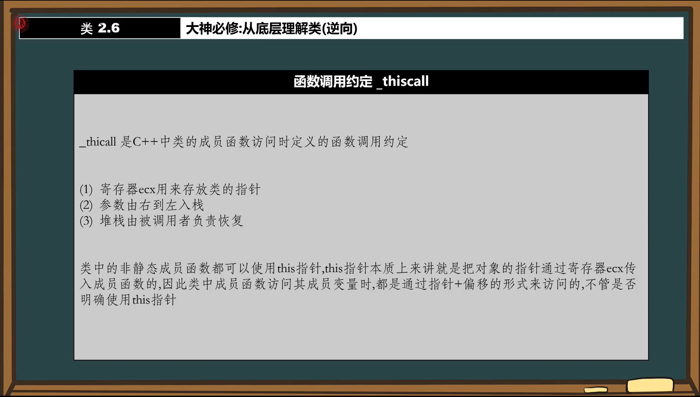
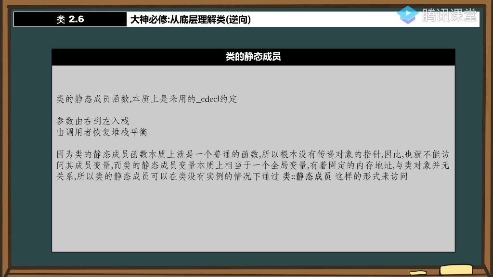
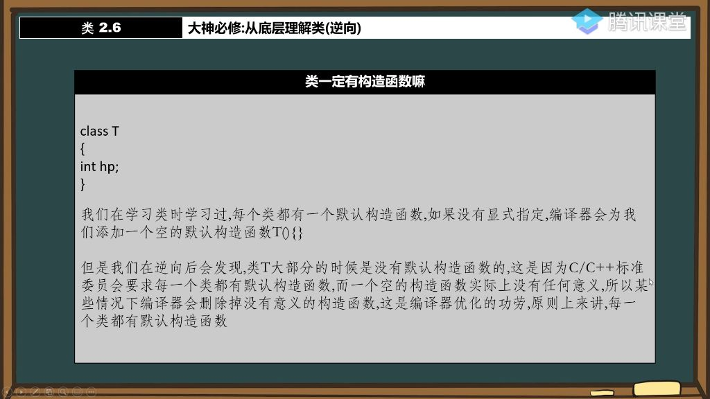

#### 一、类

##### 1. 从底层理解类

###### 1）类的函数调用约定

- **_thiscall调用约定详解**
  
  - 
  - **核心特点**：
    
    - 使用寄存器ecx存放类的对象指针（如t1.Add()中的t1地址）
    
    - 参数从右向左入栈（如Add(100,200)先push 200再push 100）
    
    - 堆栈平衡由被调用函数负责（ret 8指令）
    
      
  - **底层实现**：
    
    - 成员函数访问成员变量本质是通过"指针+偏移"方式（如ecx+4访问第二个成员变量）
    - 示例中`return hp+a+b`等价于r`eturn this->hp+a+b`

###### 2）类的静态成员

- **静态成员函数特性** 
  - 
  - **调用约定**: 采用`_cdecl`约定，与普通函数调用方式相同
  - **this指针缺失**: 不会传递对象的指针(ecx寄存器为空)，因此无法访问非静态成员变量
  - **访问方式**: 可通过类名::函数名()直接调用，无需实例化对象
  - **底层原理**:
    - 汇编层面与普通函数调用完全一致
    - 示例中 `GetCount(100,200)` 调用过程：
      - 参数按从右到左顺序压栈(push 200→push 100)
      - 调用后由调用方恢复栈平衡(add esp,8)
      - 函数内部无ecx寄存器操作，验证无this指针传递
- **静态成员变量特性**
  - **存储特性**: 具有固定内存地址的全局变量
  - **生命周期**: 与类实例无关，程序运行期间持续存在
  - **访问权限**:
    - 可通过类名::变量名直接访问
    - 在成员函数中可直接操作
- **关键问题解析**
  - **无this指针原因**:
    - 设计上就不传递对象指针(ecx寄存器为空)
    - 函数内部无法通过this->访问成员
  - **访问限制原理**:
    - 非静态成员必须通过对象地址(ecx值)加偏移访问
    - 静态函数缺乏对象指针，故无法访问非静态成员

###### 3）类一定有构造函数吗

- **构造函数存在性验证**
  - 
  - **标准要求**: C++标准委员会规定每个类必须有默认构造函数
  - **编译器行为**:
    - 未显式定义时，编译器会添加空构造函数
    - 但逆向工程常发现实际不存在默认构造函数
  - **优化机制**: 编译器会删除无实际意义的空构造函数（属于优化行为）
- **构造函数生成条件**
  - **必要场景**: 当类成员需要初始化时，编译器会生成有效构造函数
  - **调试技巧**:
    - 需关闭编译器优化才能观察到构造函数调用
    - 优化开启时（如速度最大化模式），无意义构造函数会被完全优化掉
  - **底层表现**: 实例化对象时，有效构造函数会在汇编代码中显式调用。
- **核心结论**
  - **理论原则**: 从语言规范角度，每个类都应有构造函数
  - **实践差异**:
    - 空构造函数可能被编译器优化删除
    - 只有实际需要的构造函数才会保留

