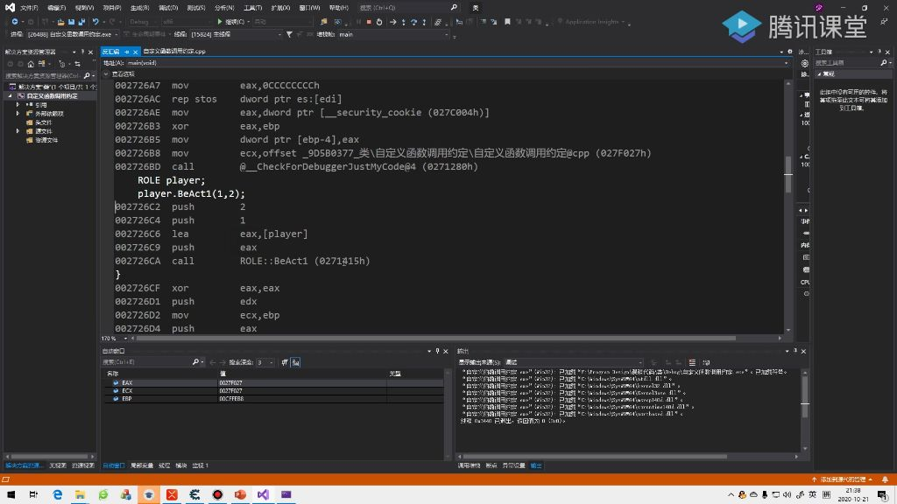

#### 一、类的自定义函数调用约定

##### 1. 定义函数调用约定

- **_thiscall调用方式**：默认情况下，类的成员函数调用时会将this指针通过ecx寄存器传递，这种调用约定称为_thiscall。
- **自定义调用约定**：可以通过在函数声明前指定其他调用约定（如stdcall、cdecl等）来改变默认的传参方式。
- **注意事项**：_thiscall并非绝对规则，调用约定可根据实际需求进行调整。
- **栈平衡机制**：函数自身负责栈平衡

##### 2. 函数调用约定应用

###### 1）例题:_stdcall传递参数

- 
- **参数传递特点**：
  - 采用倒序压栈方式传递参数（先push 2再push 1）
  - this指针不再通过ecx传递，而是作为第一个参数压栈
  - 符合_stdcall标准，函数自身负责栈平衡

###### 2）例题:_cdecl函数调用约定

- **栈平衡机制**：调用方负责恢复栈指针，通过`add esp, 0c`指令恢复12字节栈空间（对应3个int参数）。
- **参数组成**：包含两个显式参数和隐式的this指针
- **实际应用**：在逆向工程中遇到参数数量异常时，需考虑可能是由于调用约定改变导致this指针传递方式不同