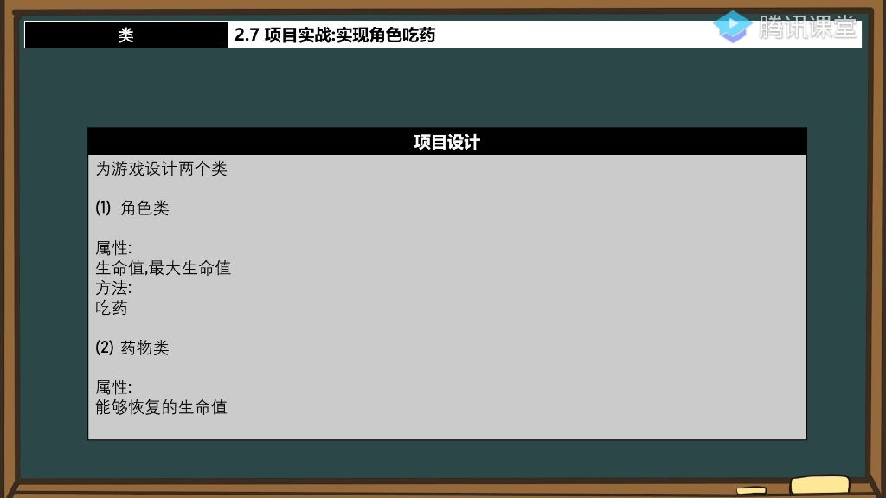

#### 一、项目实战：实现角色吃药

##### 1. 项目设计

- 
- **角色类设计**:
  - **属性**：
    - `HP`（当前生命值）
    - `maxHP`（最大生命值）
  - **方法**：`EatMed()`（吃药方法）
- **药物类设计**:
  - **属性**：
    - Recover（恢复的生命值）
- **核心逻辑**：
  
- 角色吃药后生命值增加，但不能超过最大生命值`maxHP`
  
- **初始化设置**：

  - **角色初始状态**：
    - HP=1000（半血状态）
    - maxHP=3500
  - **药物恢复量**：
    - Recover=100

- **关键方法**：

  - **GetHP()**：显示当前生命值状态

  - **EatMed()**：实现生命值恢复逻辑，包含三目运算符判断：

    `hp=hp>maxHp?maxHp:hp`

##### 3. 调试分析 

- **逆向关键点**：
  - **this指针识别**：通过`lea ecx`指令可识别类成员函数调用
  - **参数传递**：药物对象地址通过`ebp+8`传递

##### 4. 注意事项

- **边界处理**：必须检查恢复后的生命值是否超过maxHP
- **逆向技巧**：
  - 显示符号名可帮助分析类结构
  - ecx寄存器通常存储this指针
  - 成员函数调用前会先加载对象地址到ecx

