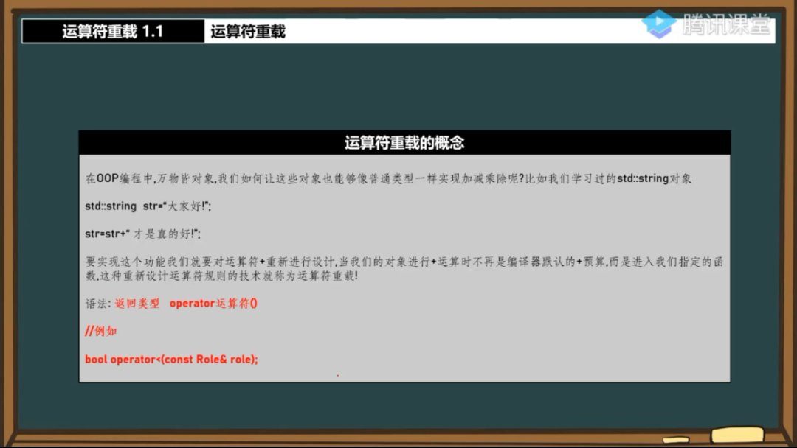
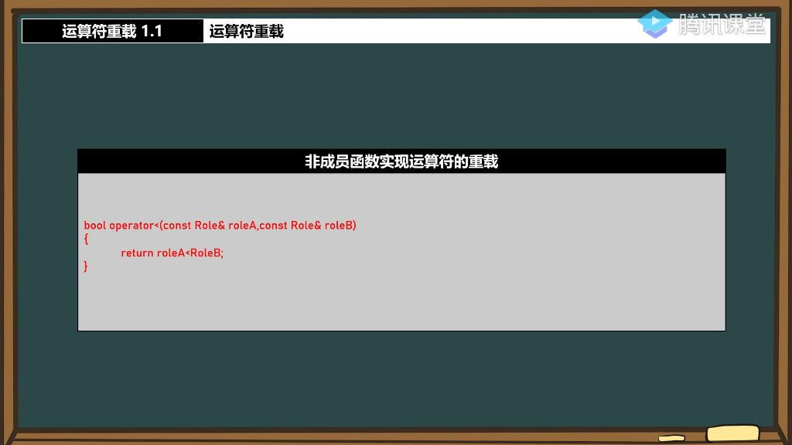
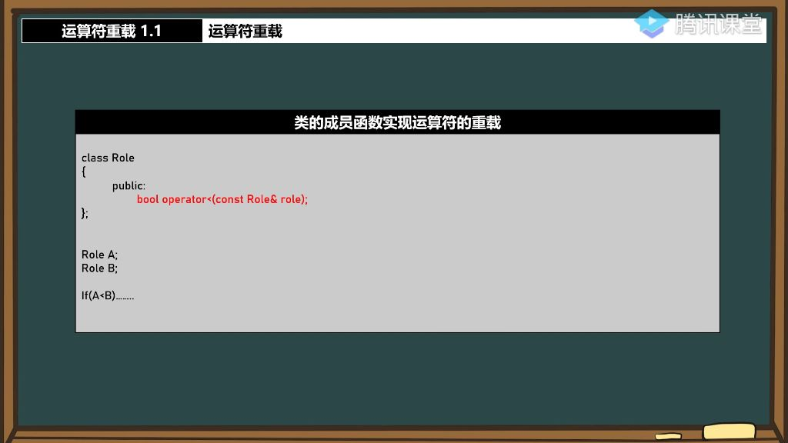

## 一、运算符重载

### 1. 运算符重载的概念

#### 1）运算符重载

- 
  - **核心概念**：让自定义类型对象能像基本类型一样使用运算符
  - **语法形式**：返回类型 operator运算符(参数)
  - **实现原理**：编译器将运算符转换为对应的函数调用

#### 2）实现方式

##### 2.1 非成员函数实现的运算符重载

- 
  - **实现方式**：在类外定义operator<函数
  - **参数顺序**：第一个参数对应运算符左侧对象，第二个对应右侧
  - **访问控制**：需要将函数声明为类的友元(friend)以访问私有成员
  - **等价关系**：man<woman 等价于 operator<(man,woman)

##### 2.2 成员函数实现的运算符重载 

- 
  - **实现方式**：在类内定义operator>成员函数
  - **this指针**：左侧对象自动作为this指针，右侧作为参数
  - **调用方式**：man>woman 等价于 man.operator>(woman)
  - **访问优势**：可直接访问类私有成员，无需友元声明

#### 3) 运算符优先级

- 重载不改变原生运算符的优先级和结合性（如*始终优先于+）;
-   避免违反直觉的重载（如重载+实现减法）