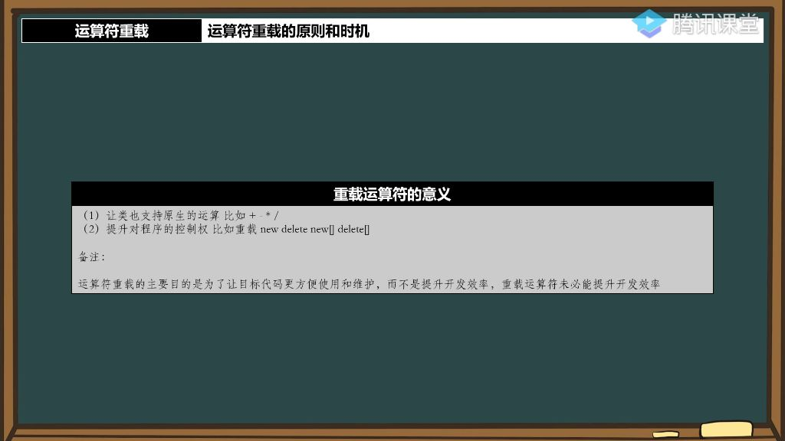
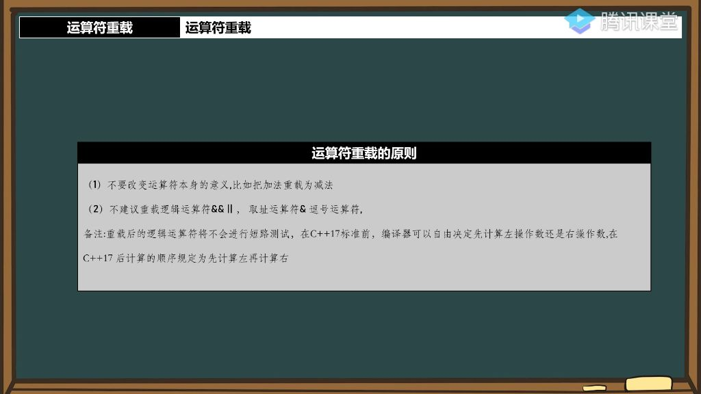
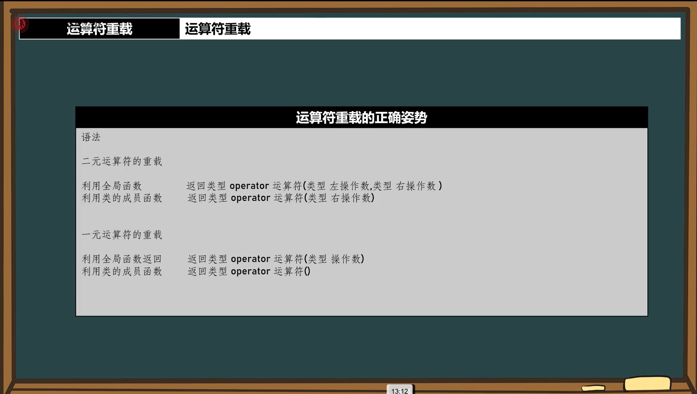
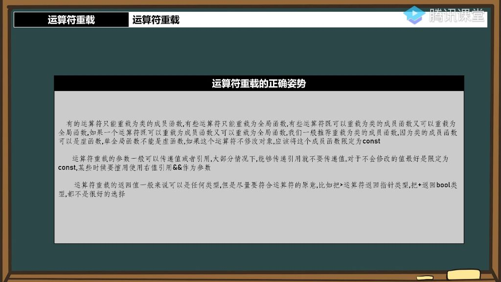

## 一、运算符重载

### 1）重载运算符的意义

- 
- **表达直观性**：使类支持原生运算（如+、−、∗、/），代码更符合直觉。例如：人+人=小孩，这种表达比调用Add()方法更自然。
- **控制权提升**：通过重载new/delete等运算符，可以自定义内存管理策略（如建立缓冲区），增强对程序资源的控制能力。
- **代码可维护性**：主要目的是提高代码可读性和可维护性，而非开发效率。过度重载可能反而降低开发速度。

### 2）重载运算符的限制

- 
- **禁止自创运算符**：只能重载现有运算符（如不能创建===或=<>=等新符号）
- **禁用运算符列表**：
  - 对象访问符`.`（如user.hp）
  - 作用域解析符`::`（如std::cout）
  - 求大小运算符`sizeof`（如sizeof(int)）
  - 条件运算符`?:`（如b=a>c?100:200）
- **运算特性不可修改**：
  - 优先级和结合性固定（如乘法定优先于加法）
  - C++17后操作数计算顺序不可更改,例如a+b+c,运算顺序为(a+b)+c,而不是a+(b+c)。
- **原生类型限制**：除`new/delete[]`外，禁止修改基本类型运算符语义（如不能将`char`的`+`重载为`−`）
- **参数数量不可变**：除`new/delete`外，必须保持原运算符的元数（如二元运算符必须保持两个操作数）

### 3）重载原则

- 
- **语义一致性**：
  - 禁止改变运算符本质含义（如加法重载为减法）
  - 返回值应符合原运算符预期（如`>`应返回`bool`而非指针）
- **不建议重载的运算符**：
  - 重载逻辑运算符`&&/||`，会丧失短路求值特性
  - 重载取址运算符`&`，易破坏指针语义
  - 重载逗号运算符`，`，实际价值低且易混淆

###### 4）运算符重载的最佳姿势

- 

- 

- **参数传递规范**：
  - 优先使用`const &`传递（如const Person&）
  - 适时使用右值引用`&&`优化性能
- **成员函数优先**：当既可成员函数又可全局函数时：
  - 成员函数支持虚函数特性
  - 不修改对象时应声明为const成员函数

- **实现方式选择**：
  - 必须成员函数：[][]`[]`、`()`、`−>`、赋值运算符`=`等
- 必须全局函数：流操作符`<< />>`
- 对称的运算符（如`+`）通常采用全局函数+友元实现