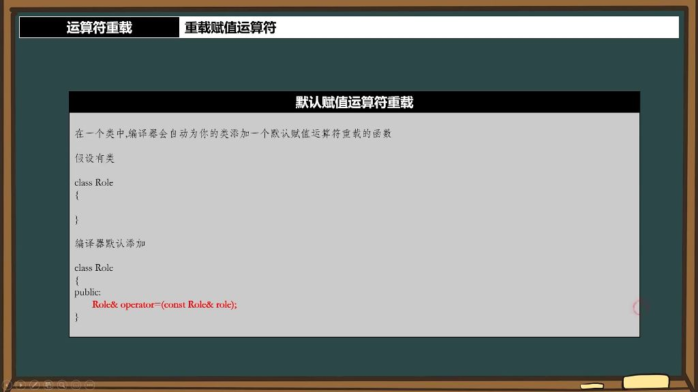
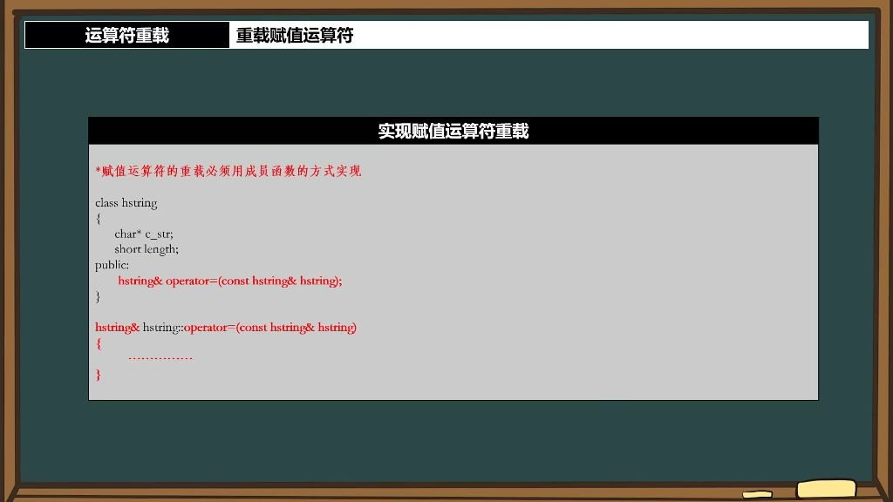
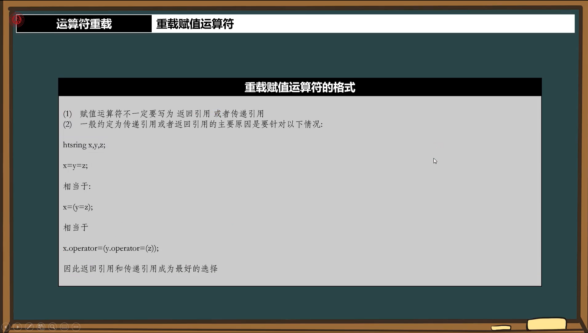

## 一、运算符重载

### 1. 重载赋值运算符

#### 1）默认赋值运算符重载

- 
- **编译器自动添加**: 在一个类中，编译器会自动为类添加默认赋值运算符重载函数。例如对于空类class Role{}，编译器会默认添加`Role& operator=(const Role& role)`;。
- **实现原理**: 默认赋值运算符会逐个复制类的成员变量，如`hp = role.hp; mp = role.mp;`，实现对象间的值复制。
- **编译器默认函数总结**:
  - 默认构造函数
  - 默认拷贝构造函数
  - 默认析构函数
  - 默认赋值运算符重载（即operator=）

#### 2）实现赋值运算符重载

- 

- **成员函数实现**：赋值运算符重载必须用成员函数的方式实现，不能使用全局函数
  - **语法要求**：函数声明形式为ClassName& operator=(const ClassName&)
  - **设计原因**：确保赋值操作能正确访问对象的私有成员，保持封装性
  
- **返回引用**：应返回当前对象的引用（*this），以支持链式赋值操作
  
  
  
  - **链式赋值支持**：返回引用允许a=b=c这样的连续赋值操作
  - **void返回问题**：虽然可以返回void，但会破坏链式赋值的语法特性
  - **引用返回优势**：避免创建临时对象，提高效率
  
- **参数传递**：通常使用`const&`传递参数，避免不必要的拷贝开销
  - **引用传递优势**：显著减少内存开销，避免不必要的对象拷贝
  - **const修饰**：使用const引用防止意外修改源对象
  - **值传递问题**：虽然语法允许，但会产生额外的构造/析构开销
  
- **赋值运算符重载的必要性** 
  - **默认行为**：对于简单类，编译器生成的默认赋值操作可能已足够
  - **特殊需求场景**：当类包含指针成员或需要深拷贝时，必须自定义赋值操作
  - **设计原则**：赋值操作应保持"对象等价性"，避免产生"猫叫的狗"等异常情况

#### 3）应用案例

- **例题：字符串类赋值运算符重载**

  - **默认赋值运算符的问题**

    - 默认行为：默认赋值运算符会简单地将成员变量依次赋值，对于指针成员会导致浅拷贝问题
    - 典型场景：当类中包含指针成员时（如字符串类），默认赋值运算符会导致多个对象共享同一块内存空间,当一个对象修改内容之后，其他共享指针的对象也会受到影响。

  - **自定义字符串类实现**

    - **缓冲区设计**：
      - 设置默认缓冲区大小（如50字节）减少小字符串的内存分配
      - 使用unsigned short uslen记录字符串长度
      - 使用char* cstr指针管理字符串内容
    - **内存管理技巧**：
      - 区分字符串长度和内存空间大小
      - 当新字符串长度小于当前缓冲区大小时，直接复用现有空间
      - 仅当需要更大空间时才重新分配内存

  - **深拷贝实现方法**

    - **关键步骤**：
      - 通过GetLength()函数计算源字符串长度
      - 检查是否需要重新分配内存空间
      - 使用memcpy()函数执行实际的内存拷贝
    - **安全措施**：
      - 对传入的字符串进行完整拷贝而非指针赋值，确保修改原字符串不会影响类内数据。

  - **赋值运算符重载实现**
- 两种重载形式：
    - hstring& operator=(const hstring& str)：处理同类对象赋值
  - hstring& operator=(const char* str)：处理C风格字符串赋值
    
    - **实现要点**：
- 返回引用类型`hstring&`以支持链式赋值（如a=b=c）
      - 确保深拷贝
- 通过`return *this`返回当前对象引用
  
- **实现中的注意事项**
  - **常见问题**：
    - 忘记处理自赋值情况（如a = a）
    - 未正确释放原有内存导致内存泄漏
  - 返回值类型错误导致无法链式调用
    
  - **最佳实践**：
  - 保持赋值运算符与构造函数行为一致
    - 对参数添加const修饰保证安全性

#### 4）构造函数与赋值运算符的区别

- **关键区别**：
  - 构造函数在对象创建时调用（如hstring str1(str2)）
  - 赋值运算符在对象已存在时调用（如str1 = str2）

- **类型转换机制**：
  - 当右侧类型不匹配时，编译器会尝试构造临时对象
  - 如str1 = "1111"会先构造临时hstring对象再调用赋值运算符

### 二、字符串类实现

#### 1. 运算符重载原则与时机

- **基本原则**：运算符重载应保持运算符原有语义，如赋值运算符"="应实现赋值功能
- **实现时机**：当类需要支持类似基本类型的操作时（如字符串类的赋值、比较等）

#### 2. 支持数字类型赋值 

- **功能需求**：使字符串类支持直接赋值数字（如hstring str = 123）

- **实现方法**：
- 添加operator=(const long long& value)重载
  - 内部将数字转换为字符串存储

- **注意事项**：
- 需要处理数字到字符串的转换逻辑
  - 浮点类型(float/double)实现较复杂，需高级技巧

#### 3. 作业任务

- 实现operator=(const long long& value)数字赋值功能
- 要求不使用现成库函数，自行实现数字转换

- 注意处理可能的边界情况和bug