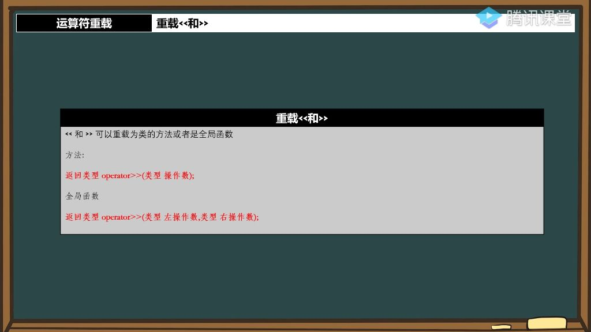
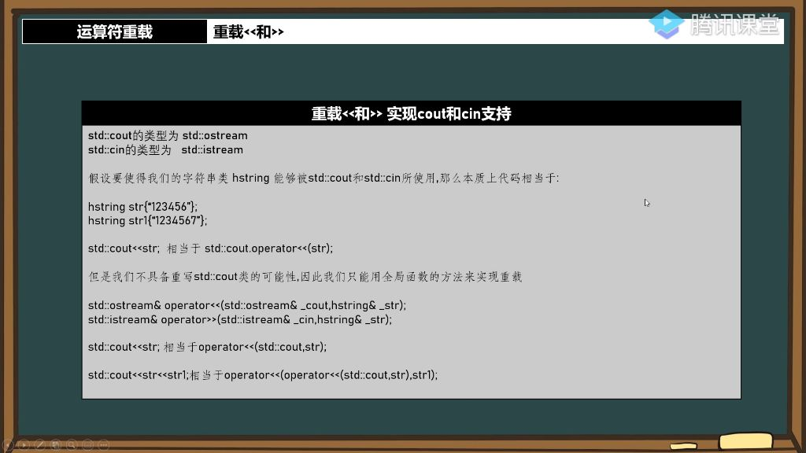

## 一、运算符重载

### 1. 重载<<和>>

- 

#### 1）实现方式

- **成员函数形式**：
  - **语法**：返回类型 operator>>(类型 操作数)
  - **特点**：作为类的成员函数实现，左操作数默认为当前对象
- **全局函数形式**：
  - **语法**：返回类型 operator>>(类型 左操作数，类型 右操作数)
  - **特点**：需要显式指定两个操作数，通常声明为类的友元函数

#### 2)  `hstring`类重载`<<`和`>>`实现`cout`和`cin`支持

##### 1）hstring类的基本结构

- **成员变量**:
  - `usmlen`: 字符串的内存长度
  - `uslen`: 字符串的实际长度(包含结尾的'\0')
  - `cstr`: 字符串内容指针
- **构造函数**：
  - `hstring(char clen=0x32)`: 默认分配50字节内存
  - `hstring(const char* str)`: 用C字符串构造
  - `hstring(const hstring& str)`: 拷贝构造函数

- **内存管理实现**
  - **关键函数**:
    - GetLength(): 计算字符串长度(包含'\0')
    - CopyStrs(): 字符串拷贝函数
  - **内存处理原则**:
    - 先检查目标内存空间是否足够
    - 不足时需要先删除旧内存再重新分配
    - 修正内存长度和字符串长度

##### 2) 输入流运算符重载实现

- **函数**：`std::istream& operator>>(std::istream& cin, hstring& str)`；

- **实现步骤**:
  - 计算新字符串总长度；
  - 检查内存是否足够，不足则重新分配；
  - 将新字符串拷贝到原字符串末尾(跳过原字符串的'\0')；
  - 更新字符串长度；
- **注意事项**:
  - 长度计算要减去1是因为两个字符串各有一个'\0'
  - 必须处理内存泄露问题，重新分配前要先删除旧内存

##### 3） 输出流运算符重载

- **函数**：`std::ostream& operator<<(std::ostream& cout, hstring& str)`。

- **必须通过全局函数实现**：因为第一个参数不是类对象，而是输出流。
- **调用原理**:
  - `std::cout << str` 会被解析为 `operator<<(std::cout, str)`
  - 返回了`ostream&`以支持链式调用。
    - `std::cout<<str<<str1`相当于`operator<<(operator<<(std::cout,str),str1)`
- **命名空间处理**:
  - 需要在头文件中声明该全局函数

##### 4）输入输出流类型区分

- `std::cin`的类型是`std::istream`，代表输入流
- `std::cout`的类型是`std::ostream`，代表输出流
- 需要明确区分输入流和输出流的类型，在重载运算符时需要正确使用对应的流类型

#### 3) 作业 

###### 1）运算符重载相关函数实现

- 缓冲区重置函数：
- 内存占用获取函数：
- 字符串长度获取函数：
  - 注意：与内存占用获取函数返回值的区别

###### 2）代码中的潜在漏洞与bug 

- 内存分配漏洞：
  - 直接删除原有内存可能导致数据丢失
- 自赋值问题：
  - 典型场景：当出现`str=str`自赋值时
  - 问题本质：删除原有内存后立即尝试从已删除内存复制数据
  - 解决方案：需要先检查是否为自赋值情况

