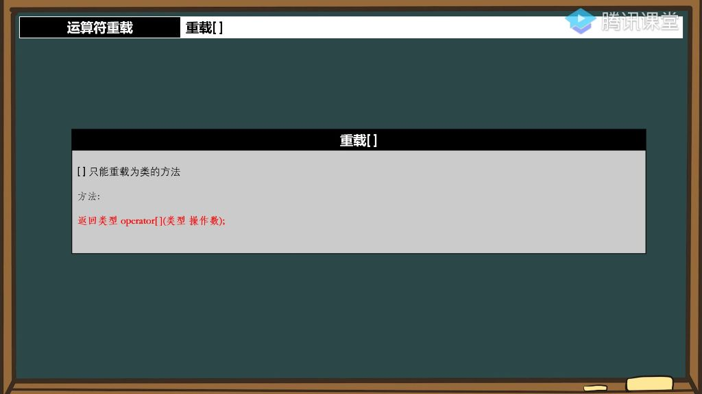

## 一、运算符重载

### 1. 重载[]

#### 1）下标运算符重载

- 
- **类方法限制**：下标运算符`[]`只能重载为类的成员方法，这是继赋值运算符`=`之后第二个只能作为类方法重载的运算符。
- **语法格式**：`返回类型 operator[](类型 操作数)`；

- <font color='red'>**返回类型选择**</font>：
  - **只读访问**：返回`const char&`或`char`
  - **读写访问**：返回`char&`
- **参数类型**：通常使用unsigned short作为索引参数类型

#### 2）实现示例

```
char& hstring::operator[](const unsigned short index) {
    return cstr[index];
}
```

- ##### 注意事项
  - **内存安全性**：
    - 直接返回字符指针引用可能破坏封装性
    - 建议添加const限定符保证只读访问：const char& operator const
  - **中文支持问题**：
    - 对英文字符支持良好，中文字符处理可能出现异常，需要特殊处理
  - **右值问题**：
    - 返回临时变量会导致无法修改
    - 返回引用才能支持赋值操作

- **最佳实践**
  - **安全实现**：

```
const char& hstring::operator[](const unsigned short index) const {
    return cstr[index];
}
```

- **字符串越界处理** 
  - **边界检查**：在头文件中定义常量`hstring_no_char = -1`作为越界返回值，避免使用0值（因为字符串末尾合法存在0）。
    - 通过if(index > uslen)检查下标是否超出字符串长度；越界时返回预定义的hstring_no_char常量；合法访问时直接返回cstr[index]字符引用。
    - 可以使用C++17新语法，将nochar定义为类的静态变量：`inline static char nochar = '\0'`，相比传统实现方式更高级，代码可读性更好
  - **重载语法**：`const char& operator[](const unsigned short index) const` 实现下标运算符重载
  - **返回值设计**：正常情况返回字符引用，越界时返回特殊常量值

### 3. hstring类优化

- **核心成员**：

  - `char∗ cstr`:	字符串内容指针
  - `unsigned short GetLength():`获取字符串长度
  - `voidCopyStrs():`字符串拷贝方法

- **运算符重载**：

  - 赋值运算符 `operator=`
  - 连接运算符`operator+`
  - 下标运算符`operator[]`
  - 流操作符`operator<<`和`operator>>`

- **构造方法**：

  - 默认构造 `hstring()`
  - C字符串构造 `hstring(constchar∗str)`
  - 拷贝构造 `hstring(const hstring& str)`

- **下标运算符重载**

  - **扩展应用**：

    - 不仅限于字符类型，可支持多种数据类型

    - 典型应用场景：字典/订单系统等键值对结构

    - 示例：可通过字符串ID直接访问内容，如

      dict["张三"]dict["张三"]dict["张三"]

  - **实现要点**：

    - 需要处理不同类型参数的兼容性
    - 注意边界检查和内存管理

##### 2. 运算符重载作业解析

###### 1）作业要求

- 作业内容: 实现一个返回key后面的字符的 `[]`运算符重载函数
- 函数原型: `const char& operator[](const char* key) const`
- 示例说明:
  - 当输入字符串为"hello world!"时
  - 调用str1["hello"]应返回" world"部分,具体返回的是' '（空格字符）的引用

###### 2）实现要点

- **参数类型**:
  - 必须使用`const char*`作为参数类型
  - 不能使用`char`类型，因为需要匹配字符串
- **返回值要求**:
  - 返回的是匹配字符串后面第一个字符的引用
  - 示例中"hello"匹配后返回空格字符' '的引用
- **实现难度**:
  - 需要处理字符串查找逻辑
  - 要考虑未找到匹配时的边界情况处理
- **注意事项**:
  - 函数需要声明为`const`成员函数
  - 返回值类型为`const char&`保证安全性
  - 需要处理key为`nullptr`或空字符串的特殊情况