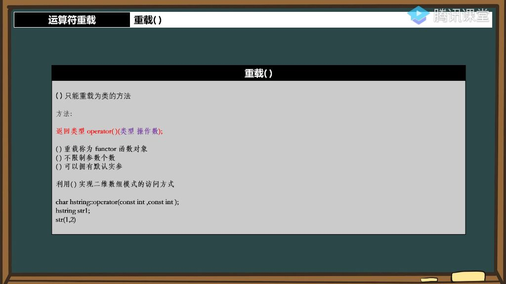

## 一、运算符重载

### 1. 重载小括号

#### 1）小括号重载为类的方法

- 
- **限制条件**：小括号运算符只能重载为类的成员方法，不能重载为全局函数，这与`[]`运算符的限制相同。
- **专业术语**：小括号运算符重载被称为"函数对象"(functor)或"重载函数调用"。
- **参数特性**：
  - 不限制参数个数，可以像普通函数一样定义多个参数，是唯一<font color='red'>不受操作数限制</font>的运算符重载
  - 支持默认实参设置

#### 2）应用案例

- **无参数重载示例**

  - **实现方式**：可以定义无参数的小括号重载，返回字符串首字符

    ```C++
    const char& operator()() {
        return cstr[0];
    }
    ```

  - **调用方式**：虽然语法看起来像函数调用，但实际是对象操作

    ```C++
    hstring str = "a123";
    std::cout << str();  // 输出'a'
    ```

- **多参数重载实现**

  - **功能设计**：实现字符串截取功能，接收起始位置和长度两个参数

    ```C++
    hstring operator()(const unsigned short start, const unsigned short length) const;
    ```

    

  - **返回值考虑**：不能返回引用，因为截取结果是临时创建的新字符串对象

  - **参数设计**：
    - 第一个参数表示截取起始位置
    - 第二个参数表示截取长度
    - 两个参数都可以设置默认值

- <font color='red'>**与函数调用的区别**</font>

  - 本质区别：虽然语法类似函数调用，但实际上是类的对象操作
  - 特殊性质：函数对象可以保存状态，而普通函数调用不能