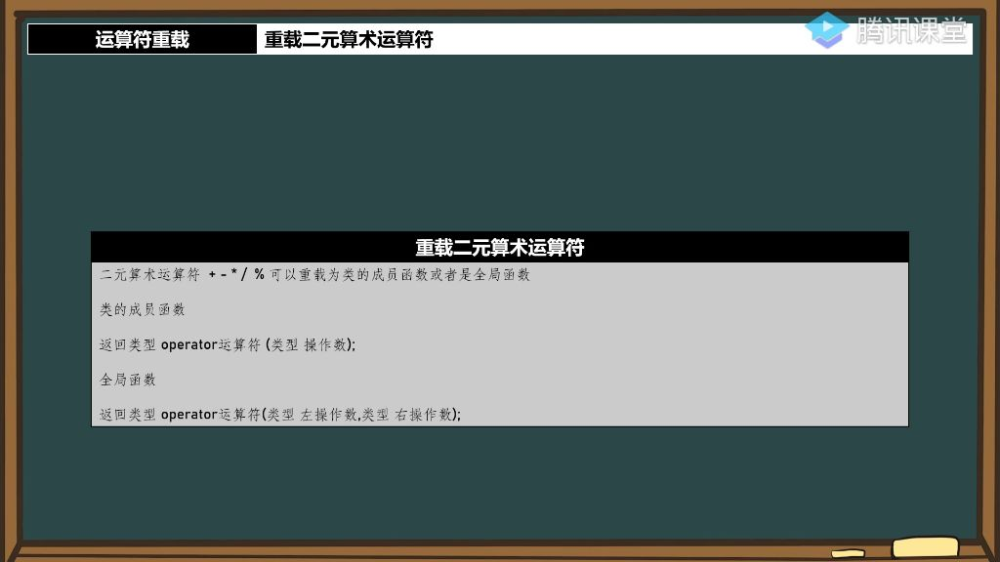

## 一、运算符重载

### 1. 重载二元算术运算符

- 
- **定义**：二元算术运算符包括`+`、`−`、`∗`、`/`、`%`等基本运算符号。
- **重载方式**：
  - **成员函数**：作为类的成员函数进行重载，语法为`返回类型 operator运算符(参数)`
  - **全局函数**：作为全局函数进行重载，需要两个参数分别对应左右操作数
- **示例说明**：如a+2
  - 当重载为成员函数时，2作为参数；
  - 重载为全局函数时，a和2分别作为两个参数

### 2、知识小结

| 知识点             | 核心内容                               | 关键代码/实现                                                | 难点解析                                                  |
| ------------------ | -------------------------------------- | ------------------------------------------------------------ | --------------------------------------------------------- |
| 运算符重载基础     | 讲解二元算术运算符(加减乘除)的重载方法 | operator+成员函数/全局函数实现                               | 引用与右值引用的区别应用                                  |
| 字符串数字转换算法 | 实现数字转字符串的三种优化方案         | 无第三方函数的纯算法实现; 右值引用优化版; 数学公式替代条件判断 | 负数处理/零值边界条件; 无if语句的极限优化; 类型兼容性设计 |
| 内存管理优化       | 引用传递与值传递的性能对比             | extreme类成员函数优化案例         | 函数栈内存生命周期管理                                    |
| 运算符重载实践     | 字符串与数字的加法运算符重载           | hstring operator+(int)实现; 动态内存分配处理                 | 类型安全与溢出防护; 多类型兼容方案                        |
| 代码优化技巧       | 从60分到满分代码的演进路径             | 循环次数优化; 数学公式替代分支; 位运算技巧                   | 面试代码的优雅性设计; 性能与可读性平衡                    |