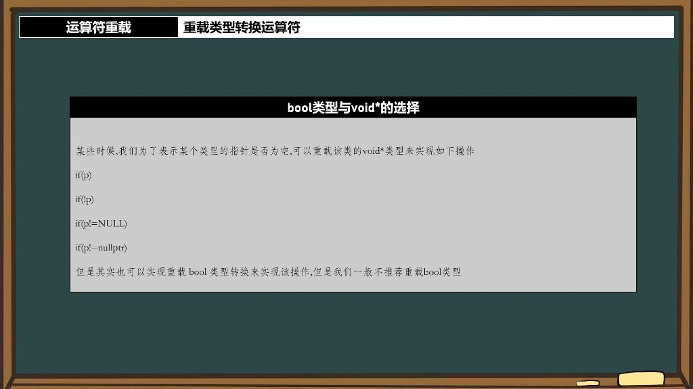

### 一、重载类型转换运算符

#### 1. 解决隐式类型转换带来的多义性问题

###### 1）隐式类型转换的概念

- 定义：在赋值或运算过程中，编译器自动进行的类型转换称为隐式类型转换。
- 示例：当声明float x = 2时，整数2会被自动转换为浮点型2.0f。

###### 2）隐式类型转换带来的问题

- 多义性问题
  - 问题本质：当类中同时存在类型转换运算符和运算符重载时，编译器无法确定转换路径。
  - 典型场景：
    - 类T包含：
      - 构造函数`T(int val)`
      - 类型转换运算符`operator int()`
  - 冲突表现：
    - 路径1：将t1通过operator int()转为int后执行int加法
    - 路径2：将100通过构造函数转为T后执行重载的operator+
  - 编译错误：出现"有多个运算符'+'匹配"的错误
- 解决方案
  - 
  - explicit关键字：
    - 作用：禁止隐式类型转换，只允许显式转换
    - 用法：在转换函数前添加explicit修饰符
    - 示例：explicit operator int()
  - 实际应用：
    - 可避免构造函数和转换运算符造成的二义性
      - 在类型转换运算符前添加explicit, 如`explicit operator int()`
      - 在构造函数前添加explicit，如`explicit T(int val)`
    - 强制要求程序员明确写出转换意图
      - 强制转换示例：
        - 当使用explicit限制后，必须显式进行类型转换才能执行运算
        - 例如：int x = t1 + static_cast<int>(100);
  - 注意事项：
    - 是C++11引入的特性
    - 适用于构造函数和类型转换运算符
    - 显式转换仍需通过static_cast等方式实现

#### 2. bool类型与void*的选择 

###### 1）重载void*类型判断指针是否为空

- 
- **应用场景**：当需要判断类中的指针成员是否为空时，可以通过重载类型转换运算符来实现类似if(p)的判断逻辑
- **实现方式**：
  - **`void*`重载**：可以重载void*类型转换运算符，通过检查指针是否为nullptr来实现条件判断
  - **`bool`重载**：理论上也可以重载bool类型转换运算符，但一般不推荐这种做法