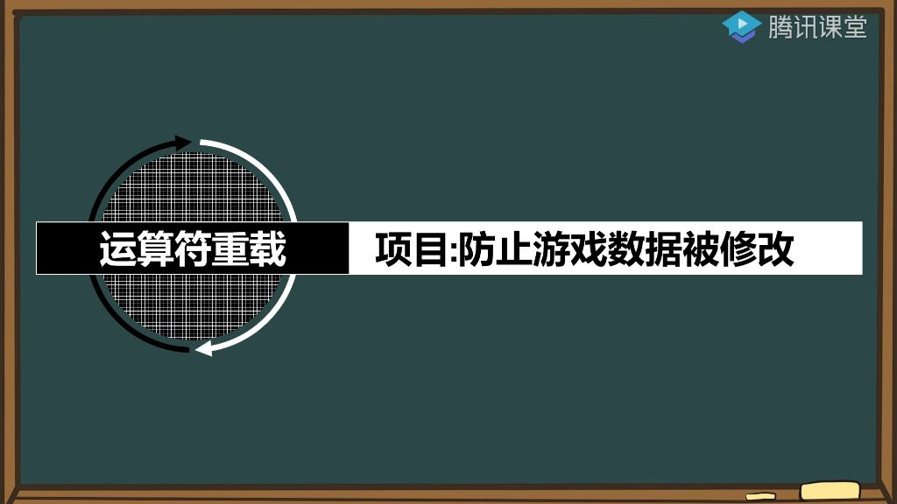
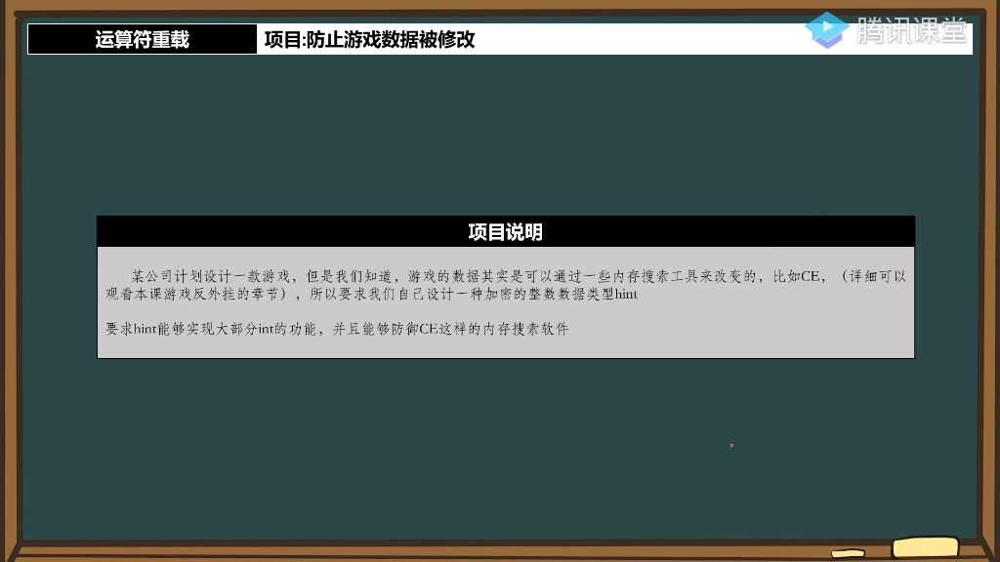

## 一、运算符重载

### 1. 运算符重载进阶应用

###### 1）项目实施目标

- 
- **项目背景**: 通过运算符重载技术实现游戏数据保护，防止内存数据被直接搜索和修改
- **技术原理**: 传统游戏数据（如`int`类型钻石数量）直接存储在内存中容易被破解工具搜索修改
- **解决方案**: 使用运算符重载创建特殊数据类型，使内存中的存储形式与实际数值不同

###### 2）运算符重载的重要性

- **技术深度**:
  - **基础部分**: 包含基本运算符如+、−、<<等重载
  - **进阶部分**: 涉及类型转换运算符、下标运算符等复杂重载
- **安全隐患**:
  - **漏洞来源**: 不规范的运算符重载是程序安全漏洞的高发区
  - **典型问题**: 内存越界、类型转换异常等都可能通过运算符重载引入

### 2. 例题:简单消费游戏

- 程序功能

  ：模拟游戏内货币消费过程

  - 初始设置2500元宝/钻石
  - 每次按键消费10单位货币
  - 实时显示剩余金额

- 实现原理：

  - 使用全局变量存储金额
  - while循环监听按键事件
  - 每次按键触发金额递减和输出

### 3. 游戏数据安全问题

#### 1）数据篡改演示

- 篡改方法：
  - 使用Cheat Engine(CE)工具
  - 搜索内存中的数值2500
  - 直接修改内存值或汇编指令
- 篡改效果：
  - 将减法指令改为加法
  - 每次按键反而增加10单位
  - 可任意设置显示值与实际值

#### 2）安全威胁分析

- 风险根源：
  - 数据明文存储在连续内存
  - 缺乏加密和校验机制
  - 关键计算在客户端执行
- 危害场景：
  - 单机游戏：直接数值修改
  - 网络游戏：可能绕过客户端校验
  - 软件破解：通过数据逆向破解

### 4. 数据保护方案设计

- 
- 设计目标：
  - 创建加密整数类型hint
  - 保持int的基本功能接口
  - 防御内存扫描工具
- 实现方案：
  - 基础方案(60分)：
    - 运算符重载封装
    - 重载+,-,=等运算符
    - 内存中存储原始值
  - 进阶方案：
    - 内存分散存储
    - 显示值加密变换
    - 运行时动态解密

### 5. 技术实现原理

- 内存防护机制：
  - **方法一**：分散存储：将4字节拆分为非连续内存块
  - **方法二**：值变换：存储值=显示值±随机偏移量，仅在运算时还原真实值
- 运算符重载要点：
  - 重载所有基本运算符
  - 保持类型行为一致性
  - 隐式/显式类型转换处理

### 6. 课后作业

- 基础实现：
  - 完成hint类的运算符重载
  - 测试基本算术运算功能
  - 验证类型转换行为
- 扩展挑战：
  - 实现内存分散存储
  - 添加随机偏移加密
  - 测试防CE扫描效果

### 7. 项目原理说明

###### 1）hint类的设计

- **hint构造函数** 
  - 实现目的：为不支持默认构造的类提供初始化功能
  - 参数设置：构造函数接收int类型参数val，默认值为0
  - 内存分配：动态分配4个不连续的char类型内存块(mem[0]-mem[3])
  - 内存打散：将4字节整数值分散存储在4个独立内存块中，防止连续搜索
- **hint析构函数** 
  - 资源释放：负责释放构造函数中分配的4块内存
  - 实现方式：依次delete mem[0]到mem[3]四个指针
  - 注意事项：必须与构造函数配对使用，防止内存泄漏
- **内存预先分配** 
  - 效率问题：动态分配内存效率低下，大量使用会显著影响性能
  - 优化方案：预先分配足够内存（如5000*4=20000字节）
  - 管理机制：实现自定义内存管理，从预分配池中调取内存
  - 对比分析：相比动态分配方案，预分配方案效率更高但实现更复杂
- **重载等于号** 
  - 实现方式：通过operator=重载赋值运算符
  - 数值写入：将int值val的4个字节分散写入mem数组
  - 读取实现：通过operator int()类型转换运算符实现数值读取
  - 加密方案：可采用加减500或异或操作进行简单加密
- **问题反思** 
  - 小数值漏洞：当数值<2^8时仍可被搜索到
  - 解决方案：对第一个字节进行异或加密处理
  - 破解难度：完整实现后显著增加游戏数据破解难度
  - 运算符选择：优先重载类型转换运算符可减少其他运算符重载工作量
  - 待完善功能：仍需重载右移运算符(>>)支持输入操作

