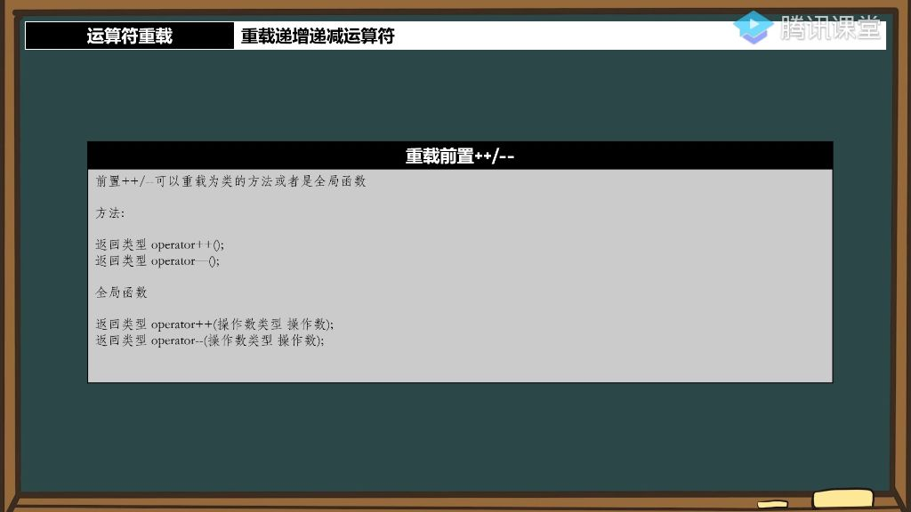
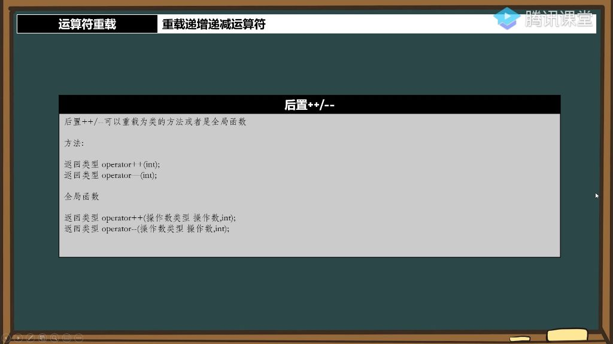

### 一、重载递增递减运算符

#### 1. 前置递增递减运算符重载 

###### 1）基本语法形式

- 
- **类方法重载**：
  - **前置递增**：返回类型 `operator++()`;
  - **前置递减**：返回类型 `operator--()`;
- **全局函数重载**：
  - **前置递增**：返回类型 `operator++(操作数类型& 操作数)`;
  - **前置递减**：返回类型 `operator--(操作数类型& 操作数)`;
- **引用使用建议**：
  - 操作数参数建议使用引用（避免拷贝）
  - 返回值建议使用引用（节约内存成本）
  - 不存在右值问题时可安全使用引用

#### 2. 后置递增递减运算符重载

###### 1）后置`++/--`可以重载为类的方法或者是全局函数

- **后置`++/--`的重载方式** 
  - 
  - **类方法重载**：
    - **后置递加**：`返回类型 operator++(int);`
    - **后置递减**：`返回类型 operator--(int);`
  - **全局函数重载**：
    - **后置递加**：`返回类型 operator++(操作数类型 操作数，int);`
    - **后置递减**：`返回类型 operator--(操作数类型 操作数，int);`
- **重载原因与区分方法** 
  - **区分必要性**：前置和后置运算符使用相同符号，需要通过参数类型区分
  - **实现方式**：
    - 后置运算符必须带一个int类型参数（仅作为标记）
    - 该参数无实际用途，仅用于函数重载区分
    - 参数名可省略（因为不会被使用）
  - **设计特点**：
    - 这是C++语言的硬性规定（必须使用int类型）
    - 编译器通过参数列表区分前置和后置版本
- **后置`++/--`不能返回引用的原因** 
  - **语义要求**：
    - 后置运算需要返回运算前的值
    - 但实际对象值已经改变
  - **内存问题**：
    - 返回临时对象时不能返回引用（临时对象会被销毁）
    - 引用要求有固定内存地址，而临时变量不符合