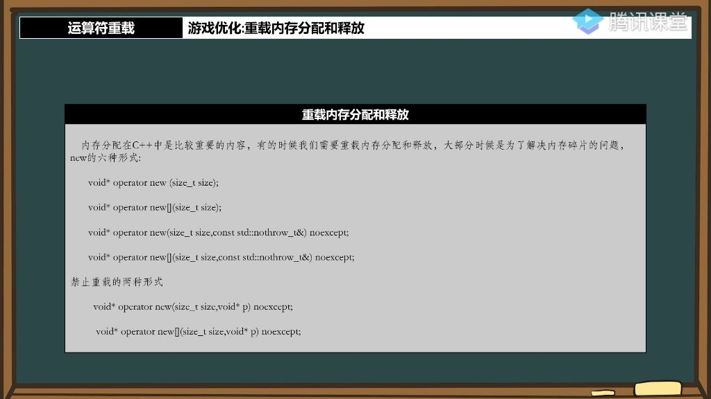
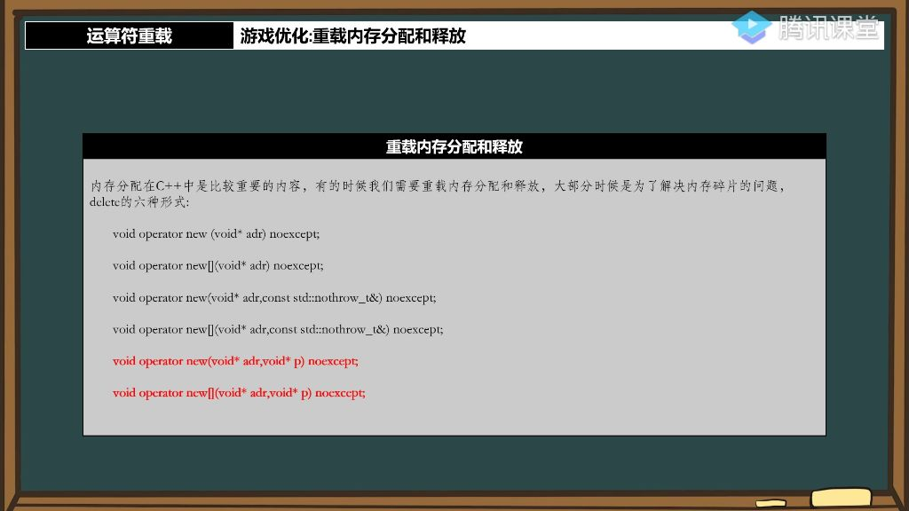

## 一、运算符的重载 

### 1. 重载内存分配释放 

#### 1）运算符重载之new和delete

- **运算符重载概述**
  - **应用场景**: 主要用于游戏开发中的内存优化，解决内存碎片和性能问题
  - **重要性**: 虽然很多程序员不会用到，但掌握后能显著提升程序性能，是高级技能
  - **内存管理意义**: C++编程中内存管理是核心问题，理解内存就理解了C++的大部分内容
- **游戏开发中的内存问题**
  - **典型问题**:
    - **动态分配**: 游戏中子弹数量不确定，必须使用new/delete动态分配
    - **内存碎片**: 频繁分配释放小对象(如16字节的子弹)会产生大量内存碎片
    - **性能损耗**: 每次new都涉及应用层到硬件层的IO操作，非常消耗资源
  - **优化思路**:
    - 预分配固定大小的内存池(如500-1000发子弹)
    - 使用标记管理内存使用状态(如布尔值标记占用)
    - 接管new/delete的内存分配过程
- **new和delete工作原理**
  - 
  - **new的三步操作**:
    - **分配内存**: 在堆上分配所需大小的内存空间
    - **调用构造**: 执行对象的构造函数进行初始化
    - **返回指针**: 将分配的内存地址返回给调用者
  - **delete的两步操作**:
    - **调用析构**: 先执行对象的析构函数
    - **释放内存**: 然后释放对象占用的内存空间
  - **重载范围**: 只能重载内存分配/释放部分(第一步)，不能重载构造/析构调用
- **内存优化方案**
  - **内存池设计**:
    - 预先分配大块连续内存
    - 使用位图或标记数组管理分配状态
    - 实现自定义的分配和释放算法
  - **优势**:
    - 减少内存碎片
    - 提高分配速度(避免系统调用)
    - 更好的缓存局部性

#### 2）重载内存分配和释放

- **new的六种形式** 
  - 
  - **基本形式**：C++中new操作符有六种重载形式，主要用于解决内存碎片问题
  - **常见形式**：最常用的两种形式是单个对象分配和数组分配
    - `void* operator new(size_t size)`
    - `void* operator new`
  - **禁止重载的两种new形式** 
    - **限制说明**：根据C++标准，有两种new形式是禁止重载的
    - **学习时机**：这两种形式将在异常处理相关章节详细讲解
  - **指定内存分配地址的用法** 
    - **定位new**：可以在指定内存地址上分配对象
    - **使用语法**：`new (address) type`
  - **new与delete的对应关系** 
    - **配对使用**：每种new形式都有对应的delete形式
    - **注意事项**：必须确保分配和释放方式匹配，否则可能导致内存问题
- **delete的六种形式** 
  - 
  - **与new的对应性**：delete运算符存在六种重载形式，与new的六种形式一一对应，但PPT仅展示了部分形式。
  - **重载限制**：部分delete形式不允许被重载。
  - **主要应用场景**：重载内存分配/释放最常见目的是解决内存碎片问题，通过自定义管理策略优化性能。
  - **类内重载优势**：相比全局重载，类内重载更安全且易于维护，是初学者的推荐实践方式。