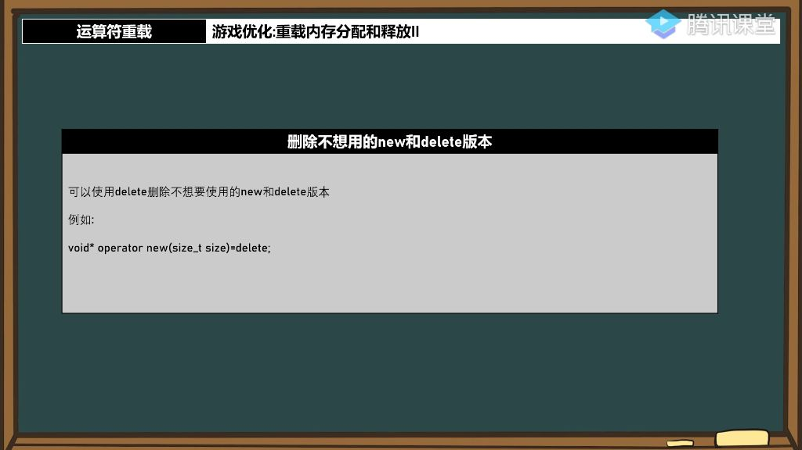
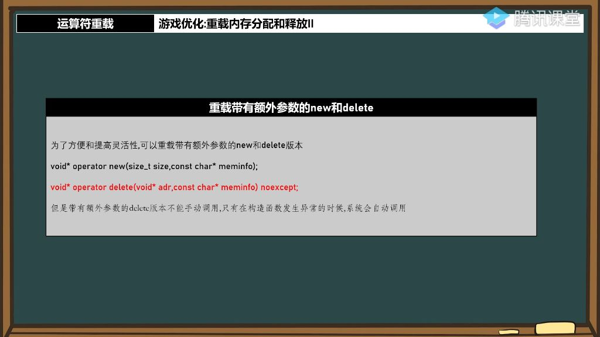

## 一、运算符重载

### 1. 内存分配和释放 

###### 1）配套的delete

- **配套原则**: 每个版本的new必须配套使用相同版本的delete，如用new就要用delete，用new[]就要用delete[]
- **原因分析**:
  - 如果自定义了内存池但未重载对应的delete，系统会调用默认delete导致内存管理不一致
- **严重后果**: 会导致内存管理混乱和潜在错误

- **重载要求**: 需要重载所有可能用到的new/delete版本
  - **可重载的四种形式**：
    - `void* operator new(size_t size)`
    - `void* operator new`
    - `void* operator new(size_t size,const std::nothrow_t&) noexcept`
    - `void* operator new noexcept`
  - **禁止重载的两种形式**：
    - `void* operator new(size_t size,void* p) noexcept`
    - `void* operator new noexcept`

###### 2）删除不用的new和delete

- 
- **语法形式**：使用`void* operator new(size_t size)=delete`;可以删除默认的new操作符重载
- **设计目的**：主要用于保持代码的一致性和统一性，防止意外使用某些内存分配方式
- **应用场景**：当需要强制使用特定版本的内存分配器或禁止某些分配方式时，这种技术特别有用

###### 3）重载带有额外参数的new和delete 

- 带有额外参数的new和delete 

  - 
  - **设计目的**：通过添加自定义参数增强内存控制的灵活性，例如可以添加内存分配提示信息等调试信息
  - **使用示例**：`blut* shotal = new ("it's a test") blut;` 其中"it's a test"是额外参数。

  

### 2、知识小结

| 知识点                   | 核心内容                                                     | 重点/易混淆点                                                |
| ------------------------ | ------------------------------------------------------------ | ------------------------------------------------------------ |
| 运算符重载（new/delete） | 通过重载new和delete实现自定义内存管理，解决频繁内存分配问题，提升面向对象效率。 | 版本匹配规则：new必须配套对应版本的delete（如new[]配delete[]），否则会导致内存管理错位。 |
| 静态成员函数特性         | 重载的new/delete必须是静态成员函数（无this指针），因内存分配时对象尚未构造。 | 静态函数中无法访问非静态成员变量，需通过其他方式（如全局内存池）管理状态。 |
| 内存池实现               | 预分配连续内存块（如1000*sizeof(对象)），通过标志位（bool数组）标记内存使用状态。 | 析构函数联动：在析构函数中重置标志位（free=false），而非直接在delete中操作。 |
| 异常安全设计             | 带额外参数的new需配套同参数delete，用于构造函数异常时自动释放内存。 | 若同时定义带size_t参数的delete版本，系统优先调用该版本，其他版本失效。 |
| 禁用默认操作             | 通过=delete禁用未重载的new/delete版本，强制使用自定义内存管理逻辑。 | 需覆盖所有new/delete变体（如new[]、delete[]），避免隐式调用系统默认版本。 |
| 面向对象效率争议         | 合理利用内存管理技术（如内存池）可显著提升面向对象性能，打破“低效”偏见。 | 实践关键：内存分配策略需与业务场景匹配（如高频小对象适用内存池）。 |