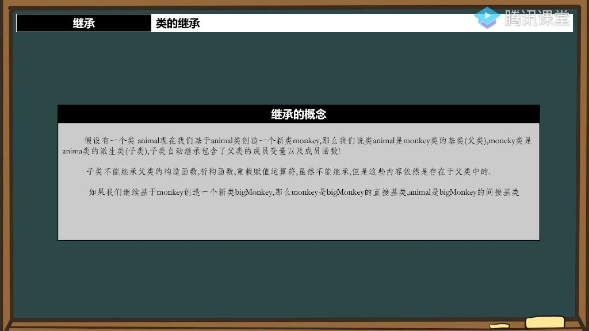
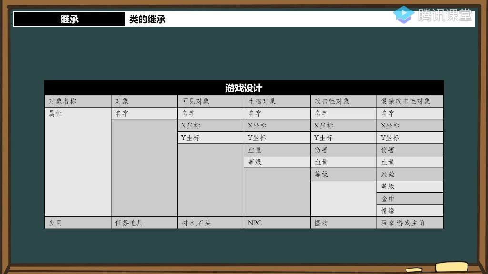
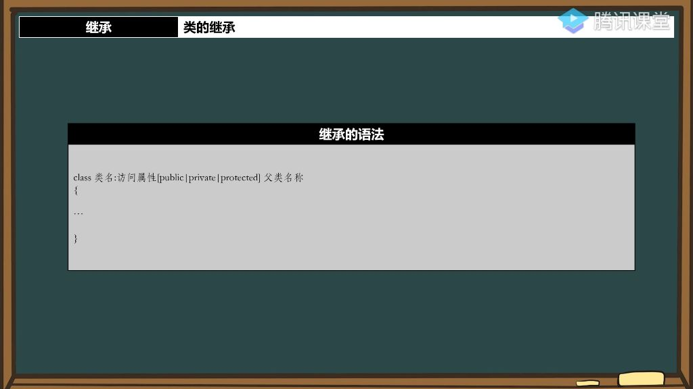

## 一、类的继承

### 1. 继承的概念

#### 1）继承的概念定义

- 
- **本质特征**：继承是将父类的属性和方法传递给子类的机制，类似于现实中的财产继承关系
- **术语关系**：
  - **基类/父类**：被继承的类（如animal类）
  - **派生类/子类**：继承得到的类（如monkey类）
- **继承内容**：
  - 自动继承父类的成员变量和普通成员函数
  - 不能继承构造函数、析构函数和重载赋值运算符

#### 2）继承的概念应用

- 
- **实现优势**：
  - 子类自动获得父类所有非特殊成员，避免重复定义相同属性
  - 只需定义新增属性，减少代码冗余
  - 类关系更符合现实世界的层次关系
- **管理便利**：通过继承关系建立清晰的类层次结构

### 2. 继承的语法 

#### 1）类的继承基础 

- **语法格式**：在子类声明后加冒号和访问修饰符（如public），后跟父类名，例如：class 子类 : public 父类;
- **访问修饰符说明**：当前必须使用public修饰，其他修饰符（如private/protected）将在后续课程详细讲解
- **继承关系建立**：通过该语法，子类自动获得父类的所有成员变量和方法

#### 2）子类与父类的关系

- **子类的内存组成**：
  - 子类内存 = 父类成员内存 + 子类新增成员内存

- **演变关系**：表示"is-a"关系（如人是动物），应使用继承实现，子类具有父类全部特征。

### 3. 类的访问属性

- **private成员**：仅当前类可访问，子类继承后也无法直接访问。
- **protected成员**：允许子类访问但禁止外部访问，专为继承设计。
- **内存存在性**：即使不可访问，private成员仍存在于子类内存空间。

### 4. final关键字

- **语法**：`class class_name final {}`;

- **作用**：阻止类被继承，final修饰的类不能作为基类。
- **特殊性质**：
  - 作为关键字时仅限制继承行为，在其他上下文可作为普通变量名使用（但不建议）