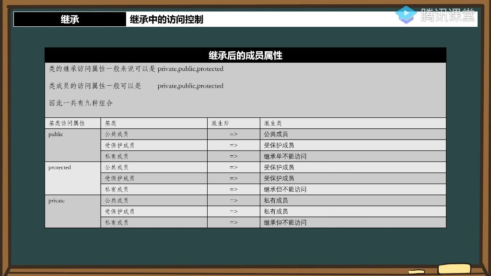
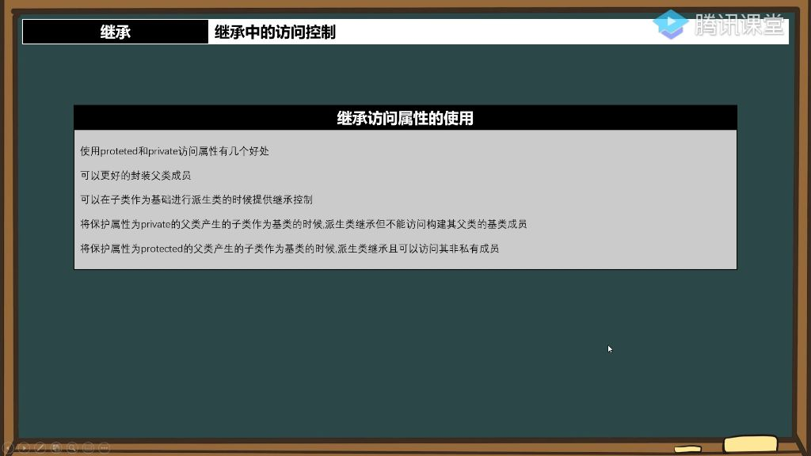
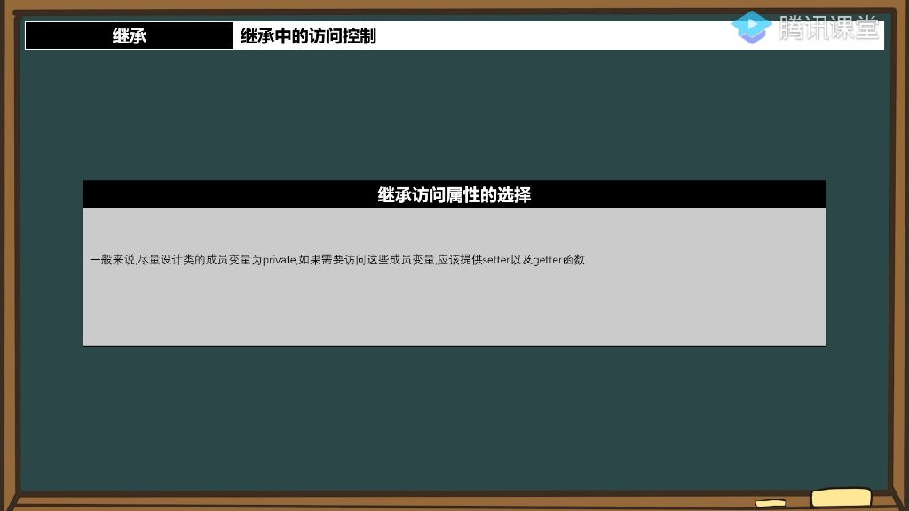

## 一、继承

### 1. 继承中的访问控制

#### 1）继承后的成员属性

- 
  - **访问属性总结表** 
    - **核心区别**：
      - public继承：保持原访问级别
      - protected继承：将public降级为protected
      - private继承：将非private成员全部转为private
    - **易错重点**：
      - private继承后成员在派生类内部仍可访问（不同于"不能访问"的基类private成员）
      - protected继承会导致后续派生时public成员不可见

#### 2）修改继承成员的访问属性

- **修改继承成员访问属性的方法** 
  - **语法格式**：使用using 基类名::成员名来修改继承成员的访问属性，例如using MoveObject::getHP将getHP方法修改为public访问权限
  - **注意事项**：语法中只需写基类名和成员名，不需要其他修饰符或限定符
- **可修改访问属性的成员类型** 
  - **可修改成员**：基类中的protected和public成员可以被修改访问属性
  - **不可修改成员**：基类中的private成员无法修改访问属性，因为派生类无法访问这些成员
  - **修改原理**：必须先能访问成员才能修改其属性，private成员在派生类中不可见
- **使用建议**：应谨慎使用此特性，因为可能破坏封装性

#### 3）继承访问属性的使用

- 

- **封装优势**：可以更好地隐藏父类成员，如通过private继承使某些成员在派生类外部不可见
- **控制优势**：可以在派生链中灵活控制成员访问权限，如将基类public成员在中间派生类改为private

#### 4）继承访问属性的选择

- 
- **类成员变量的访问控制原则** 
  - **基本原则**：在设计类时应尽量将成员变量声明为private，这是专业代码的常见做法
  - **访问方式**：若需要访问private成员变量，通过setter和getter函数来实现
  - **例外情况**：public和protected修饰符在特定场景下仍有使用价值，但需要谨慎考虑
- **使用setter/getter的好处**
  - **调试优势**：通过函数访问可以在setter/getter中设置断点，便于跟踪数据变化
  - **错误预防**：大型项目中直接暴露成员变量容易导致意外读写，引发难以发现的错误