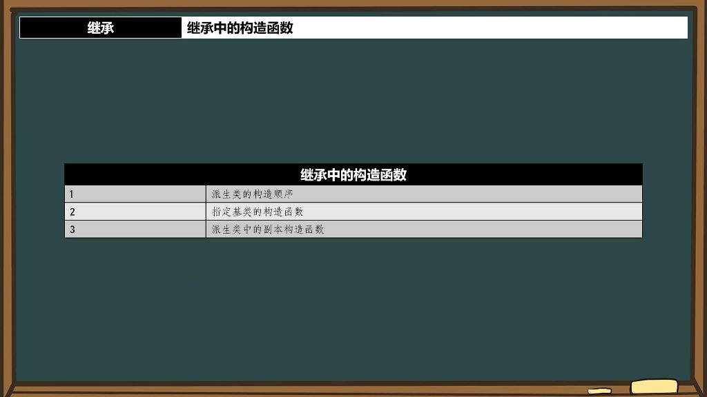
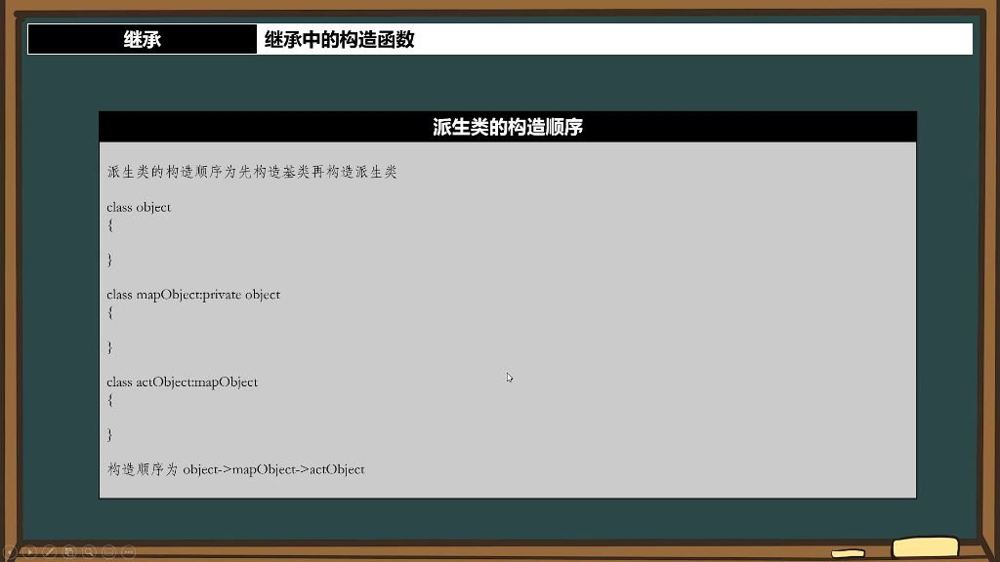

## 一、继承

### 1. 继承中的构造函数

#### 1）派生类的构造顺序

- **派生类的构造顺序为先构造基类再构造派生类** 
  - **内存布局原理**：基类内存位于派生类内存之前，形成拼接结构
  - **构造顺序规则**：
    - 先构造最顶层基类
    - 再构造中间派生类
    - 最后构造最底层派生类

#### 2）指定基类的构造函数

- **默认构造函数与指定构造函数** 
  - **默认调用规则**：当未显式指定时，派生类会默认调用基类的默认构造函数
  - **显式指定方法**：在派生类的初始化列表中，显式的调用基类的构造函数。
- **构造函数中的成员初始化** 
  - **正确做法**：通过初始化列表同时初始化基类和派生类成员
  - **错误示范**：在基类构造完成前尝试初始化继承成员会导致错误
- **类型转换与继承** 
  - **隐式转换规则**：派生类引用(指针)可自动转换为基类引用(指针)
  - **内存原理**：基类只使用对象内存中属于基类的部分

#### 3）继承构造函数

- **基本概念**
  - **强制继承特性**: 构造函数默认不继承，但可以通过using关键字强制继承父类的构造函数
  - **语法形式**: 在派生类中使用using BaseClass::BaseClass;语句
  - **编译器行为**: 继承的构造函数由编译器自动完成，相当于显式调用父类构造函数
- **实现细节**
  - **访问权限特殊性**: 构造函数的访问权限不受继承声明位置影响，即使放在private区域仍保持public访问性
  - **继承范围**:默认构造函数和副本构造函数不会被自动继承， 使用using会继承父类所有非默认构造函数（包括复制构造函数）