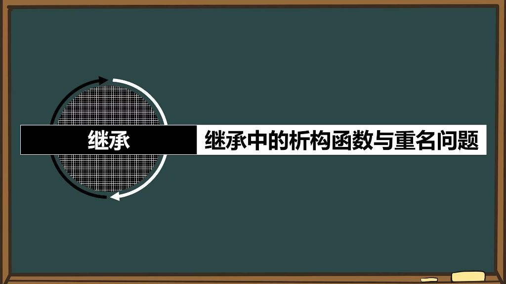
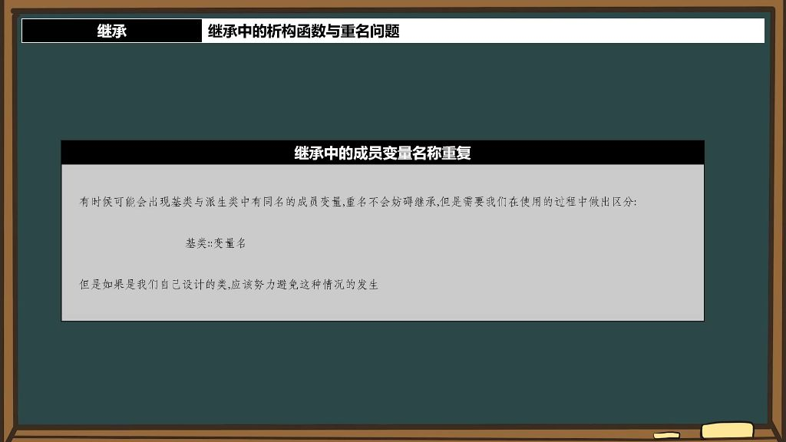

## 一、继承

### 1. 析构函数

#### 1）继承中的析构顺序

- **基本特点**：析构函数在继承关系中只有一个，与构造函数不同（构造函数有多个）
- **析构顺序**：在多层继承中（如A→B→C），析构顺序与构造顺序完全相反
  - **构造顺序**：基类→派生类（A→B→C）
  - **析构顺序**：派生类→基类（C→B→A）
- **原理分析**：
  - 构造时必须先初始化基类成员，否则派生类可能调用未初始化的基类成员
  - 析构时若先释放基类，派生类可能访问已释放的基类资源导致错误
  - 示例：当C依赖B，B依赖A时，必须按C→B→A顺序释放
- **内存管理机制**：
  - 派生类对象包含完整的基类子对象
  - 析构时先处理派生类新增成员，再逐级向上释放基类部分
  - 类似栈结构：后构造的先析构（LIFO原则）

### 2. 继承中的重名问题

#### 1）继承中的成员变量名称重复

- 
- **作用域区分原则**：当基类和派生类存在同名成员变量时，不会产生冲突，因为类作用域不同。就像"你是你爸的儿子，他是他爸的儿子"虽然都叫"儿子"但不冲突。
  - 内存机制：重名变量会被同时继承，存储在不同内存区域
- **访问方式**：
  - **类内部访问**：使用基类::变量名语法
  - **类外部访问**：通过对象名.基类名::变量名
- **设计建议**：自行设计的类应尽量避免成员变量重名，但在使用第三方库时可能无法避免。

#### 2）继承中的成员函数名称重复

- **两种情况处理**：

  - **参数不同（函数重载）**：
    - 可使用using 基类::函数名引入基类函数，引入后派生类将同时拥有两个版本函数
  - **参数相同**：
    - 直接通过对象名.基类名::函数名()调用基类版本
    - 默认情况下派生类函数会覆盖基类函数

  - **编码建议**：为增强可读性，建议显式写出完整调用链而非简写形式