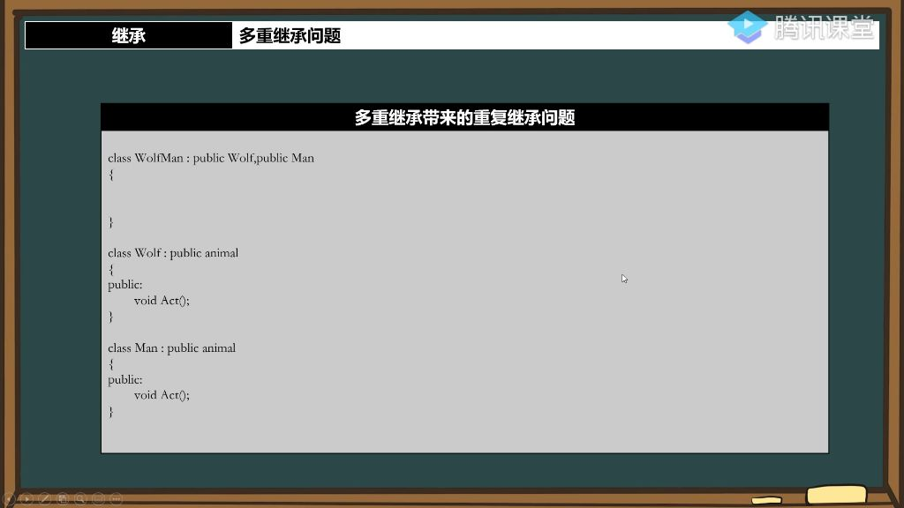

## 一、继承

### 1. 多重继承问题

#### 1）多重继承的概念

- **本质**：一个子类可以同时继承多个父类的特性。
- **术语演变**：现代编程更倾向使用"基类(base class)"和"派生类(derived class)"替代"父类/子类"的说法
- **内存结构**：派生类对象内存中会包含所有基类的数据成员，按继承顺序排列
- **应用场景**：适用于需要组合多个类特性的情况，如游戏开发中的混合角色设计

#### 2）多重继承带来的成员重复问题

- 例题:狼人继承问题 
  - 表现：当多个基类包含同名成员时，派生类调用会产生二义性
  - 典型示例：狼类(Wolf)和人类(Man)都定义了eat()方法，狼人(WolfMan)调用eat()时编译器无法确定使用哪个版本
  - 底层原因：派生类会继承所有基类的完整成员，包括同名成员
- **方法1限定符处理** 
  - **语法**：使用基类名::成员名显式指定调用版本
  - **特点**：
    - 每次调用都需要显式指定
    - 适合临时性解决特定调用场景
    - 代码可读性会降低
- **方法2using引入** 
  - **语法**：在派生类中使用using 基类名::成员名
  - **示例**：using Wolf::eat将狼类的eat引入当前作用域
  - **特点**：
    - 只需在类定义时声明一次
    - 后续调用无需再指定基类
    - 会永久覆盖其他基类的同名成员
- **方法3自定义变身函数**
  - **实现思路**：
    - 添加状态标志(如IsWolf)
    - 在派生类中重写冲突方法
    - 根据状态调用不同基类版本
  - **优势**：
    - 最符合面向对象设计原则
    - 可以动态切换行为
    - 代码可维护性最佳
  - **典型应用**：游戏角色状态切换系统

#### 3）多重继承的深层问题

- 
- **重复继承问题**：当多个基类有共同祖先时，会导致最派生类包含多份祖先类的副本
  - 例题：狼人和人的继承问题 
    - 重复继承本质：当多个父类继承自同一个基类时，子类会包含多份基类成员，导致成员重复问题。例如狼(Wolf)和人(Man)都继承自动物(Animal)，狼人(WolfMan)继承自狼和人时就会包含两份Animal的成员。

- **内存结构**：
  - **单一继承**：父类成员在前，子类新增成员在后
  - **多重继承**：按继承顺序排列各父类成员，最后是子类新增成员
- **访问冲突**：当尝试访问继承的成员时（如x坐标），需要明确指定来自哪个父类路径（Wolf::x或Man::x），否则会产生歧义。

#### 4) 虚基类 

- **作用**：解决多重继承中的重复成员问题，确保基类在继承体系中只存在一个实例
- **语法**：在继承时添加virtual关键字，如class Wolf : virtual public Animal
- **特性**：
  - 首次继承正常引入基类成员
  - 后续继承时发现已存在虚基类则不再重复引入
  - 所有继承路径共享同一份基类成员
- **注意事项**：
  - 虚继承会增加对象内存开销和访问成本
  - 应谨慎使用多重继承，优先考虑组合(has-a)关系
  - 典型适用场景：表达"is-a"关系的多重分类（如狼人同时是狼和人）