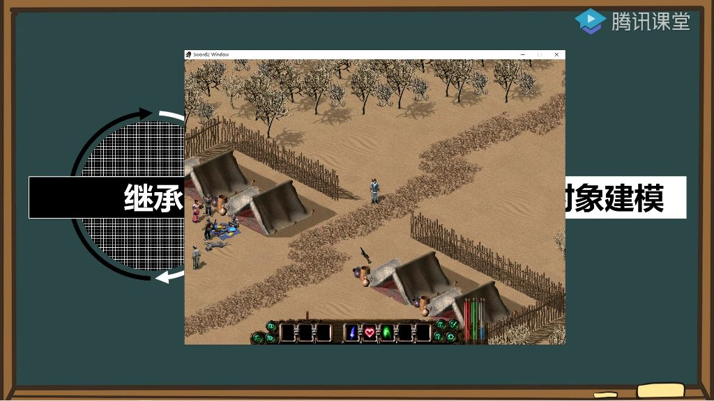

#### 一、继承总结

- 核心难点：继承的难点不在于语法或内存管理，而在于容易违反面向对象的基本思想
- 常见错误：在面试和实际工作中，最容易犯的错误是设计不当导致违反面向对象原则
- 关键原则：需要牢记前两天反复强调的面向对象基本思想

#### 二、游戏数据对象建模

- 实践案例：以剑侠情缘游戏为例进行对象建模练习
- 练习目的：通过拆解游戏中的各种对象来掌握面向对象设计
- 资源获取：该游戏可在付费课的反外挂章节或免费课的初级练手游戏中找到

#### 三、万物皆对象

##### 1. 地图上的对象

- 
- **具体实例**：房子、帐篷、草房、树木等
- **共同特征**：这些对象都不能移动
- **设计原则**：
  - 不能简单派生：房子不是树木，树木不是房子
  - 应采用同级关系：都属于"地图元件"类
  - **基础属性**：x坐标、y坐标、图像编号、名称等
  - **实现方式**：通过MapObject类的不同实例来表现各种地图元素

##### 2. 游戏中的对象

- **玩家对象**：
  - 包含内力、体力、金币等属性
  - 拥有完整的游戏属性系统
- **NPC对象**：
  - 属性比玩家少（不需要内力、体力等）
  - 不能简单用NPC派生玩家
- **正确关系**：
  - 应定义"人形对象"作为基类
  - 玩家和NPC都派生自"人形对象"
  - 避免违反"is-a"原则（玩家不是NPC）

##### 3. 人物对象

- **包含关系**：
  - 人物拥有技能和物品
  - 技能和物品都有名称属性
  - 区别：物品有数量，技能可能有伤害值
- **设计建议**：
  - 技能和物品可派生自同一个基类
  - 人物与技能是"has-a"关系（包含），不是"is-a"关系
  - 人物结构体中应包含技能对象和物品栏对象

##### 4. 拆解游戏对象

- **练习方法**:
  - 尝试拆解游戏中所有可见对象
  - 重点在于分析过程而非结果好坏
  - 遇到问题可与老师或同学讨论
- **设计要点**：
  - 明确区分"has-a"和"is-a"关系
  - 人物有技能，但人物不是技能
  - 物品和技能有共性但本质不同
- **代码优化**：
  - 合理设计可减少代码量
  - 但不能为了减少代码而违反面向对象原则
  - 需要在代码简洁性和设计合理性间取得平衡