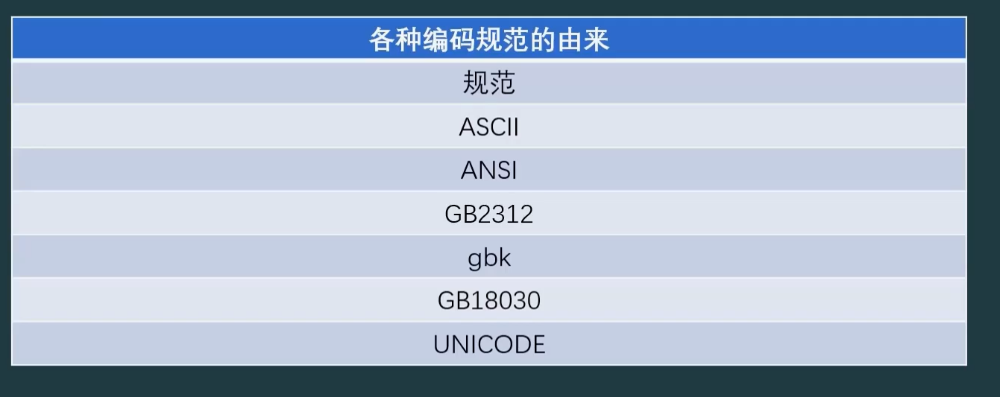

- UTF-16
  
- UNICODE的一种具体实现；早期中文英文都是两个字节，现在改成变长了；
  
- UTF-8
  
- UNICODE的一种具体实现；英文都是1字节，汉字可能两个字节，也可能是3/4个字节。
  
- 不同的编码之间，可以通过一些库函数相互转换；

- GBK2312

  - | 字符类型                     | 字节数 | 第一个字节范围              | 说明                       |
    | ---------------------------- | ------ | --------------------------- | -------------------------- |
    | **英文 / 数字 / ASCII 符号** | 1 字节 | `00–7F`                     | 与 ASCII 完全相同          |
    | **中文字符（汉字）**         | 2 字节 | **首字节** ≥ 0xA1 且 ≤ 0xFE | 这两个字节共同表示一个汉字 |
