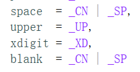

- 字符处理函数(cctype头文件)

  - int isupper(char)		判断字符是否是大写字母；
  - int islower(char)		判断字符是否是小写字母；
  - int isalpha(char)		判断字符是否是字母；
  - int isdigit(char)		判断字符是否是是数字；
  - int isalnum(char)		判断字符是否是字母或者数字；
  - int isspace(char)		判断字符是否是空格；
  - int isblank(char)		判断字符是否是空白；
  - int ispunct(char)		判断字符是否是标点符号；
  - int isprint(char)		判断字符能不能打印；
  - int iscntrl(char)		判断字符是否是控制字符；
  - int isgraph(char)		判断字符是否是图形字符；
  - int tolower(char)		将字符转换为小写；

  - int toupper(char)		将字符转换为大写；

- C++中space和blank的定义相同：
  - 

