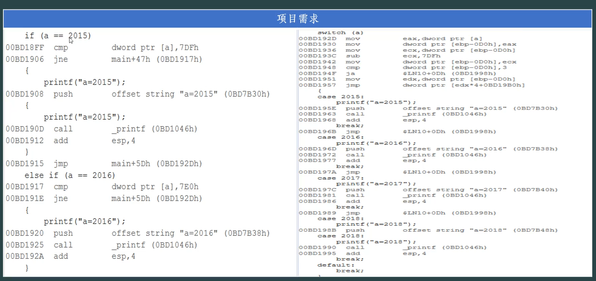

### 底层实现机制对比

| 特性           | `switch`语句               | `if-else`链        |
| :------------- | :------------------------- | :----------------- |
| **实现方式**   | 跳转表（Jump Table）       | 顺序条件测试       |
| **时间复杂度** | O(1) - 常数时间            | O(n) - 线性时间    |
| **内存使用**   | 可能需要额外内存存储跳转表 | 仅代码空间         |
| **适用场景**   | 离散、密集的整数值         | 复杂条件、范围判断 |